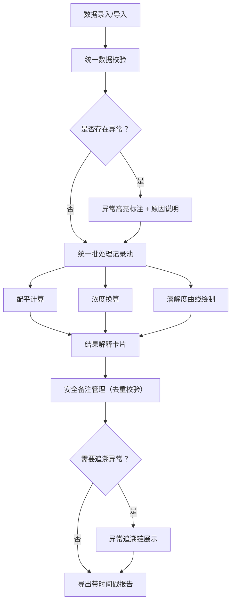

## 1. 产品概述

溶解度曲线教学器是一款面向化学教师、质检工程师及相关专业人员的教学与质检工具。该产品通过可视化曲线展示、精确的化学计算和完整的数据追溯链，解决传统教学中pH越界提醒模糊、计算结果缺乏解释、界面与报告数据不一致、重复导入产生矛盾结论等核心问题。

- 核心目标：让化学计算过程可解释、可追溯、可复核
- 目标用户：中学/大学化学教师、实验室质检工程师、企业培训人员
- 核心价值：一套数据、多方复用，异常可追溯至原始称量单据

## 2. 核心功能

### 2.1 用户角色

| 角色 | 说明 | 核心权限 |
|------|------|----------|
| 教师 | 使用系统进行化学教学演示 | 数据录入、曲线绘制、结果导出、教学讲解 |
| 质检工程师 | 对实验数据进行复核与质检 | 数据导入/导出、安全备注管理、异常追溯、报告生成 |

### 2.2 功能模块

1. **数据录入与导入页面**：试剂参数录入、批量数据导入、称量单关联
2. **溶解度曲线计算与展示页面**：曲线绘制、pH越界检测、配平计算、浓度换算
3. **结果解释与报告页面**：计算结果说明、安全备注管理、可读性报告导出
4. **异常追溯页面**：异常记录定位、称量单回溯、处理意见追踪

### 2.3 页面详情

| 页面名称 | 模块名称 | 功能描述 |
|---------|---------|----------|
| 数据录入与导入 | 试剂参数表单 | 支持试剂名称、浓度、温度、pH值、称量单号等字段录入 |
| 数据录入与导入 | 批量导入 | CSV/Excel文件导入，自动校验字段完整性 |
| 数据录入与导入 | 数据校验 | 实时检测试剂浓度错填、pH越界等异常并高亮标注 |
| 溶解度曲线计算 | 曲线绘制 | 基于输入数据生成溶解度-温度曲线可视化图表 |
| 溶解度曲线计算 | pH越界检测 | 精确提示越界范围、影响因素及纠正建议（非模糊提醒） |
| 溶解度曲线计算 | 配平计算 | 化学方程式配平，共用同一批处理记录 |
| 溶解度曲线计算 | 浓度换算 | mol/L、g/L、质量分数等单位换算，与配平共用数据源 |
| 结果解释与报告 | 结果解释卡片 | 每项计算结果旁附1-2句通俗解释，便于教学讲解 |
| 结果解释与报告 | 安全备注管理 | 同一批次备注去重，二次导入不产生矛盾结论 |
| 结果解释与报告 | 报告导出 | 文件名带时间戳区分运行批次；内容使用通俗语言描述异常原因 |
| 异常追溯 | 异常记录列表 | 按严重程度排序展示所有异常记录 |
| 异常追溯 | 追溯链路展示 | 从异常记录→原始数据→称量单→处理意见的完整链路可视化 |

## 3. 核心流程

### 3.1 主流程（质检工程师复核场景）

质检工程师导入实验数据 → 系统自动校验并标记异常 → 系统统一计算配平与浓度换算 → 工程师查看结果及解释说明 → 工程师添加/查看安全备注（自动去重）→ 追溯异常记录至称量单和处理意见 → 导出带时间戳的可读性报告

### 3.2 主流程（教师教学场景）

教师录入试剂参数 → 实时查看溶解度曲线 → 点击数据点查看计算过程解释 → 切换配平计算/浓度换算（数据自动同步）→ 导出教学用报告

## 4. 用户界面设计

### 4.1 设计风格

- **主色调**：深蓝（#1e3a5f）代表专业与可信，搭配青绿（#0d9488）作为数据高亮色
- **辅助色**：琥珀黄（#f59e0b）标记警告，深红（#dc2626）标记严重异常
- **按钮风格**：圆角8px，轻微阴影，悬停时浮起效果
- **字体**：标题使用Noto Serif SC（学术感），正文使用Noto Sans SC（易读性）
- **布局风格**：左右分栏，左侧操作区+右侧可视化区，卡片式模块组织
- **图标风格**：Lucide线性图标，搭配化学器皿emoji增强亲和力

### 4.2 页面设计概述

| 页面名称 | 模块名称 | UI元素 |
|---------|---------|--------|
| 数据录入 | 参数表单 | 标签分组输入框、实时校验提示（琥珀/红色边框）、称量单关联选择器 |
| 曲线展示 | 可视化区 | 交互式SVG曲线图（支持悬停查看数据点）、pH正常范围带（绿色背景）、越界点红色闪烁标记 |
| 结果解释 | 解释卡片 | 浅蓝底色卡片、图标+文字结构、可展开/收起的详细说明 |
| 报告导出 | 导出面板 | 时间戳预览、文件格式选择、通俗语言开关、导出进度条 |
| 异常追溯 | 追溯链路 | 横向时间线布局、节点可点击展开详情、颜色编码表示严重程度 |

### 4.3 响应式设计

- 桌面端优先（≥1280px）：左右双栏布局，充分利用屏幕空间
- 平板端（768-1279px）：上下布局，操作区在上，可视化区在下
- 移动端（<768px）：单列卡片式布局，折叠非核心模块

## 5. 数据一致性与追溯性设计原则

### 5.1 单源数据原则
所有计算（配平、浓度换算、曲线绘制）共用同一份批处理记录，杜绝界面与报告各算各的。

### 5.2 安全备注幂等性
同一批次安全备注采用哈希校验，二次导入时自动识别并合并，不产生冲突结论。

### 5.3 完整追溯链
每条异常记录保存：原始输入值→校验规则→计算中间值→称量单ID→处理意见ID，支持正向与反向查询。

### 5.4 可区分的导出文件
文件名格式：`溶解度分析报告_批号_{batchId}_{YYYYMMDD}_{HHmmss}.{ext}`，确保每次运行均可区分。
