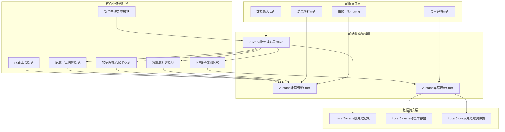
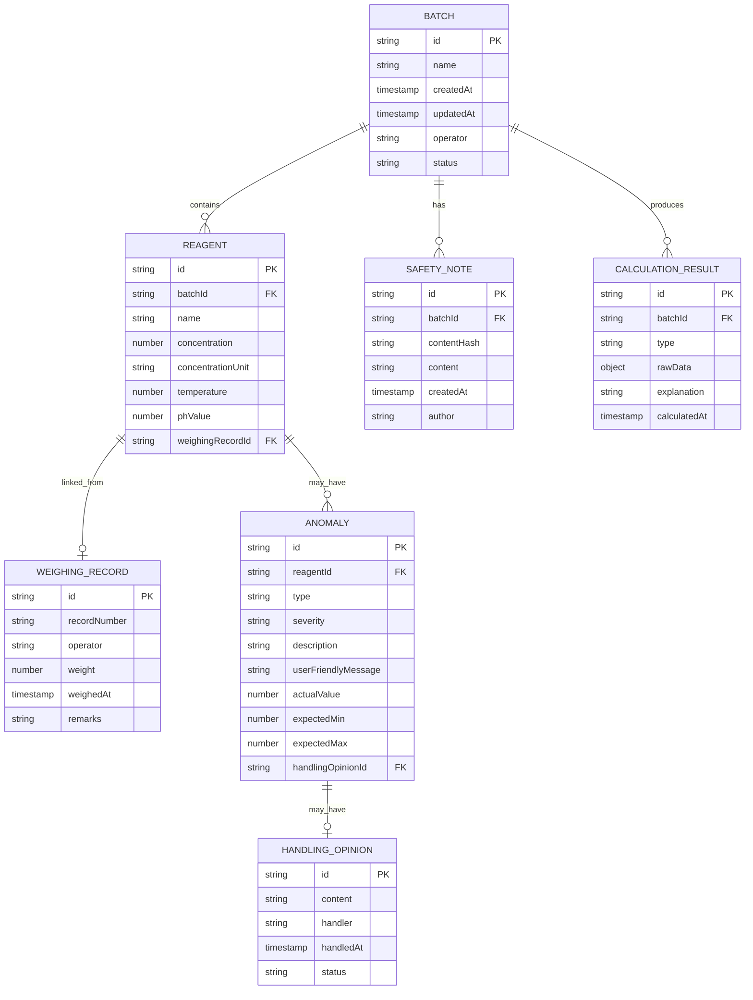

## 1. 架构设计



## 2. 技术描述

- **前端框架**：React@18 + TypeScript@5
- **构建工具**：Vite@5
- **样式方案**：Tailwind CSS@3
- **状态管理**：Zustand@4
- **路由管理**：React Router DOM@6
- **图表可视化**：Recharts@2（React友好的SVG图表库）
- **图标库**：Lucide React
- **后端服务**：无（纯前端应用，数据本地持久化）
- **数据存储**：浏览器LocalStorage（带版本管理）
- **导出格式**：CSV、HTML（可读性格式）、JSON（原始数据）

## 3. 路由定义

| 路由路径 | 页面名称 | 页面用途 |
|---------|---------|---------|
| / | 首页/工作台 | 快速入口、最近批处理记录列表 |
| /input | 数据录入 | 试剂参数录入、批量数据导入、称量单关联 |
| /curve | 曲线计算 | 溶解度曲线展示、pH越界检测、配平计算、浓度换算 |
| /result | 结果与报告 | 计算结果解释、安全备注、报告导出 |
| /trace | 异常追溯 | 异常记录列表、追溯链路可视化 |

## 4. 数据模型

### 4.1 实体关系图



### 4.2 核心数据结构定义

```typescript
// 批处理记录 - 所有计算的唯一数据源
interface BatchRecord {
  id: string;
  name: string;
  createdAt: number;
  updatedAt: number;
  operator: string;
  reagents: Reagent[];
  safetyNotes: SafetyNote[];
  status: 'draft' | 'calculating' | 'completed' | 'has_anomaly';
}

// 试剂记录
interface Reagent {
  id: string;
  name: string;
  formula?: string;
  concentration: number;
  concentrationUnit: 'mol/L' | 'g/L' | 'mass_fraction';
  temperature: number;
  phValue: number;
  solubility?: number;
  weighingRecordId?: string;
  weighingRecord?: WeighingRecord;
}

// 称量单
interface WeighingRecord {
  id: string;
  recordNumber: string;
  operator: string;
  weight: number;
  weighedAt: number;
  remarks: string;
}

// 安全备注 - 通过contentHash保证幂等性
interface SafetyNote {
  id: string;
  contentHash: string;
  content: string;
  author: string;
  createdAt: number;
}

// 异常记录 - 含用户友好的错误描述
interface Anomaly {
  id: string;
  reagentId: string;
  type: 'ph_out_of_range' | 'concentration_error' | 'temperature_abnormal' | 'formula_error';
  severity: 'warning' | 'error' | 'critical';
  description: string;
  userFriendlyMessage: string;
  actualValue: number;
  expectedMin?: number;
  expectedMax?: number;
  handlingOpinionId?: string;
  handlingOpinion?: HandlingOpinion;
}

// 处理意见
interface HandlingOpinion {
  id: string;
  content: string;
  handler: string;
  handledAt: number;
  status: 'pending' | 'approved' | 'rejected';
}

// 计算结果 - 含解释说明
interface CalculationResult {
  id: string;
  batchId: string;
  type: 'solubility_curve' | 'balancing' | 'concentration_conversion';
  rawData: Record<string, unknown>;
  explanation: string;
  detailedExplanation?: string;
  calculatedAt: number;
}
```

## 5. 核心模块设计

### 5.1 统一批处理记录管理模块

- **单一数据源原则**：所有计算模块均从BatchRecord读取数据，计算结果统一写回
- **变更追踪**：使用Zustand中间件记录每次数据变更，支持撤销/重做
- **持久化策略**：自动保存至LocalStorage，带版本号，支持数据迁移

### 5.2 pH越界检测模块

- **检测规则**：pH正常范围0-14，常用范围2-12，超出常用范围即标记警告
- **精确提示**：返回实际值、正常范围、偏差百分比、可能原因列表
- **用户友好消息**：避免"pH越界"等模糊表述，使用如"pH值为15.2，已超出水溶液理论最大值14，可能原因：电极校准偏差或录入笔误"

### 5.3 安全备注去重模块

- **哈希算法**：对备注内容+批次ID生成SHA-256哈希作为唯一标识
- **导入策略**：二次导入时比对哈希值，存在则跳过并提示"已存在相同备注"
- **冲突处理**：内容相近但哈希不同时，展示并排对比，由用户确认是否合并

### 5.4 报告导出模块

- **文件命名**：`溶解度分析报告_批号_{batchId}_{YYYYMMDD}_{HHmmss}.{ext}`
- **导出格式**：
  - HTML：适合非技术人员阅读，含完整图表和解释
  - CSV：适合数据进一步分析
  - JSON：适合程序读取和数据备份
- **通俗语言模式**：开关控制，开启后所有字段名、缩写替换为中文解释

### 5.5 异常追溯模块

- **追溯链**：异常记录 → 试剂原始数据 → 称量单 → 处理意见
- **可视化展示**：横向时间线，节点颜色对应严重程度
- **反向查询**：支持从称量单号反查关联的所有异常记录

## 6. 项目目录结构

```
src/
├── components/
│   ├── common/          # 通用组件（Button、Card、Input等）
│   ├── chart/           # 图表组件（溶解度曲线、pH范围带）
│   ├── form/            # 表单组件（试剂录入、数据导入）
│   ├── explanation/     # 解释卡片组件
│   └── trace/           # 追溯链路组件
├── pages/
│   ├── Home.tsx         # 首页/工作台
│   ├── DataInput.tsx    # 数据录入页
│   ├── CurveView.tsx    # 曲线计算页
│   ├── ResultReport.tsx # 结果报告页
│   └── AnomalyTrace.tsx # 异常追溯页
├── store/
│   ├── useBatchStore.ts      # 批处理记录状态管理
│   ├── useCalculationStore.ts # 计算结果状态管理
│   └── useAnomalyStore.ts    # 异常记录状态管理
├── utils/
│   ├── calculator/       # 计算逻辑模块
│   │   ├── solubility.ts    # 溶解度曲线计算
│   │   ├── phCheck.ts       # pH越界检测
│   │   ├── balancing.ts     # 化学方程式配平
│   │   └── concentration.ts # 浓度单位换算
│   ├── export/           # 导出模块
│   │   ├── reportGenerator.ts # 报告生成
│   │   └── fileNaming.ts      # 文件命名规则
│   ├── trace/            # 追溯模块
│   │   └── traceChain.ts     # 追溯链构建
│   ├── validation/       # 数据校验
│   │   └── deduplication.ts  # 安全备注去重
│   └── storage/          # 持久化
│       └── localStore.ts     # LocalStorage封装
├── types/
│   └── index.ts          # 全局类型定义
├── data/
│   └── mockData.ts       # 演示用Mock数据
├── hooks/
│   └── useCalculation.ts # 计算逻辑Hook
├── router/
│   └── index.tsx         # 路由配置
├── App.tsx
└── main.tsx
```
