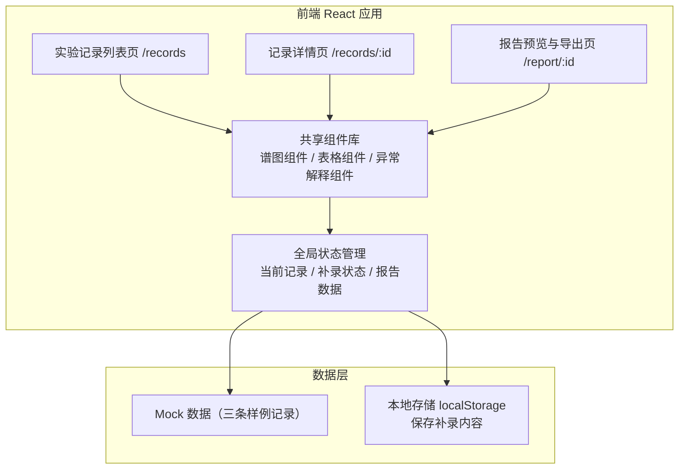
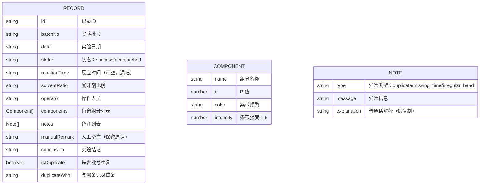

## 1. 架构设计

## 2. 技术描述

- 前端：React@18 + TypeScript + tailwindcss@3 + vite
- 初始化工具：vite-init
- 后端：无，纯前端应用，使用 Mock 数据 + localStorage 持久化补录内容
- 数据：内置三条样例记录（顺利/待确认/坏数据）

## 3. 路由定义

| 路由 | 用途 |
|------|------|
| `/` 或 `/records` | 实验记录列表页，展示所有样例记录 |
| `/records/:id` | 单条记录详情页，谱图+数据表+补录操作 |
| `/report/:id` | 报告预览与导出页，整合展示+异常解释+复制/导出 |

## 4. 数据模型

### 4.1 数据模型定义

### 4.2 Mock 样例数据

- **记录1（顺利）**：批号 TLC-2026-0601-01，各字段完整，组分清晰，无异常
- **记录2（待确认）**：批号 TLC-2026-0601-02（与记录1同日），反应时间漏记，Rf值偏移，需补录
- **记录3（坏数据）**：批号 TLC-2026-0601-01（与记录1重复），条带明显拖尾异常，附人工备注原话
