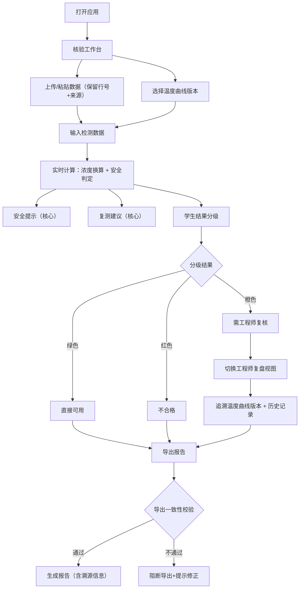

## 1. 产品概述
食品添加剂残留核验工具，面向食品配方工程师和食品专业学生，解决添加剂残留复核过程中的数据追溯、浓度换算、安全判定和结果导出问题。核心价值是让复核流程有据可查、计算过程透明、结果分级清晰。

## 2. 核心功能

### 2.1 用户角色
| 角色 | 登录方式 | 核心权限 |
|------|----------|----------|
| 配方工程师 | 本地免登录（单用户桌面应用） | 完整核验、温度曲线版本管理、导出报告、最终判定 |
| 学生 | 本地免登录（单用户桌面应用） | 执行核验、查看分级结果、标识需工程师复核项 |

### 2.2 功能模块
1. **核验工作台（首页）**：计算工具面板、输入区、实时结果区
2. **工程师复盘视图**：温度曲线版本列表、历史核验记录、溯源详情
3. **学生结果视图**：结果分级卡片、安全提示、复测建议
4. **报告导出**：与界面一致的 PDF/JSON 报告，保留溯源信息

### 2.3 页面详情
| 页面名称 | 模块名称 | 功能描述 |
|----------|----------|----------|
| 核验工作台 | 数据源输入 | 支持粘贴表格数据/上传 CSV，保留原始行号和来源备注 |
| 核验工作台 | 计算工具面板 | 展示公式、单位、适用范围、失败原因，人能看懂的位置 |
| 核验工作台 | 浓度换算 | mg/kg ↔ ppm ↔ μg/mL 多单位换算，关联来源材料批次 |
| 核验工作台 | 安全提示 | 超阈值高亮、国标条款引用、实时提示（核心稳定） |
| 核验工作台 | 复测建议 | 自动生成复测样品数、复测批次、复测方法建议（核心稳定） |
| 工程师复盘 | 温度曲线版本 | 版本号、创建时间、差异对比，不用翻聊天记录 |
| 工程师复盘 | 历史核验 | 按批次/时间检索，一键查看完整计算链路 |
| 学生视图 | 结果分级 | 绿色"直接可用"、橙色"需工程师复核"、红色"不合格" |
| 报告导出 | 一致性校验 | 导出前校验界面摘要与导出内容完全一致 |
| 报告导出 | 溯源信息 | 嵌入原始行号、图片名、来源备注到导出文件 |

## 3. 核心流程
用户打开应用 → 进入核验工作台 → 选择/上传数据源（自动保留行号）→ 选择温度曲线版本 → 输入添加剂检测数据 → 实时计算浓度换算与安全判定 → 查看安全提示和复测建议 → 学生可查看分级结果 → 工程师可切换复盘视图追溯 → 一键导出报告（内容与界面摘要一致）

## 4. 用户界面设计

### 4.1 设计风格
- 主色：深青色 `#0F766E`（科技感+食品安全专业感）
- 辅助色：琥珀黄 `#D97706`（警告）、祖母绿 `#059669`（通过）、赤红 `#DC2626`（不通过）
- 中性色：石板灰系列，确保长文本可读性
- 按钮风格：方中带圆（圆角 6px），主按钮实心带细边框，悬停上浮 +1px 阴影
- 字体：标题用 Noto Serif SC（专业印刷感），正文用 Noto Sans SC
- 布局：左侧数据源面板 + 中央计算工具 + 右侧结果摘要的三栏科研工作台布局
- 图标风格：Lucide 线性图标，统一 18px 尺寸

### 4.2 页面设计概述
| 页面名称 | 模块名称 | UI 元素 |
|----------|----------|---------|
| 核验工作台 | 顶部导航 | 角色切换（工程师/学生）、导出按钮、版本选择下拉 |
| 核验工作台 | 左栏-数据源 | 原始表格展示、行号列、来源备注列、上传区域 |
| 核验工作台 | 中央-计算工具 | 公式卡片（公式+单位+适用范围+失败原因四要素）、输入框、实时计算 |
| 核验工作台 | 右栏-结果摘要 | 分级标识、安全提示横幅、复测建议列表、溯源信链 |
| 工程师复盘 | 曲线版本时间线 | 垂直时间线、版本卡片、差异对比按钮 |
| 工程师复盘 | 历史记录表格 | 批次号、时间、判定、操作列 |
| 学生视图 | 分级结果卡片 | 大色块卡片、状态图标、简洁说明文字 |

### 4.3 响应式
- 桌面优先（1280px+），三栏布局
- 平板（768px-1279px）：左栏可折叠，中右两栏
- 移动端（<768px）：单栏堆叠，顶栏角色选择保留
