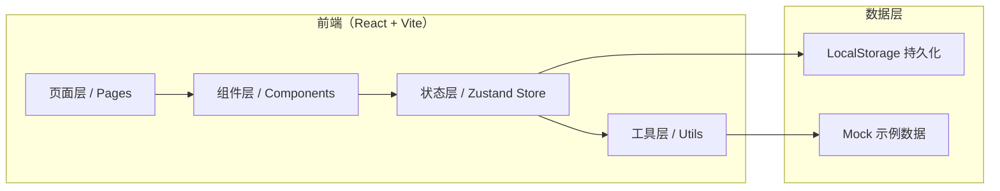
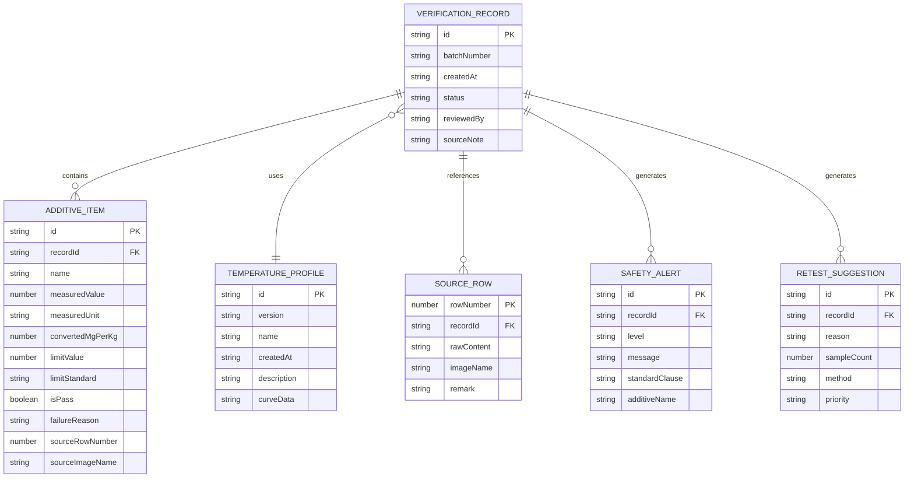

## 1. 架构设计



## 2. 技术说明
- 前端：React@18 + TypeScript + tailwindcss@3 + vite
- 初始化工具：vite-init
- 后端：无（纯前端单页应用，数据 LocalStorage 持久化）
- 数据库：浏览器 LocalStorage + 内置 Mock 示例数据
- 状态管理：zustand
- 图标：lucide-react
- 导出：jsPDF（PDF）+ 原生 JSON 序列化

## 3. 路由定义
| 路由 | 用途 |
|------|------|
| / | 核验工作台（默认首页，包含计算工具、安全提示、复测建议） |
| /review | 工程师复盘视图（温度曲线版本、历史记录、溯源） |
| /result | 学生结果视图（分级结果展示） |

## 4. 数据模型

### 4.1 数据模型定义



### 4.2 状态管理模型

```typescript
// 核验状态
interface VerificationState {
  currentRecord: VerificationRecord | null;
  temperatureProfiles: TemperatureProfile[];
  selectedProfileId: string | null;
  additiveItems: AdditiveItem[];
  sourceRows: SourceRow[];
  safetyAlerts: SafetyAlert[];
  retestSuggestions: RetestSuggestion[];
  historyRecords: VerificationRecord[];
  role: 'engineer' | 'student';

  // 操作
  setRole: (role: 'engineer' | 'student') => void;
  selectProfile: (id: string) => void;
  addSourceRows: (rows: Omit<SourceRow, 'recordId'>[]) => void;
  addAdditiveItem: (item: Omit<AdditiveItem, 'id' | 'recordId'>) => void;
  updateAdditiveItem: (id: string, patch: Partial<AdditiveItem>) => void;
  calculateConversions: () => void;
  runSafetyCheck: () => void;
  generateRetestSuggestions: () => void;
  saveRecord: () => string;
  loadRecord: (id: string) => void;
  exportReport: (format: 'pdf' | 'json') => Blob;
  validateExportConsistency: () => { ok: boolean; mismatches: string[] };
}
```

## 5. 目录结构
```
src/
├── pages/
│   ├── Workbench.tsx       # 核验工作台（首页）
│   ├── Review.tsx          # 工程师复盘视图
│   └── Result.tsx          # 学生结果视图
├── components/
│   ├── workbench/
│   │   ├── DataSourcePanel.tsx    # 左栏：数据源面板
│   │   ├── CalcToolPanel.tsx      # 中栏：计算工具
│   │   └── ResultSummary.tsx      # 右栏：结果摘要
│   ├── review/
│   │   ├── TempProfileTimeline.tsx
│   │   ├── HistoryRecordTable.tsx
│   │   └── TraceabilityChain.tsx
│   ├── result/
│   │   └── GradeResultCard.tsx
│   ├── common/
│   │   ├── RoleSwitcher.tsx
│   │   ├── SafetyAlertBanner.tsx
│   │   ├── RetestSuggestionList.tsx
│   │   └── ExportButton.tsx
│   └── formula/
│       └── FormulaCard.tsx        # 公式卡片（公式+单位+适用范围+失败原因）
├── store/
│   └── useVerificationStore.ts
├── utils/
│   ├── conversion.ts      # 浓度换算
│   ├── safety.ts          # 安全判定
│   ├── retest.ts          # 复测建议生成
│   ├── export.ts          # 导出（PDF/JSON）
│   └── consistency.ts     # 导出一致性校验
├── types/
│   └── index.ts
├── data/
│   └── mockData.ts        # 示例数据
├── App.tsx
├── main.tsx
└── index.css
```
