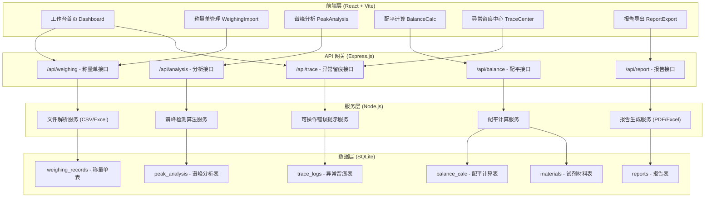
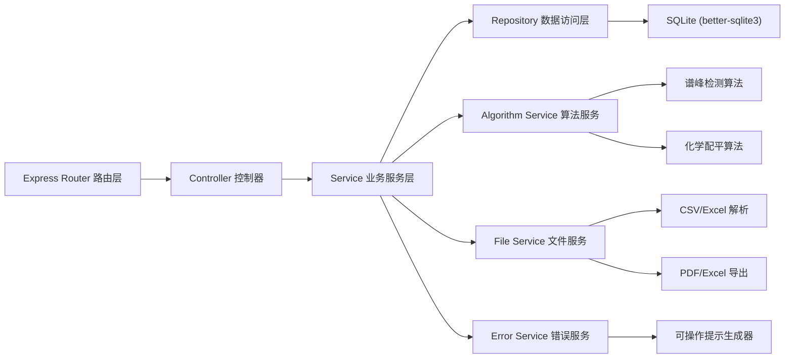
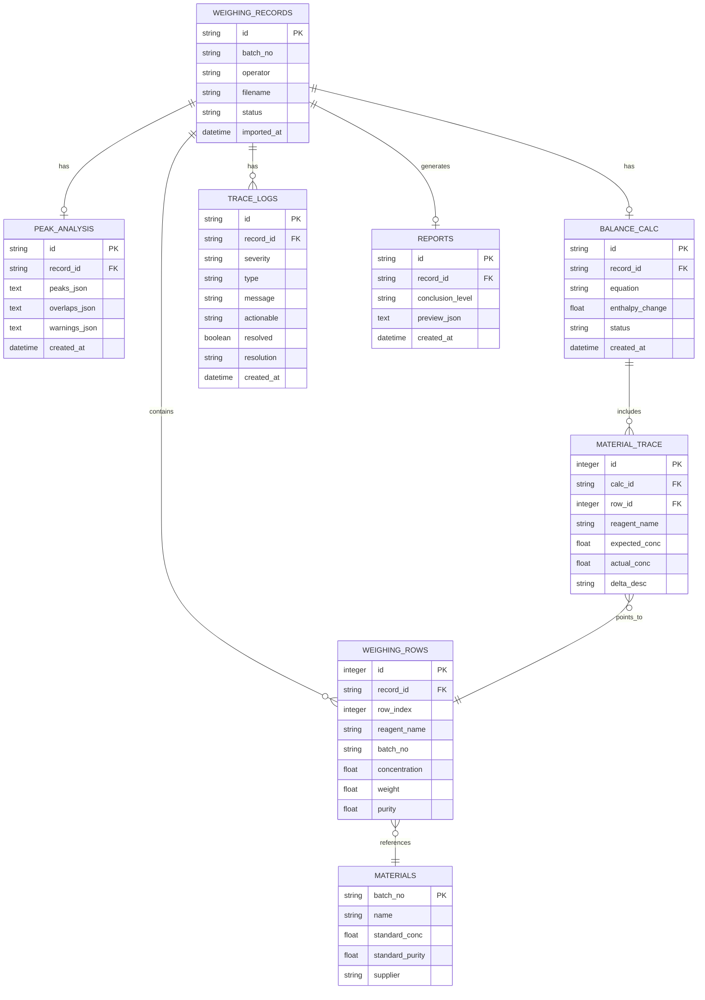

## 1. 架构设计



## 2. 技术说明

- **前端**：React@18 + TypeScript + TailwindCSS@3 + Vite@5
  - 图表：recharts（波形图展示）
  - 文件上传：react-dropzone
  - 状态管理：Zustand
  - UI 组件：自定义组件 + Phosphor Icons
- **初始化工具**：vite-init (npm create vite@latest)
- **后端**：Express@4 + TypeScript
  - 文件解析：csv-parse + xlsx
  - PDF 生成：pdfkit
  - Excel 导出：exceljs
- **数据库**：SQLite（通过 better-sqlite3 驱动，零配置本地文件）
- **数据初始化**：首次启动自动建表 + 导入 3 条样例数据（顺利/待确认/坏数据）

## 3. 路由定义

| 前端路由 | 页面组件 | 用途 |
|----------|----------|------|
| / | Dashboard | 工作台首页：数据概览 + 记录列表 |
| /weighing | WeighingImport | 称量单导入 + 数据预览 |
| /analysis/:id | PeakAnalysis | 谱峰分析 + 温度曲线 + 重叠峰标记 |
| /balance/:id | BalanceCalc | 配平计算 + 材料追溯 |
| /trace | TraceCenter | 异常留痕中心 + 可操作提示 |
| /report/:id | ReportExport | 报告预览 + 分级标识 + 导出 |

## 4. API 定义

### 4.1 通用响应格式

```typescript
interface ApiResponse<T> {
  success: boolean;
  data: T | null;
  error: {
    code: string;
    message: string;
    actionable?: string; // 可操作提示（如"请上传 batch_20240601_03 的温度曲线文件"）
  } | null;
}
```

### 4.2 称量单接口

```typescript
// POST /api/weighing/import
interface WeighingImportRequest {
  file: File; // CSV or Excel
}
interface WeighingImportResponse {
  recordId: string;
  validation: {
    isValid: boolean;
    missingFields: string[];
    suspiciousRows: number[];
  };
  previewData: WeighingRow[];
}

// GET /api/weighing/:id
interface WeighingRecord {
  id: string;
  batchNo: string;
  importedAt: string;
  operator: string;
  rows: WeighingRow[];
  status: 'success' | 'pending' | 'bad';
}
interface WeighingRow {
  reagentName: string;
  batchNo: string;
  concentration: number; // mol/L
  weight: number; // g
  purity: number; // %
}

// GET /api/weighing/list?status=success|pending|bad
```

### 4.3 谱峰分析接口

```typescript
// POST /api/analysis/run/:recordId
interface PeakAnalysisRequest {
  temperatureCurve: number[][]; // [[time, temp], ...]
}
interface PeakAnalysisResponse {
  analysisId: string;
  peaks: Peak[];
  overlaps: OverlapRegion[];
  warnings: string[];
}
interface Peak {
  id: string;
  time: number;
  temperature: number;
  height: number;
  width: number;
}
interface OverlapRegion {
  id: string;
  startTime: number;
  endTime: number;
  peakCount: number;
  confidence: number;
}

// PUT /api/analysis/:id/peaks (人工调整标记)
```

### 4.4 配平计算接口

```typescript
// POST /api/balance/calculate/:recordId
interface BalanceCalcRequest {
  reactants: { formula: string; coefficient?: number }[];
  products: { formula: string; coefficient?: number }[];
}
interface BalanceCalcResponse {
  calcId: string;
  balancedEquation: string;
  enthalpyChange: number; // kJ/mol
  materialTrace: MaterialTraceItem[];
  status: 'success' | 'pending' | 'bad';
}
interface MaterialTraceItem {
  reagentName: string;
  sourceRow: number;
  batchNo: string;
  concentration: number;
  purity: number;
  delta: string; // 浓度偏差描述
}
```

### 4.5 异常留痕接口

```typescript
// GET /api/trace/list
interface TraceLog {
  id: string;
  recordId: string;
  severity: 'low' | 'medium' | 'high';
  type: string; // MISSING_CURVE / CONCENTRATION_ERROR / PEAK_UNCERTAIN / ...
  message: string;
  actionable: string; // 可操作提示
  createdAt: string;
  resolved: boolean;
  resolution?: string;
}

// PUT /api/trace/:id/resolve
```

### 4.6 报告接口

```typescript
// GET /api/report/:id/preview
interface ReportPreview {
  recordId: string;
  conclusionLevel: 'usable' | 'review' | 'reject'; // 绿/黄/红
  summary: string;
  peakAnalysis: PeakAnalysisResponse;
  balanceCalc: BalanceCalcResponse;
  traceLogs: TraceLog[];
}

// GET /api/report/:id/download?format=pdf|excel
```

## 5. 服务端架构图



## 6. 数据模型

### 6.1 ER 图



### 6.2 DDL 建表语句

```sql
-- 称量单主表
CREATE TABLE IF NOT EXISTS weighing_records (
  id TEXT PRIMARY KEY,
  batch_no TEXT NOT NULL,
  operator TEXT,
  filename TEXT,
  status TEXT NOT NULL DEFAULT 'pending',
  imported_at DATETIME DEFAULT CURRENT_TIMESTAMP
);

-- 称量单明细行
CREATE TABLE IF NOT EXISTS weighing_rows (
  id INTEGER PRIMARY KEY AUTOINCREMENT,
  record_id TEXT NOT NULL REFERENCES weighing_records(id),
  row_index INTEGER NOT NULL,
  reagent_name TEXT NOT NULL,
  batch_no TEXT,
  concentration REAL,
  weight REAL,
  purity REAL
);

-- 谱峰分析结果
CREATE TABLE IF NOT EXISTS peak_analysis (
  id TEXT PRIMARY KEY,
  record_id TEXT NOT NULL REFERENCES weighing_records(id),
  peaks_json TEXT,
  overlaps_json TEXT,
  warnings_json TEXT,
  created_at DATETIME DEFAULT CURRENT_TIMESTAMP
);

-- 配平计算结果
CREATE TABLE IF NOT EXISTS balance_calc (
  id TEXT PRIMARY KEY,
  record_id TEXT NOT NULL REFERENCES weighing_records(id),
  equation TEXT,
  enthalpy_change REAL,
  status TEXT NOT NULL DEFAULT 'pending',
  created_at DATETIME DEFAULT CURRENT_TIMESTAMP
);

-- 材料追溯明细
CREATE TABLE IF NOT EXISTS material_trace (
  id INTEGER PRIMARY KEY AUTOINCREMENT,
  calc_id TEXT NOT NULL REFERENCES balance_calc(id),
  row_id INTEGER REFERENCES weighing_rows(id),
  reagent_name TEXT NOT NULL,
  expected_conc REAL,
  actual_conc REAL,
  delta_desc TEXT
);

-- 异常留痕日志
CREATE TABLE IF NOT EXISTS trace_logs (
  id TEXT PRIMARY KEY,
  record_id TEXT NOT NULL REFERENCES weighing_records(id),
  severity TEXT NOT NULL,
  type TEXT NOT NULL,
  message TEXT NOT NULL,
  actionable TEXT,
  resolved INTEGER DEFAULT 0,
  resolution TEXT,
  created_at DATETIME DEFAULT CURRENT_TIMESTAMP
);

-- 报告表
CREATE TABLE IF NOT EXISTS reports (
  id TEXT PRIMARY KEY,
  record_id TEXT NOT NULL REFERENCES weighing_records(id),
  conclusion_level TEXT NOT NULL,
  preview_json TEXT,
  created_at DATETIME DEFAULT CURRENT_TIMESTAMP
);

-- 试剂材料标准库
CREATE TABLE IF NOT EXISTS materials (
  batch_no TEXT PRIMARY KEY,
  name TEXT NOT NULL,
  standard_conc REAL,
  standard_purity REAL,
  supplier TEXT
);

-- 索引
CREATE INDEX IF NOT EXISTS idx_rows_record ON weighing_rows(record_id);
CREATE INDEX IF NOT EXISTS idx_trace_record ON trace_logs(record_id);
CREATE INDEX IF NOT EXISTS idx_trace_severity ON trace_logs(severity);
CREATE INDEX IF NOT EXISTS idx_records_status ON weighing_records(status);
```
