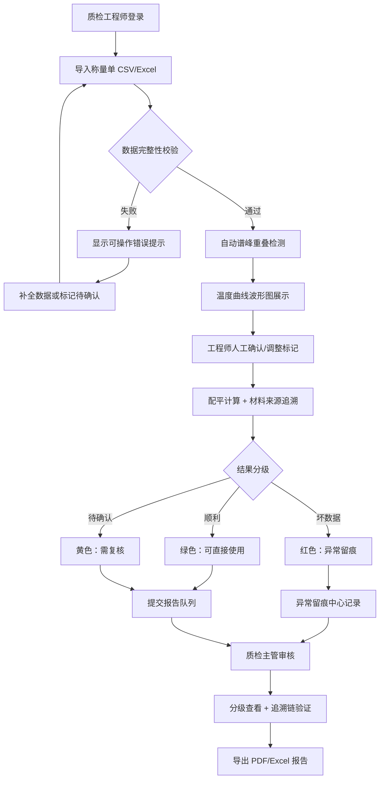

## 1. 产品概述

反应热安全预警系统是为质检工程师与质检主管打造的实验室安全分析工具，专注于化学反应热数据的智能审核、异常留痕与报告生成。通过自动化称量单导入、谱峰重叠检测、配平计算追溯，将零散的实验数据转化为可追溯的安全结论，显著降低人工复核成本与误判风险。

## 2. 核心功能

### 2.1 用户角色

| 角色 | 注册方式 | 核心权限 |
|------|----------|----------|
| 质检工程师 | 本地账户 | 导入称量单、执行谱峰分析、标记异常、提交复核 |
| 质检主管 | 本地账户 | 查看分析结果、区分可用/待复核数据、审批报告、导出报告 |

### 2.2 功能模块

1. **工作台首页**：数据概览卡片、待处理记录列表、快速导入入口
2. **称量单管理**：CSV/Excel 导入、数据校验、原始数据留痕
3. **谱峰分析页**：波形图展示、重叠峰自动标记、人工调整
4. **配平计算页**：反应式配平、热焓计算、材料来源追溯
5. **异常留痕中心**：异常类型统计、可操作错误提示、处理记录链
6. **报告导出页**：多格式报告（PDF/Excel）、结论分级标识、批量导出

### 2.3 页面详情

| 页面名称 | 模块名称 | 功能描述 |
|----------|----------|----------|
| 工作台首页 | 数据概览卡片 | 显示今日分析数、异常数、待复核数、已出报告数 |
| 工作台首页 | 记录状态列表 | 按状态（顺利/待确认/异常）分类展示最近记录 |
| 工作台首页 | 快速导入区 | 拖拽上传称量单文件、一键开始分析 |
| 称量单管理 | 文件导入模块 | 支持 CSV/Excel 格式上传，实时校验字段完整性 |
| 称量单管理 | 数据预览表 | 导入后预览前 20 行，高亮缺失/异常字段 |
| 谱峰分析页 | 温度曲线波形图 | 多曲线叠加展示，支持缩放、平移、区间选择 |
| 谱峰分析页 | 重叠峰检测面板 | 自动识别并标记重叠峰区域，可人工添加/删除 |
| 配平计算页 | 反应式配平器 | 输入反应物/生成物，自动配平并计算 ΔH |
| 配平计算页 | 材料来源追溯 | 将计算结论关联回称量单中的原始试剂批次 |
| 异常留痕中心 | 异常列表 | 按严重程度排序，显示异常原因、影响范围、建议操作 |
| 异常留痕中心 | 错误提示气泡 | 处理失败时给出可操作提示（如"缺少 2024-06-01_batch03 的温度曲线"） |
| 报告导出页 | 报告预览 | 分级结论标识（绿色=可直接使用、黄色=需复核、红色=数据异常） |
| 报告导出页 | 导出面板 | 支持 PDF/Excel 导出，可选择报告模板与字段范围 |

## 3. 核心流程

### 3.1 质检工程师工作流

质检工程师登录工作台 → 拖拽导入称量单（CSV/Excel）→ 系统自动校验数据完整性 → 校验通过后触发谱峰分析 → 系统识别重叠峰并展示温度曲线 → 工程师人工确认或调整标记 → 系统执行配平计算并关联原始材料 → 若数据异常：系统显示可操作错误提示（如缺哪份温度曲线）→ 工程师补全数据或标记为待确认 → 提交结果进入报告队列

### 3.2 质检主管审核流

质检主管登录 → 查看待审核报告列表 → 系统以颜色分级标识：绿色（可直接使用）、黄色（需工程师复核）、红色（数据异常）→ 点击查看详情：材料追溯链、异常处理记录、配平计算过程 → 可一键通过/退回/导出 → 导出为 PDF 或 Excel 报告

## 4. 用户界面设计

### 4.1 设计风格

- **主色调**：实验室安全蓝（#1E3A5F 深靛蓝）作为主色，搭配警示黄（#E8A838）与安全绿（#2D8659），异常红（#C0392B）用于严重告警
- **按钮风格**：微圆角（6px），主按钮使用深蓝渐变 + 微弱阴影，次级按钮采用描边样式
- **字体**：标题使用 Playfair Display（精致衬线体体现专业感），正文使用 JetBrains Mono（等宽字体适合数据密集型界面）
- **布局风格**：顶部固定导航栏 + 左侧功能菜单 + 右侧内容区，卡片式模块布局，信息密度适中
- **图标风格**：线性简约图标，统一 2px 线条宽度，使用 Phosphor Icons 风格
- **特殊细节**：数据卡片采用微玻璃拟态效果（半透明背景 + 模糊边框），异常记录卡片添加左侧彩色竖条状态指示

### 4.2 页面设计概览

| 页面名称 | 模块名称 | UI 元素 |
|----------|----------|---------|
| 工作台首页 | 数据概览卡片 | 4 张玻璃拟态卡片，数字使用大号 Playfair Display，底部趋势小箭头 |
| 工作台首页 | 记录状态列表 | 三列横向布局，每列顶部有色条（绿/黄/红），卡片悬浮微上浮动画 |
| 称量单管理 | 导入区 | 虚线边框拖拽区，中心显示上传图标 + "拖入称量单文件或点击上传" |
| 谱峰分析页 | 波形图 | 深色背景绘图区，曲线使用高对比度颜色，重叠峰区域半透明红色高亮 |
| 异常留痕中心 | 异常列表 | 每行左侧状态色条，错误提示使用黄色背景气泡，建议操作使用绿色按钮 |
| 报告导出页 | 报告预览 | 分级徽标（绿/黄/红圆点 + 文字），追溯链使用时间线样式展示 |

### 4.3 响应式

- 桌面端优先设计（最小支持 1280px 宽度）
- 平板端（768px-1280px）：左侧菜单折叠为图标栏，卡片自适应两列
- 移动端（<768px）：底部 Tab 导航，波形图简化为单指缩放模式
- 所有数据表格支持横向滚动，关键列冻结
