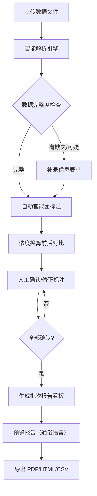

## 1. 产品概述

红外谱图官能团标注系统是一款面向化学/材料专业学生和实验室人员的数据分析工具。核心解决"谱图数据不完整、反应信息晚到、人工判断口径不一"的日常痛点，围绕批次报告这条主线，提供数据上传、智能解析、官能团标注、浓度换算对比、人工确认与报告导出的一站式工作流。

- 目标用户：化学系学生、实验室助理、非技术背景的实验人员
- 核心价值：让不完整数据也能用、让判断过程可追溯、让报告人人看得懂

## 2. 核心功能

### 2.1 用户角色

| 角色 | 说明 | 核心权限 |
|------|------|----------|
| 学生用户 | 上传自己的实验数据进行分析 | 上传数据、查看标注、导出报告、人工确认 |
| 教师/助教 | 审核学生数据，提供反馈 | 全部学生权限 + 批量审核 |

### 2.2 功能模块

1. **数据上传与解析页**：拖拽上传 CSV/Excel，自动识别混乱格式（旧表、补录备注、漏填单位），实时预览解析结果
2. **批次报告看板页**：同一数据源驱动图表（谱图曲线、官能团分布）、明细表格、下载按钮，浓度换算前后对比一目了然
3. **官能团标注工作区**：自动标注 + 人工修正，支持补录反应条件、确认漏记反应时间，完整记录每次修改
4. **报告导出页**：生成面向非技术人员的 PDF/HTML 报告，用通俗语言解释缺失原因（而非字段名和缩写）

### 2.3 页面详情

| 页面名称 | 模块名称 | 功能描述 |
|-----------|-------------|---------------------|
| 数据上传与解析页 | 文件拖拽区 | 支持 CSV/Excel 拖拽上传，显示文件格式说明 |
| 数据上传与解析页 | 智能解析引擎 | 自动识别旧表头、补录备注行、漏填单位，标记可疑数据 |
| 数据上传与解析页 | 解析预览表 | 双色标记：绿色=正常，黄色=已补录，红色=缺失待处理 |
| 数据上传与解析页 | 样例数据加载 | 一键载入贴近日常的样例（含坏数据） |
| 批次报告看板页 | 谱图曲线图 | 显示红外吸收峰曲线，标注识别的官能团位置 |
| 批次报告看板页 | 官能团分布饼图 | 统计本次批次识别到的官能团类别占比 |
| 批次报告看板页 | 浓度换算对比卡 | 展示换算前/换算后的判断结果差异，高亮变化项 |
| 批次报告看板页 | 数据明细表 | 与图表同源的原始数据 + 解析结果，支持筛选排序 |
| 批次报告看板页 | 重复运行按钮 | 使用当前参数重新跑一次分析，记录运行历史 |
| 官能团标注工作区 | 自动标注面板 | 显示算法识别的官能团、波数范围、置信度 |
| 官能团标注工作区 | 人工修正区 | 可增删改标注，添加备注，记录修改人/时间 |
| 官能团标注工作区 | 补录信息表单 | 补充晚到的反应条件、漏记的反应时间，不丢弃原有数据 |
| 官能团标注工作区 | 人工确认复选框 | 每条标注需人工确认后方可进入最终报告 |
| 报告导出页 | 报告预览区 | 所见即所得的报告预览，模拟最终导出效果 |
| 报告导出页 | 缺失原因说明 | 将"blank_ctrl_missing"等字段翻译为通俗解释（如"本批次未做空白对照实验，可能影响背景扣除精度"） |
| 报告导出页 | 导出格式选择 | 支持 PDF、HTML、CSV 三种格式 |
| 报告导出页 | 导出记录 | 列出所有历史导出，方便追溯 |

## 3. 核心流程

用户上传实验数据文件 → 系统智能解析（自动识别混乱格式、标记可疑数据）→ 用户补录缺失信息（反应条件、反应时间等）→ 系统自动标注官能团并进行浓度换算 → 用户人工确认每条标注（可修正）→ 系统生成批次报告（图表+明细+对比）→ 导出面向非技术人员的报告（通俗语言解释缺失）

## 4. 用户界面设计

### 4.1 设计风格

- **主色调**：深靛蓝 #1e3a5f（专业、稳重），辅色：琥珀橙 #f59e0b（标注、警示）
- **按钮风格**：微圆角（6px）、轻微阴影、hover 时上浮 1px + 阴影加深
- **字体**：标题用 "Source Serif 4"（衬线，学术感），正文用 "DM Sans"（无衬线，易读）
- **布局风格**：卡片式布局，左侧导航 + 右侧内容区，数据看板采用网格不对称布局
- **图标风格**：Lucide 线性图标，统一 20px 尺寸，标注状态用颜色圆点

### 4.2 页面设计概述

| 页面名称 | 模块名称 | UI 元素 |
|-----------|-------------|-------------|
| 数据上传与解析页 | 文件拖拽区 | 虚线边框 + 渐变色背景，拖拽时边框变为实线琥珀色，文件图标居中 |
| 数据上传与解析页 | 解析预览表 | 斑马纹 + 三色行背景（绿/黄/红），悬停行高亮，右侧有快速补录按钮 |
| 批次报告看板页 | 谱图曲线图 | 深色背景画布，曲线用渐变描边，官能团标注用垂直虚线 + 悬浮提示 |
| 批次报告看板页 | 浓度换算对比卡 | 左右分栏对比，变化项用箭头 + 高亮色，中间有"→"符号 |
| 官能团标注工作区 | 人工确认复选框 | 自定义复选框（方框打勾），确认后整行变浅绿，显示确认人 |
| 报告导出页 | 缺失原因说明 | 黄色浅底卡片，左侧感叹号图标，右侧通俗文字解释 |

### 4.3 响应式

桌面端优先设计（≥1280px），平板端（768-1279px）两列布局，移动端（<768px）单列堆叠，触摸目标 ≥44px。

