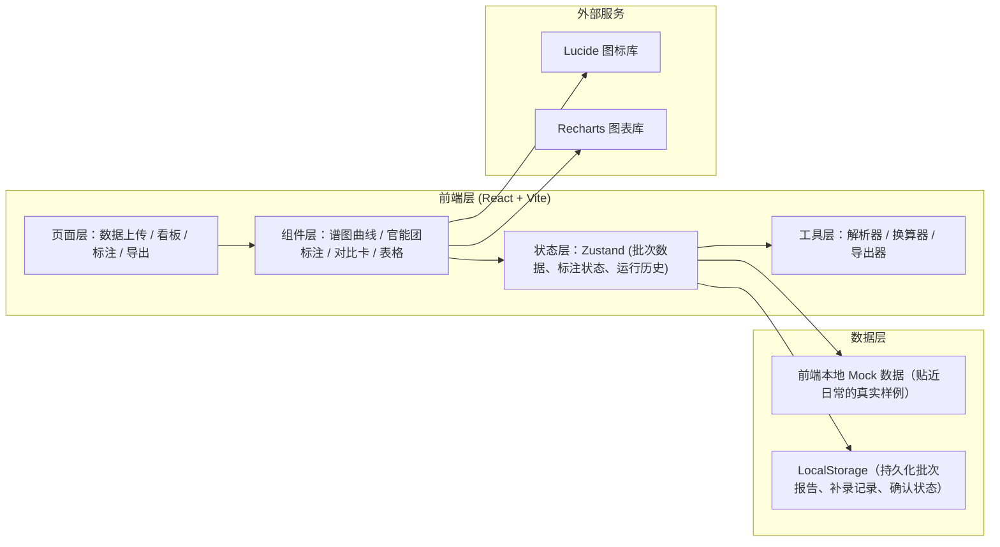
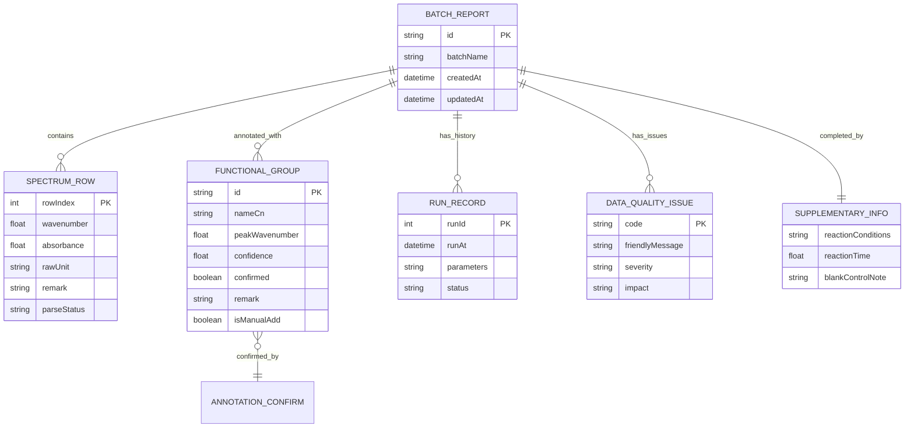

## 1. 架构设计



## 2. 技术描述

- **前端**：React@18 + TypeScript + TailwindCSS@3 + Vite@5
- **初始化工具**：vite-init（react-ts 模板）
- **后端**：无后端，纯前端 + LocalStorage 持久化
- **数据存储**：LocalStorage（批次报告、运行历史、人工确认记录）
- **图表**：Recharts（谱图曲线、饼图、柱状对比图）
- **状态管理**：Zustand
- **图标**：Lucide React
- **文件解析**：自定义 CSV/Excel 解析（纯前端，支持混乱格式识别）

## 3. 路由定义

| 路由 | 用途 |
|-------|---------|
| / | 数据上传与解析页（首页） |
| /dashboard | 批次报告看板页 |
| /annotation | 官能团标注工作区 |
| /export | 报告导出预览页 |

## 4. API 定义

本项目无后端，所有数据操作通过前端工具函数完成：

```typescript
// 数据解析相关
interface ParseResult {
  success: boolean;
  data: SpectrumRow[];
  warnings: ParseWarning[];
  errors: ParseError[];
}

type ParseWarning = {
  type: 'missing_unit' | 'late_reaction_condition' | 'old_format_header' | 'remark_detected';
  rowIndex: number;
  message: string;
  suggestedFix?: string;
};

// 官能团标注相关
interface FunctionalGroup {
  id: string;
  name: string;
  nameCn: string;
  wavenumberStart: number;
  wavenumberEnd: number;
  peakWavenumber: number;
  confidence: number;
  confirmed: boolean;
  confirmedBy?: string;
  confirmedAt?: Date;
  remark?: string;
  isManualAdd: boolean;
}

// 浓度换算对比
interface ConcentrationComparison {
  before: {
    value: number;
    unit: string;
    judgment: string;
  };
  after: {
    value: number;
    unit: string;
    judgment: string;
  };
  changed: boolean;
}

// 批次报告
interface BatchReport {
  id: string;
  batchName: string;
  createdAt: Date;
  updatedAt: Date;
  spectrumData: SpectrumRow[];
  annotations: FunctionalGroup[];
  concentrationComparisons: ConcentrationComparison[];
  runHistory: RunRecord[];
  supplementaryInfo: SupplementaryInfo;
  dataQuality: DataQualityIssue[];
}

// 缺失原因翻译（面向非技术人员）
type DataQualityIssue = {
  code: string;
  friendlyMessage: string;
  severity: 'info' | 'warning' | 'error';
  impact: string;
};
```

## 5. 数据模型

### 6.1 数据模型 ER 图



### 6.2 初始数据（贴近日常的真实样例）

- 包含 1 个完整批次（含旧表头格式、补录备注行、漏填单位、空白对照缺失、反应时间漏记、反应条件晚到等真实问题）
- 包含 8-12 条官能团标注数据（3 条待确认、2 条需补录、1 条人工添加）
- 包含 3 次运行历史（首次自动运行、补录后重跑、人工确认后再跑）
- 包含 5 条数据质量问题（每条都有通俗语言解释）

