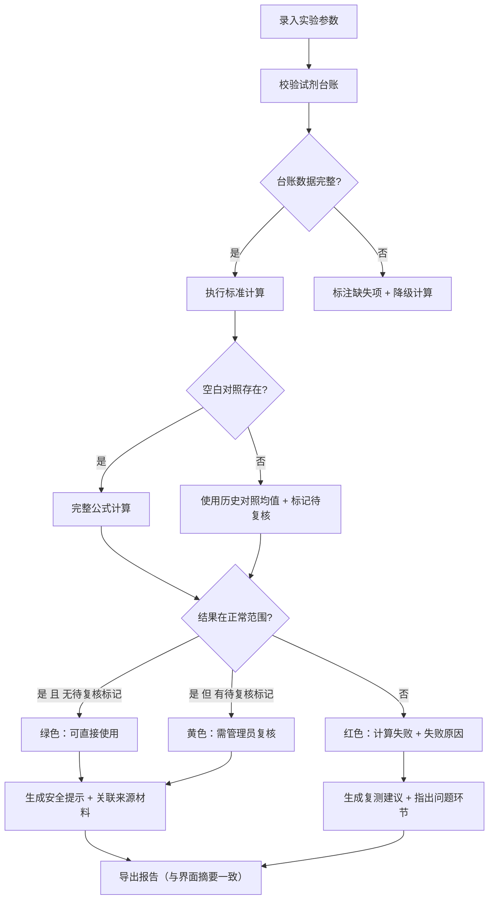

## 1. 产品概述
面向课题组实验室的晶体水含量计算与管理工具，解决批次报告不齐、空白对照缺失、试剂台账混乱等问题，让实验人员与管理员高效协作。
- 核心目标：将晶体水含量计算过程标准化、透明化，自动区分可直接使用结果与需管理员复核结果
- 目标用户：课题组实验人员、实验室管理员、课题负责人

## 2. 核心功能

### 2.1 用户角色
| 角色 | 核心权限 |
|------|----------|
| 实验人员 | 录入实验数据、查看计算结果、申请复测、导出报告 |
| 实验室管理员 | 管理试剂台账、标记复核结果、维护批次追踪、处理异常数据 |

### 2.2 功能模块
1. **计算工作台**：核心计算区，输入样品质量、干燥后质量、空白对照等参数，实时计算并显示公式推导
2. **试剂台账管理**：试剂登记、空值检测、重复条目合并、备注结构化解析
3. **批次追踪**：按批次号关联所有实验记录、试剂使用、计算结果与复测历史
4. **结果总览**：结果分级展示（绿色通过/黄色待复核/红色失败）、安全提示、复测建议
5. **报告导出**：导出PDF/CSV，确保与界面摘要完全一致

### 2.3 页面详情
| 页面名称 | 模块名称 | 功能描述 |
|-----------|-------------|---------------------|
| 计算工作台 | 参数输入区 | 样品编号、批次号、试剂选择、样品质量(g)、干燥后质量(g)、空白对照值、平行样数量 |
| 计算工作台 | 公式展示区 | 实时显示计算公式、代入数值、单位换算、适用范围说明 |
| 计算工作台 | 异常诊断区 | 空白对照缺失时给出替代方案与失败原因分析 |
| 试剂台账 | 试剂列表 | 试剂编号、名称、批号、纯度、入库日期、状态标记 |
| 试剂台账 | 数据清洗工具 | 空值高亮、重复检测合并、备注字段结构化提取（浓度/批号/有效期） |
| 批次追踪 | 批次时间线 | 批次号→试剂→实验记录→计算结果→复测的完整追溯链 |
| 批次追踪 | 安全风险面板 | 试剂过期、批次异常、质控超标的红色预警 |
| 结果总览 | 结果分级卡片 | 绿色=可直接使用、黄色=需管理员复核、红色=计算失败/数据异常 |
| 结果总览 | 复测建议 | 自动关联来源材料，指出哪一步需要复测及复测优先级 |
| 报告导出 | 预览与导出 | 先预览与界面摘要一致的报告内容，再导出PDF/CSV |

## 3. 核心流程

实验人员在计算工作台录入样品参数 → 系统校验试剂台账完整性 → 执行晶体水含量计算（空白对照缺失时走降级方案并标记） → 自动分级结果（通过/待复核/失败） → 生成安全提示与复测建议 → 导出与界面摘要一致的报告

## 4. 用户界面设计

### 4.1 设计风格
- **主色调**：深青蓝 `#0E4C5C`（科研专业感）
- **辅助色**：警示琥珀 `#F59E0B`、安全绿 `#10B981`、危险红 `#EF4444`
- **中性色**：冷灰系列，背景 `#F8FAFC`，卡片白 `#FFFFFF`
- **按钮风格**：方中带圆（圆角8px），主按钮有细边框+轻微阴影
- **字体**：标题用"思源宋体"体现学术感，正文用"Inter"保证数据可读性
- **布局风格**：顶部导航 + 左侧功能菜单 + 右侧主内容区的三栏式专业布局
- **图标**：使用 lucide-react 的线性图标，保持一致的2px描边

### 4.2 页面设计概览
| 页面名称 | 模块名称 | UI元素 |
|-----------|-------------|-------------|
| 计算工作台 | 参数输入区 | 左侧表单卡片，分组标签用顶部Tab切换，输入框带单位后缀 |
| 计算工作台 | 公式展示区 | 右侧代码风格卡片，等宽字体显示公式，数值高亮，鼠标悬浮显示单位说明 |
| 计算工作台 | 异常诊断区 | 底部警示条，黄色背景带图标，可展开查看失败原因详情 |
| 结果总览 | 结果分级卡片 | 大色块卡片，顶部色条+图标+状态文字，中间数值，底部操作按钮 |
| 批次追踪 | 批次时间线 | 垂直时间轴，节点带状态色点，连接线为虚线，可点击展开详情 |
| 试剂台账 | 数据行 | 空值单元格标浅红底色，重复行左侧有合并图标，备注字段悬停显示结构化解析结果 |

### 4.3 响应式
桌面端优先（1280px以上），平板端折叠左侧菜单为抽屉，移动端将卡片垂直堆叠，表格转为卡片列表。
