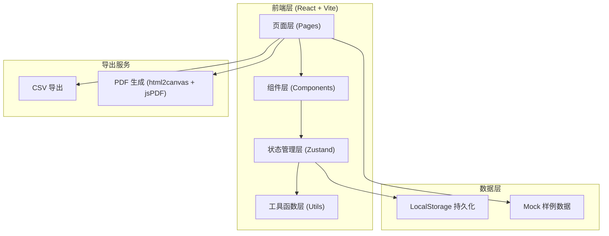
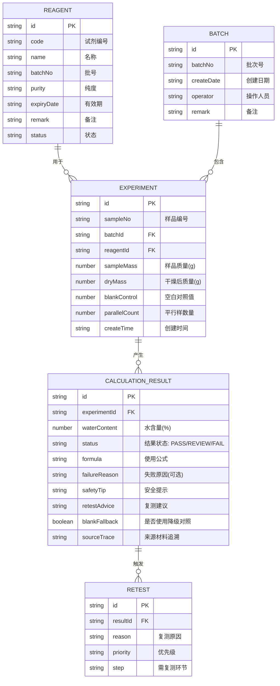

## 1. 架构设计

## 2. 技术说明
- 前端：React@18 + TypeScript + tailwindcss@3 + Vite
- 状态管理：zustand（轻量、支持本地持久化中间件）
- 路由：react-router-dom
- 图标：lucide-react
- PDF导出：html2canvas + jspdf
- 数据持久化：LocalStorage（无需后端，纯前端可运行）
- 初始化工具：vite-init

## 3. 路由定义
| 路由 | 用途 |
|-------|---------|
| / | 计算工作台（默认首页） |
| /reagent | 试剂台账管理 |
| /batch | 批次追踪 |
| /results | 结果总览 |

## 4. 数据模型

### 4.1 数据模型实体关系

### 4.2 计算核心公式

晶体水含量计算公式：
- **标准公式（有空白对照）**：
  H₂O(%) = [(m₁ - m₂ - B) / m₁] × 100%
  其中 m₁=样品质量，m₂=干燥后质量，B=空白对照值

- **降级公式（空白对照缺失）**：
  H₂O(%) = [(m₁ - m₂ - B̄) / m₁] × 100%
  其中 B̄=同试剂近30天空白对照均值（结果自动标记为"需管理员复核"）

- **适用范围**：结晶水含量 0.5% ~ 50% 的无机/有机晶体样品
- **平行样偏差阈值**：≤ 0.5%（超出则标记"需复核"）
