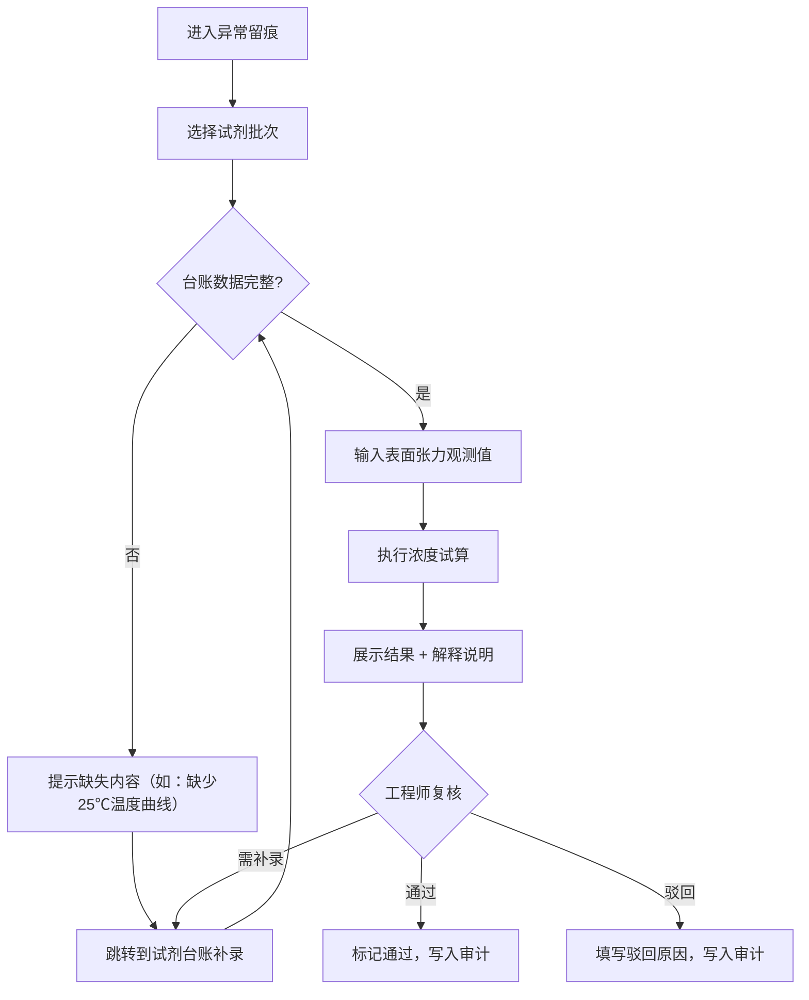
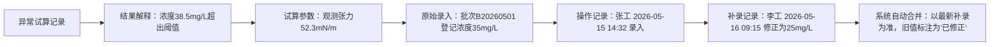

## 1. 产品概述

表面张力浓度试算系统是为质检工程师设计的专业质量管控工具，解决旧流程过度依赖人工经验、试剂台账补录后结果变化不可追溯的痛点。系统通过双入口设计（日常异常留痕、月底批次追踪），提供可解释的试算结果、全链路回溯、可操作错误提示和防重复结论机制，让质检工作从"凭经验"走向"可追溯、可复核、可讲解"。

- **目标用户**：质检工程师、实验室主管、授课教师
- **核心价值**：结果可解释、过程可追溯、错误可操作、数据不重复

---

## 2. 核心功能

### 2.1 用户角色

| 角色 | 使用场景 | 核心权限 |
|------|---------|---------|
| 质检工程师 | 日常试算、复核异常、导出报告 | 全部功能：试算、留痕、回溯、导出、补录 |
| 实验室主管 | 月底批次追踪、审核结论 | 批次追踪、查看所有记录、审核确认 |
| 授课教师 | 课前案例讲解 | 查看结果解释、演示追溯链路 |

### 2.2 功能模块

1. **异常留痕（日常入口）**：试算列表、新建试算、结果展示带解释、快速复核
2. **批次追踪（月底/课前入口）**：按批次聚合、时间线视图、变更审计、解释说明
3. **试剂台账管理**：试剂录入、补录记录、去重校验、导入历史
4. **全链路回溯**：从结果→试算过程→原始数据→操作记录的完整追溯
5. **导出中心**：导出内容与界面摘要严格一致、支持 PDF/Excel

### 2.3 页面详情

| 页面名称 | 模块名称 | 功能描述 |
|---------|---------|----------|
| 异常留痕首页 | 试算列表卡片 | 展示今日/本周待复核记录，状态标签，快速进入试算详情 |
| 异常留痕首页 | 新建试算表单 | 试剂选择、温度曲线上传、浓度输入、提交校验 |
| 试算详情页 | 结果解释区 | 试算数值 + 1-2句自然语言解释，支持展开详细推理过程 |
| 试算详情页 | 错误提示区 | 处理失败时展示可操作指引（如"缺少批次B20260601的25℃温度曲线，请在试剂台账中补充"） |
| 试算详情页 | 来源追溯面板 | 可视化链路：结果 → 计算参数 → 原始数据 → 录入/补录记录 → 操作人 |
| 试算详情页 | 复核操作 | 通过/驳回/补录入口，操作时自动记录审计日志 |
| 批次追踪页 | 批次聚合视图 | 按试剂批次号分组展示所有试算记录，变更高亮显示 |
| 批次追踪页 | 时间线组件 | 展示该批次下所有录入、补录、试算、复核操作的时间线 |
| 试剂台账页 | 台账列表 | 试剂记录展示，标注补录/修改记录，去重冲突提示 |
| 试剂台账页 | 录入/补录表单 | 支持新增和补录，自动检测重复（同一批次+同一指标不允许多份结论） |
| 导出弹窗 | 导出配置 | 选择格式（PDF/Excel），实时预览导出内容与页面摘要一致性 |

---

## 3. 核心流程

### 3.1 日常试算流程（异常留痕入口）

质检工程师日常工作中遇到需要试算的样本，进入异常留痕页面发起试算：

1. 选择试剂批次号 → 系统自动拉取台账中已有数据
2. 上传/关联温度曲线数据 → 系统校验完整性
3. 输入观测表面张力值 → 触发浓度试算
4. 系统展示试算结果 + 自然语言解释
5. 工程师复核：通过 / 驳回（需填原因）/ 发起补录
6. 操作记录自动写入审计日志，可追溯

### 3.2 验收场景：试剂浓度错填记录倒查

以一条试剂浓度错填的记录为起点，验证全链路追溯能力：

1. 在异常留痕中找到标记为"浓度异常"的试算记录
2. 点击"追溯来源" → 展开可视化链路
3. 沿链路回溯：异常结果 → 试算参数（发现浓度值偏高）→ 原始录入记录 → 操作人+时间
4. 查看是否有补录记录 → 系统自动合并同批次同指标记录，不产生重复结论
5. 导出该记录 → 验证导出内容与页面摘要完全一致

---

## 4. 用户界面设计

### 4.1 设计风格

- **设计语言**：专业工业风（Industrial Professional）——质检是严肃的专业工作，界面需要传达信任感、精确度和可追溯性
- **主色调**：深海蓝 `#1e3a5f` — 代表专业、严谨；辅助色：校准橙 `#e8743b` — 用于异常标记和操作强调
- **中性色**：石板灰系列 `#f8fafc, #e2e8f0, #94a3b8, #334155` — 用于文本、边框和背景
- **按钮风格**：直角微圆角（2px），坚实边框，hover 时轻微下沉效果，强调"可点击、可操作"
- **字体**：标题使用"思源宋体 SemiBold"体现专业感，正文使用"Inter Regular"保证可读性，数据数值使用等宽字体"JetBrains Mono"
- **布局风格**：信息密度适中的卡片式布局，重要数据（试算结果、浓度值）使用大号等宽字体突出显示
- **图标风格**：Lucide 线性图标，统一 1.5px 线宽，保持专业简洁感

### 4.2 页面设计概览

| 页面名称 | 模块名称 | UI 设计要素 |
|---------|---------|------------|
| 异常留痕首页 | 顶部统计栏 | 深蓝色背景卡片，展示待复核/已通过/异常数量，大号数值 + 等宽字体 |
| 异常留痕首页 | 试算记录列表 | 每行一条记录，左侧状态色块（绿/橙/红），中间核心数据，右侧操作按钮 |
| 试算详情页 | 结果解释卡片 | 顶部大号结果数值，下方灰底解释文字（1-2句），右侧"展开详情"按钮 |
| 试算详情页 | 错误提示卡片 | 橙红色左边框 + 警告图标，标题说明问题类型，正文给出具体操作步骤 |
| 试算详情页 | 来源追溯面板 | 时间线布局，节点用圆点+连接线，每个节点可点击展开详情 |
| 批次追踪页 | 批次选择器 | 左侧批次列表，选中高亮，右侧展示该批次全部信息 |
| 试剂台账页 | 去重冲突提示 | 黄色背景横幅，文字说明"检测到同批次同指标的两份记录，已自动合并" |

### 4.3 响应式

- **桌面优先**：所有核心操作在桌面端完成（≥1280px），主内容区宽度 1200px 居中
- **平板适配**（768-1279px）：侧边栏收起为图标模式，列表密度调整
- **手机适配**（<768px）：底部 Tab 导航，卡片纵向堆叠，追溯链路简化展示

### 4.4 动效设计

- 页面加载：内容从下向上 12px 渐入，错开 50ms 延迟
- 状态切换：颜色过渡 200ms ease-out，数值变化使用数字滚动动画
- 追溯链路展开：连接线 SVG stroke-dasharray 动画绘制
- 错误提示出现：左侧边框从 0 宽度展开到 4px，伴随内容淡入
