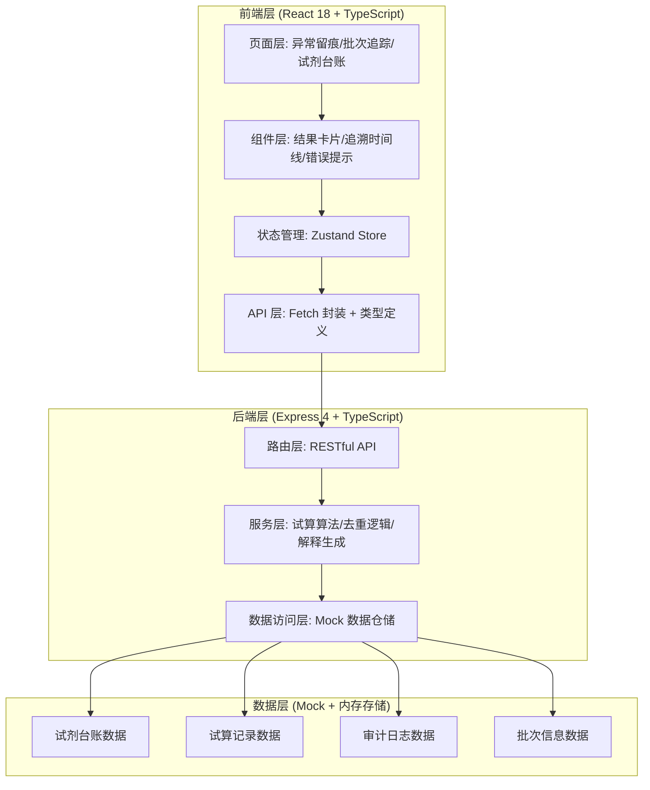
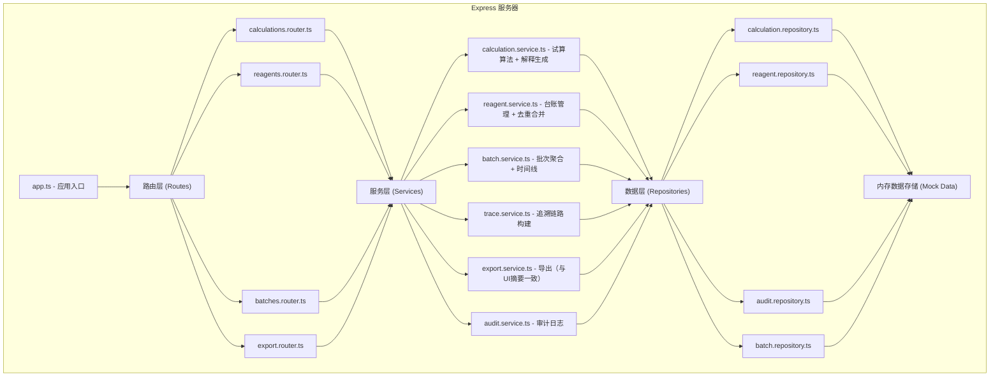
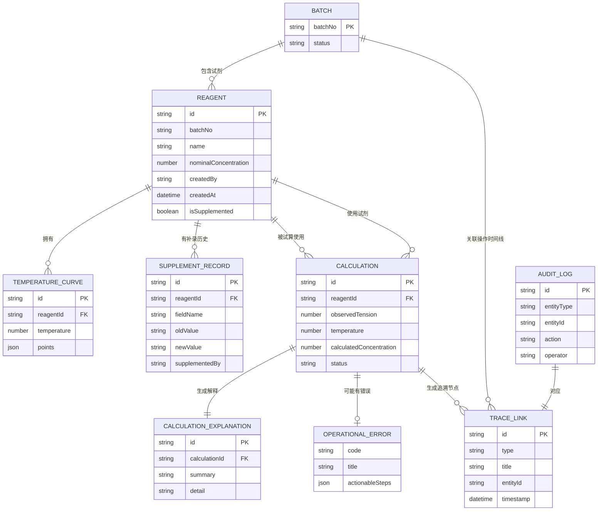

## 1. 架构设计



## 2. 技术描述

- **前端框架**: React@18 + TypeScript + Vite
- **UI 样式**: TailwindCSS@3
- **状态管理**: Zustand
- **路由管理**: React Router DOM
- **图标库**: Lucide React
- **后端框架**: Express@4 + TypeScript
- **初始化工具**: vite-init（react-express-ts 模板）
- **数据存储**: 内存 Mock 数据（开发演示用），服务重启后恢复初始数据集
- **导出功能**: SheetJS (xlsx) 生成 Excel，jsPDF 生成 PDF

## 3. 路由定义

### 3.1 前端路由

| 路由路径 | 页面名称 | 说明 |
|---------|---------|------|
| `/` | 异常留痕首页 | 日常入口，展示试算列表和快速操作 |
| `/calculation/:id` | 试算详情页 | 展示试算结果、解释、追溯链路、复核操作 |
| `/batch-tracking` | 批次追踪页 | 月底/课前入口，按批次聚合查看 |
| `/reagent-ledger` | 试剂台账页 | 试剂录入、补录、去重管理 |
| `/reagent-ledger/new` | 试剂录入页 | 新增试剂记录表单 |
| `/reagent-ledger/:id/supplement` | 试剂补录页 | 补录已有记录的缺失数据 |

### 3.2 后端 API 路由

| 方法 | 路由路径 | 用途 |
|-----|---------|------|
| GET | `/api/calculations` | 获取试算记录列表（支持筛选、分页） |
| GET | `/api/calculations/:id` | 获取单条试算详情（含追溯链路） |
| POST | `/api/calculations` | 新建表面张力浓度试算 |
| PUT | `/api/calculations/:id/review` | 复核试算结果（通过/驳回） |
| GET | `/api/calculations/:id/trace` | 获取试算的完整追溯链路 |
| GET | `/api/reagents` | 获取试剂台账列表 |
| GET | `/api/reagents/:id` | 获取单条试剂详情 |
| POST | `/api/reagents` | 新增试剂记录（自动去重校验） |
| PUT | `/api/reagents/:id/supplement` | 补录试剂数据（合并逻辑） |
| GET | `/api/batches` | 获取批次列表 |
| GET | `/api/batches/:batchNo` | 获取批次详情（含该批次所有操作时间线） |
| GET | `/api/calculations/:id/export` | 导出试算报告（与界面摘要一致） |
| GET | `/api/temperature-curves` | 获取可用温度曲线列表（用于校验缺失） |

## 4. API 类型定义

```typescript
// ============ 共享类型（前后端通用） ============

// 试剂台账
interface Reagent {
  id: string;
  batchNo: string;                    // 批次号，去重关键字段之一
  name: string;                        // 试剂名称
  nominalConcentration: number;        // 标称浓度 (mg/L)
  actualConcentration?: number;        // 实测浓度 (mg/L)
  temperatureCurves: TemperatureCurve[]; // 关联的温度曲线
  supplier?: string;
  productionDate?: string;
  expiryDate?: string;
  createdBy: string;
  createdAt: string;
  updatedBy?: string;
  updatedAt?: string;
  isSupplemented: boolean;             // 是否经过补录
  supplementHistory: SupplementRecord[]; // 补录历史
  status: 'active' | 'superseded' | 'archived';
  supersededById?: string;             // 被哪条记录取代（去重合并时使用）
}

// 温度曲线
interface TemperatureCurve {
  id: string;
  temperature: number;                 // 温度 (℃)
  points: { tension: number; concentration: number }[]; // 校准点
  source: 'calibration' | 'literature' | 'supplement';
  measuredAt?: string;
}

// 补录记录
interface SupplementRecord {
  id: string;
  fieldName: string;                   // 补录的字段名
  oldValue?: string;
  newValue: string;
  supplementedBy: string;
  supplementedAt: string;
  reason: string;
}

// 试算记录
interface Calculation {
  id: string;
  reagentId: string;
  reagentBatchNo: string;
  observedTension: number;             // 观测表面张力 (mN/m)
  temperature: number;                 // 测量温度 (℃)
  calculatedConcentration: number;     // 试算浓度 (mg/L)
  deviation: number;                   // 与标称浓度偏差 (%)
  explanation: CalculationExplanation; // 结果解释
  status: 'pending' | 'passed' | 'rejected' | 'error';
  error?: OperationalError;            // 可操作错误信息
  reviewedBy?: string;
  reviewedAt?: string;
  reviewNote?: string;
  createdBy: string;
  createdAt: string;
  traceIds: TraceLink[];               // 追溯链路节点ID列表
}

// 结果解释
interface CalculationExplanation {
  summary: string;                     // 1-2句简短解释，界面主展示
  detail: string;                      // 详细推理过程，可展开查看
  factors: {
    name: string;
    value: string;
    impact: 'high' | 'medium' | 'low';
  }[];
}

// 可操作错误
interface OperationalError {
  code: 'MISSING_TEMPERATURE_CURVE' | 'INVALID_INPUT' | 'REAGENT_NOT_FOUND' | 'DUPLICATE_CONCLUSION';
  title: string;
  actionableSteps: string[];           // 可操作步骤，如 ["在试剂台账中补充该批次的25℃温度曲线"]
  relatedResource?: {
    type: 'reagent' | 'batch' | 'temperature-curve';
    id?: string;
    batchNo?: string;
    temperature?: number;
    navigationPath?: string;           // 前端跳转路径
  };
}

// 追溯链路节点
interface TraceLink {
  id: string;
  type: 'result' | 'calculation' | 'raw-data' | 'reagent-entry' | 'supplement' | 'audit';
  title: string;
  description: string;
  timestamp: string;
  operator?: string;
  parentId?: string;
  metadata?: Record<string, unknown>;
}

// 审计日志
interface AuditLog {
  id: string;
  entityType: 'calculation' | 'reagent' | 'batch';
  entityId: string;
  action: 'create' | 'update' | 'review' | 'supplement' | 'merge' | 'export';
  operator: string;
  timestamp: string;
  details: string;
  oldValues?: Record<string, unknown>;
  newValues?: Record<string, unknown>;
}

// 批次聚合
interface BatchInfo {
  batchNo: string;
  reagentCount: number;
  calculationCount: number;
  latestActivityAt: string;
  status: 'normal' | 'attention' | 'anomaly';
  timeline: TraceLink[];
}
```

## 5. 服务器架构图



## 6. 数据模型

### 6.1 实体关系图



### 6.2 初始 Mock 数据（包含验收场景：试剂浓度错填）

初始数据集包含以下内容，用于演示和验收测试：

1. **试剂台账 5 条**：
   - B20260501：十二烷基硫酸钠（SDS），含一条浓度错填记录（标称35mg/L，后补录修正为25mg/L）
   - B20260502：Triton X-100，数据完整
   - B20260515：吐温80，缺少30℃温度曲线（用于演示错误提示）
   - B20260601：CTAB，数据完整
   - B20260602：SDS，另一个批次

2. **温度曲线数据**：覆盖 20℃、25℃、30℃ 三个常用温度点的校准数据

3. **试算记录 8 条**：
   - 3 条待复核状态
   - 3 条已通过
   - 1 条异常（B20260501 浓度错填，核心验收案例）
   - 1 条错误状态（缺少温度曲线，演示可操作错误提示）

4. **补录记录 2 条**：B20260501 的浓度修正，以及另一条温度曲线补录

5. **审计日志**：覆盖所有录入、补录、试算、复核操作
