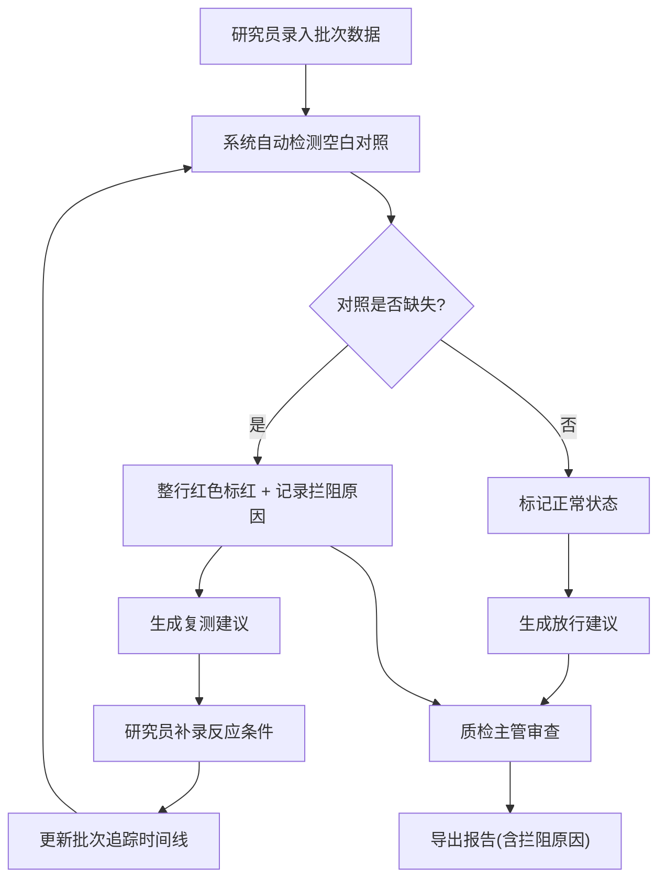

## 1. 产品概述

面向药化研究员和质检主管的催化反应选择性报告管理系统，解决批次报告清洗繁琐、空白对照缺失人工标红低效、数据多源不一致、复测判断静态化等痛点。通过统一数据源驱动看板、明细表格与导出报告，保留人工备注原话，实现反应条件补录后批次追踪动态更新。

## 2. 核心功能

### 2.1 用户角色

| 角色 | 注册方式 | 核心权限 |
|------|----------|----------|
| 药化研究员 | 系统内置 | 录入批次数据、补录反应条件、查看复测建议、保留人工备注 |
| 质检主管 | 系统内置 | 审查报告、查看拦阻原因、导出完整报告 |

### 2.2 功能模块

1. **批次报告看板页**：统计图表、批次状态概览、快速筛选
2. **批次明细表格**：空白对照缺失自动标红、人工备注原文展示、状态标识
3. **复测建议模块**：基于当前数据动态生成、条件补录后自动更新建议
4. **批次追踪时间线**：记录补录历史与状态变更
5. **报告导出功能**：导出Excel/PDF，含拦阻原因说明

### 2.3 页面详情

| 页面名称 | 模块名称 | 功能描述 |
|----------|----------|----------|
| 批次报告看板页 | 统计概览卡片 | 总批次数、通过率、待确认数、异常数 |
| 批次报告看板页 | 选择性分布图表 | 柱状图展示各批次选择性数值与阈值线 |
| 批次报告看板页 | 批次状态饼图 | 顺利/待确认/异常三类占比 |
| 批次明细表格 | 数据表格 | 批次号、反应条件、选择性、对照状态、备注、操作 |
| 批次明细表格 | 空白对照标红 | 缺失空白对照的行整行红色背景高亮 |
| 批次明细表格 | 人工备注列 | 原样展示研究员手写备注，不做自动润色 |
| 批次明细表格 | 补录弹窗 | 补录反应条件，自动关联批次追踪 |
| 复测建议面板 | 动态建议列表 | 依据当前数据状态生成复测/放行/废弃建议 |
| 批次追踪时间线 | 时间线组件 | 展示每次数据录入、补录、状态变更的时间与内容 |
| 报告导出 | 导出弹窗 | 选择格式（Excel/PDF），预览后下载，包含拦阻原因说明 |

## 3. 核心流程

研究员在系统中录入或导入批次报告数据，系统自动检测空白对照是否缺失并标红。研究员可补录反应条件，系统同步更新批次追踪时间线并重新计算复测建议。质检主管查看看板与明细，通过导出功能获取含拦阻原因说明的完整报告，用于审批决策。

## 4. 用户界面设计

### 4.1 设计风格

- **主色**：深青蓝色 #0F4C5C（专业、冷静的科研调性）
- **辅色**：警示红 #E63946（标红缺失对照）、确认绿 #2A9D8F（正常数据）、琥珀橙 #E9C46A（待确认）
- **中性色**：暖灰阶 #F8F7F4 背景 / #2B2B2B 文字
- **按钮风格**：圆角8px，微阴影，hover态上移1px
- **字体**：标题用 Lora（衬线体，学术感），正文用 JetBrains Mono（等宽体，数据表格清晰）
- **布局风格**：顶部导航 + 左侧筛选 + 右侧主内容区（看板卡片在上、数据表格在下）
- **图标风格**：Lucide 线性图标，颜色跟随语义状态

### 4.2 页面设计概述

| 页面名称 | 模块名称 | UI元素 |
|----------|----------|--------|
| 批次报告看板页 | 统计卡片 | 渐变背景 + 大数字 + 趋势箭头 + 状态色标签 |
| 批次报告看板页 | 选择性分布图 | 柱形按状态着色，阈值虚线红色，hover显示详情 |
| 批次明细表格 | 表格行 | 斑马纹，缺失对照行红色渐变背景+左侧红条标识 |
| 批次明细表格 | 备注单元格 | 引用样式（左侧竖线+浅灰底），保留原句换行 |
| 复测建议面板 | 建议卡片 | 三列布局（复测/放行/废弃），带头像与动态时间戳 |
| 批次追踪时间线 | 时间线节点 | 圆点+竖线，补录记录用琥珀色节点突出 |
| 报告导出弹窗 | 预览区域 | 缩略预览+拦阻原因折叠面板 |

### 4.3 响应式

桌面端优先设计（≥1280px），数据表格横向滚动适配中小屏，移动端保留核心统计与导出功能。

### 4.4 3D场景指引

不适用。
