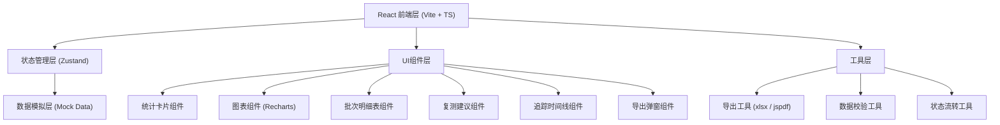

## 1. 架构设计



## 2. 技术描述

- **前端**：React@18 + TypeScript + Vite
- **UI 框架**：Tailwind CSS@3
- **状态管理**：Zustand（统一数据源，确保看板/明细/导出数据一致）
- **图表库**：Recharts（柱状图、饼图）
- **导出库**：xlsx（Excel导出）、jspdf + html2canvas（PDF导出）
- **图标库**：lucide-react
- **后端**：无，纯前端 Mock 数据模拟
- **数据库**：无，使用 localStorage 持久化 + Mock 初始化数据

## 3. 路由定义

| 路由 | 用途 |
|------|------|
| / | 批次报告看板主页（默认页，含统计、图表、明细表、复测建议、时间线） |

单页应用设计，全部模块在同一页面内分区呈现，确保数据同源。

## 4. API 定义（无后端，使用 TypeScript 类型）

```typescript
// 批次状态枚举
type BatchStatus = 'success' | 'pending' | 'failed';

// 反应条件
interface ReactionCondition {
  temperature: number;       // 温度 ℃
  pressure: number;          // 压力 atm
  catalystType: string;      // 催化剂类型
  catalystLoading: number;   // 催化剂装载量 mol%
  solvent: string;           // 溶剂
  reactionTime: number;      // 反应时间 h
}

// 追踪记录
interface TrackingRecord {
  id: string;
  timestamp: string;
  type: 'create' | 'update' | 'supplement' | 'status_change';
  operator: string;
  content: string;           // 保留人工备注原话
  beforeData?: Partial<BatchReport>;
  afterData?: Partial<BatchReport>;
}

// 批次报告核心数据
interface BatchReport {
  id: string;
  batchNo: string;                    // 批次号
  date: string;                       // 实验日期
  researcher: string;                 // 研究员
  targetCompound: string;             // 目标化合物
  selectivity: number;                // 选择性 %
  selectivityThreshold: number;       // 选择性阈值 %
  hasBlankControl: boolean;           // 是否有空白对照
  blankControlNote?: string;          // 空白对照说明
  conditions: ReactionCondition;      // 反应条件
  status: BatchStatus;                // 批次状态
  manualNote?: string;                // 人工备注（保留原话）
  retestSuggestion?: RetestSuggestion;
  tracking: TrackingRecord[];         // 批次追踪
  blockerReasons?: string[];          // 拦阻原因（质检主管查看）
}

// 复测建议
interface RetestSuggestion {
  level: 'release' | 'retest' | 'discard';
  reason: string;
  suggestedConditions?: Partial<ReactionCondition>;
  supplementRequired: string[];       // 需要补录的字段
  generatedAt: string;
}

// 应用状态
interface ReportState {
  batches: BatchReport[];
  selectedBatchId: string | null;
  filterStatus: BatchStatus | 'all';
  supplementBatch: (id: string, data: Partial<ReactionCondition>, note: string) => void;
  recomputeSuggestion: (id: string) => void;
  exportReport: (format: 'xlsx' | 'pdf') => Blob;
}
```

## 5. 数据模型（Mock 初始化数据）

### 三条核心样例数据

**1. 顺利记录 (success)**
- 批次号：CAT-2026-0610-001
- 选择性：92.3%（阈值 85%）
- 空白对照：完整
- 人工备注："反应在 18h 时已达平衡，延长到 24h 选择性无明显变化，收率 87%"
- 状态：success

**2. 待确认记录 (pending)**
- 批次号：CAT-2026-0610-002
- 选择性：83.1%（略低于阈值 85%）
- 空白对照：完整
- 人工备注："催化剂换了新批号，可能活性略低，建议补做一组对照确认是不是批间差"
- 需要补录：催化剂批号、重复实验结果
- 状态：pending

**3. 明显坏数据 (failed)**
- 批次号：CAT-2026-0610-003
- 选择性：45.7%（远低于阈值 85%）
- 空白对照：缺失 —— 自动标红
- 人工备注："空白对照样被污染了，离心机报警那批，色谱图基线飘得厉害"
- 拦阻原因：["空白对照缺失，无法判断选择性真实性", "选择性显著低于阈值", "疑似样品污染"]
- 状态：failed

## 6. 数据校验与状态流转逻辑

```
状态流转规则：
1. 初始录入 → 自动校验 hasBlankControl 和 selectivity
2. hasBlankControl === false → 强制 failed，记录拦阻原因
3. selectivity < threshold - 5 → 标记 failed
4. threshold - 5 ≤ selectivity < threshold → 标记 pending，提示补录
5. selectivity ≥ threshold 且 hasBlankControl → 标记 success
6. 补录后重新执行上述规则，更新状态和追踪时间线
```
