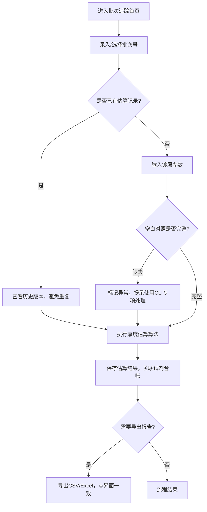
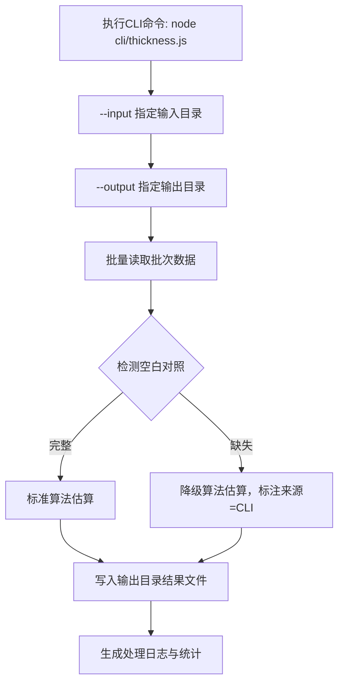

## 1. 产品概述

薄膜镀层厚度估算实验室管理系统，服务于实验室管理员的日常试剂台账管理、批次追踪、镀层厚度估算及谱图判读工作。解决台账混乱、批次报告难以回溯、厚度估算结果不一致等痛点。

- 核心价值：提供可靠的试剂台账管理，支持批次报告回溯，保证厚度估算结果的一致性和可追溯性
- 目标用户：实验室管理员、实验技术人员

## 2. 核心功能

### 2.1 功能模块

1. **批次追踪（首页/日常入口）**：厚度估算日常操作、批次列表、快速录入、状态概览
2. **试剂台账**：试剂信息管理、库存追踪、入库出库记录、导入导出
3. **薄膜镀层厚度估算**：厚度计算、空白对照检测、估算结果记录、重复导入去重
4. **谱图判读**：月底/课前谱图审核、判读记录、数据一致性校验
5. **CLI工具**：命令行批量处理、空白对照缺失专项处理、输入输出目录指定

### 2.2 页面详情

| 页面名称 | 模块名称 | 功能描述 |
|-----------|-------------|---------------------|
| 批次追踪（首页） | 批次概览卡片 | 展示今日批次、待处理、已完成、异常数量统计 |
| 批次追踪（首页） | 快速厚度估算 | 快捷录入材料批次、厚度参数、即时估算 |
| 批次追踪（首页） | 最近批次列表 | 展示最近10条批次记录，支持状态筛选、快速查看 |
| 批次追踪（首页） | 批次导入 | 支持CSV/Excel批量导入，自动去重（按批次号+材料编号） |
| 试剂台账 | 试剂列表 | 展示全部试剂，支持搜索、分类筛选、库存状态标记 |
| 试剂台账 | 试剂入库/出库 | 记录试剂流转，关联批次号，自动更新库存 |
| 试剂台账 | 示例数据加载 | 首次进入加载5-8条示例试剂和台账记录 |
| 试剂台账 | 导入/导出 | 支持CSV格式导入导出，导出内容与界面摘要严格一致 |
| 厚度估算详情 | 厚度计算面板 | 输入镀层参数、选择算法、实时计算厚度范围 |
| 厚度估算详情 | 空白对照校验 | 检测空白对照数据完整性，缺失时提示并标记 |
| 厚度估算详情 | 估算历史 | 同一批次多次估算记录，展示版本差异，避免重复结论 |
| 谱图判读 | 谱图列表 | 按月/课前筛选待判读谱图，关联对应批次 |
| 谱图判读 | 判读记录 | 记录判读结论、备注、判读人，与估算结果联动校验 |
| 全局 | 数据一致性保障 | 导出文件与界面展示数据100%一致，状态字段映射统一 |

## 3. 核心流程

### 3.1 日常厚度估算流程

实验室管理员登录系统 → 进入批次追踪首页 → 录入或选择材料批次 → 输入镀层参数进行厚度估算 → 系统校验空白对照（缺失则标红预警） → 保存估算结果 → 可关联试剂台账中的对应试剂 → 月底在谱图判读模块审核对应谱图

### 3.2 CLI空白对照缺失处理流程

管理员在终端执行CLI命令 → 指定输入目录（批次数据文件）和输出目录 → CLI自动检测空白对照缺失记录 → 对缺失记录执行降级估算算法 → 生成结构化输出文件 → 结果可导入Web端查看

## 4. 用户界面设计

### 4.1 设计风格

- **主色调**：科技深蓝 #1e3a5f 作为主色，精准灰 #374151 作为中性色，警示橙 #f59e0b 标记异常
- **辅助色**：合格绿 #10b981（通过）、待确认蓝 #3b82f6、异常红 #ef4444
- **按钮风格**：圆角4px，扁平风格，hover有微妙阴影和背景加深
- **字体**：标题使用思源宋体（学术感），正文使用系统等宽字体+PingFang SC（数据可读性）
- **布局风格**：左侧导航栏 + 顶部面包屑 + 主内容卡片式布局，数据表格使用斑马纹增强可读性
- **图标风格**：使用Lucide图标库，统一线宽，与实验室场景匹配（烧瓶、试管、显微镜等）

### 4.2 页面设计概览

| 页面名称 | 模块名称 | UI元素 |
|-----------|-------------|-------------|
| 批次追踪首页 | 概览卡片 | 4张统计卡片，带数字微动效，色条表示状态占比 |
| 批次追踪首页 | 快速估算面板 | 双列表单布局，输入即时校验，计算按钮带loading动画 |
| 批次追踪首页 | 批次列表 | 数据表格，状态标签彩色，hover高亮行，支持行内快捷操作 |
| 试剂台账 | 试剂卡片/列表 | 切换视图，库存进度条，低库存标红，入库出库快捷按钮 |
| 厚度估算详情 | 计算面板 | 参数分组，公式展示区，结果高亮，置信区间可视化 |
| 谱图判读 | 判读工作台 | 左右分栏：左侧谱图列表，右侧判读表单+历史结论对比 |

### 4.3 响应式设计

- 桌面端优先（≥1280px），三栏布局：侧边导航 + 主内容 + 辅助信息
- 平板端（768-1279px）：折叠侧边导航为图标栏，主内容全宽
- 移动端（<768px）：顶部汉堡菜单，卡片堆叠布局，表格横向滚动
