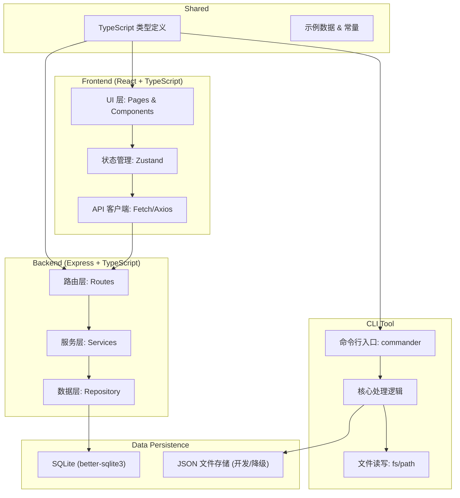
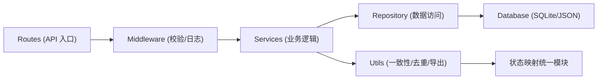
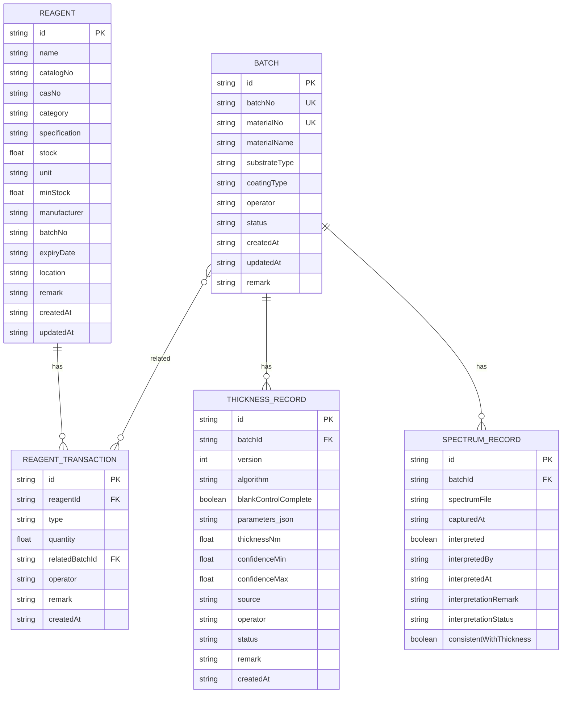

## 1. 架构设计



## 2. 技术描述

- **前端**: React@18 + TypeScript + Vite + TailwindCSS@3 + Zustand + react-router-dom + lucide-react
- **后端**: Express@4 + TypeScript
- **初始化工具**: vite-init (react-express-ts 模板)
- **数据库**: SQLite (better-sqlite3)，开发阶段提供 JSON 文件存储作为降级方案
- **CLI工具**: commander + 原生 fs/path 模块
- **数据导入导出**: CSV 原生解析/生成，保证格式一致性

## 3. 路由定义

### 3.1 前端路由

| 路由路径 | 页面组件 | 用途 |
|-------|---------|------|
| / | BatchTracking | 批次追踪（首页/日常入口） |
| /reagents | ReagentLedger | 试剂台账 |
| /thickness/:batchId | ThicknessDetail | 薄膜镀层厚度估算详情 |
| /spectrum | SpectrumInterpretation | 谱图判读 |
| /cli-help | CliGuide | CLI 使用指南 |

### 3.2 后端 API 路由

| 方法 | 路径 | 用途 |
|-----|------|------|
| GET | /api/batches | 获取批次列表（支持分页、筛选） |
| POST | /api/batches | 创建新批次 |
| PUT | /api/batches/:id | 更新批次信息 |
| DELETE | /api/batches/:id | 删除批次 |
| POST | /api/batches/import | 批量导入批次（自动去重） |
| GET | /api/batches/:id/thickness | 获取批次厚度估算历史 |
| POST | /api/batches/:id/thickness | 新增厚度估算记录 |
| GET | /api/reagents | 获取试剂列表 |
| POST | /api/reagents | 新增试剂 |
| PUT | /api/reagents/:id | 更新试剂 |
| POST | /api/reagents/import | 批量导入试剂 |
| GET | /api/reagents/export | 导出试剂台账（与界面一致） |
| POST | /api/reagents/:id/transaction | 试剂入库/出库 |
| GET | /api/spectrums | 获取谱图列表 |
| POST | /api/spectrums/:id/interpret | 提交谱图判读 |
| GET | /api/sample-data/init | 首次加载示例数据 |

## 4. API 数据模型定义

### 4.1 核心类型定义

```typescript
// shared/types/index.ts

export type BatchStatus = 'pending' | 'processing' | 'completed' | 'exception';
export type ThicknessAlgorithm = 'standard' | 'degraded_cli';
export type ResultStatus = 'pass' | 'pending' | 'fail';

export interface Reagent {
  id: string;
  name: string;
  catalogNo: string;
  casNo?: string;
  category: string;
  specification: string;
  stock: number;
  unit: string;
  minStock: number;
  manufacturer: string;
  batchNo: string;
  expiryDate: string;
  location: string;
  remark?: string;
  createdAt: string;
  updatedAt: string;
}

export interface ReagentTransaction {
  id: string;
  reagentId: string;
  type: 'in' | 'out';
  quantity: number;
  relatedBatchId?: string;
  operator: string;
  remark?: string;
  createdAt: string;
}

export interface Batch {
  id: string;
  batchNo: string;
  materialNo: string;
  materialName: string;
  substrateType: string;
  coatingType: string;
  operator: string;
  status: BatchStatus;
  createdAt: string;
  updatedAt: string;
  remark?: string;
}

export interface ThicknessRecord {
  id: string;
  batchId: string;
  version: number;
  algorithm: ThicknessAlgorithm;
  blankControlComplete: boolean;
  parameters: {
    wavelength: number;
    refractiveIndex: number;
    reflectance?: number;
    transmittance?: number;
  };
  thicknessNm: number;
  confidenceMin: number;
  confidenceMax: number;
  source: 'web' | 'cli';
  operator: string;
  status: ResultStatus;
  remark?: string;
  createdAt: string;
}

export interface SpectrumRecord {
  id: string;
  batchId: string;
  spectrumFile?: string;
  capturedAt: string;
  interpreted: boolean;
  interpretedBy?: string;
  interpretedAt?: string;
  interpretationRemark?: string;
  interpretationStatus?: ResultStatus;
  consistentWithThickness?: boolean;
}
```

## 5. 服务端架构



### 5.1 模块职责

- **Routes**: 定义 HTTP 端点，参数解析
- **Middleware**: 请求体校验、CORS、错误处理、简单日志
- **Services**: 核心业务逻辑（厚度算法、去重判断、一致性校验）
- **Repository**: 数据持久化抽象层，屏蔽 SQLite/JSON 差异
- **Utils**: 
  - `consistency.ts`: 统一状态字段映射，保证前端展示、数据库存储、导出文件三者一致
  - `dedup.ts`: 批次去重算法（batchNo + materialNo 联合唯一键）
  - `csv.ts`: CSV 导入导出，字段映射与界面完全一致

## 6. 数据模型

### 6.1 ER 图



### 6.2 唯一约束与去重策略

- **BATCH 表**: `(batchNo, materialNo)` 建立联合唯一索引
- **THICKNESS_RECORD 表**: `(batchId, version)` 联合唯一，同一批次版本号递增，避免重复结论
- **导入去重逻辑**: 导入时先查询联合键，存在则跳过或更新（可配置），返回导入统计（新增/更新/跳过数量）

### 6.3 状态字段统一映射表

| 内部值 (DB/API) | 界面显示 | 导出文件 | 颜色 |
|----------------|---------|---------|------|
| pass | 通过 | 通过 | #10b981 |
| pending | 待确认 | 待确认 | #3b82f6 |
| fail | 未通过 | 未通过 | #ef4444 |
| processing | 处理中 | 处理中 | #f59e0b |

**关键设计**: 通过 `utils/consistency.ts` 中的 `statusMap` 单处维护，前端渲染、后端导出都从此读取，杜绝不一致。

### 6.4 CLI 工具设计

```
cli/
├── index.ts          # CLI 入口，commander 定义命令
├── thickness.ts      # 厚度估算核心命令
├── handlers/
│   ├── blankMissing.ts  # 空白对照缺失处理
│   └── batchProcess.ts  # 批量处理逻辑
└── utils/
    ├── fileIO.ts     # 输入输出目录处理
    └── logger.ts     # 控制台日志
```

CLI 命令示例:
```bash
# 基本用法
npm run cli:thickness -- --input ./data/batches --output ./results/2026-06

# 只处理空白对照缺失的记录
npm run cli:thickness -- --input ./data --output ./results --only-blank-missing

# 完整选项
node dist/cli/index.js thickness \
  --input ./raw-data \
  --output ./processed \
  --algorithm degraded \
  --log-level info
```
