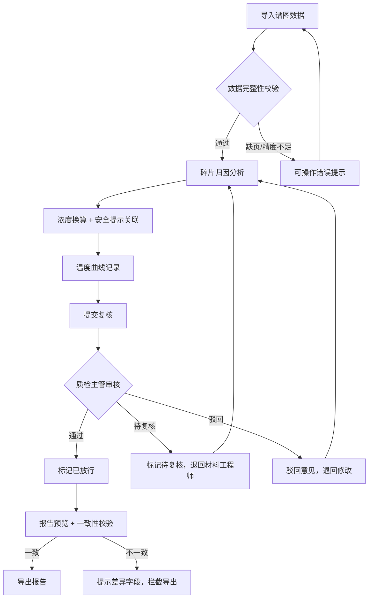

## 1. 产品概述

质谱碎片归因助手是面向材料工程师与质检主管的专业工具，用于完成质谱谱图数据从导入、碎片归因分析、浓度换算、批次追踪、复核确认到报告导出的全流程管理。核心解决：谱图数据分页遗漏、称量精度对导出结果的影响、导出与界面信息不一致、错误提示不可操作等实际生产问题。

- 目标用户：材料工程师（负责数据导入与归因分析）、质检主管（负责结果审核与放行）
- 核心价值：确保浓度换算精度可控、批次全程可追溯、导出报告与界面摘要严格一致、处理失败时给出可操作的修复指引

## 2. 核心功能

### 2.1 用户角色

| 角色 | 进入方式 | 核心权限 |
|------|----------|----------|
| 材料工程师 | 默认进入 | 导入谱图数据、执行归因分析、浓度换算、查看温度曲线、提交复核 |
| 质检主管 | 角色切换 | 审核归因结果、标记通过/待复核、导出报告、查看批次追踪全景 |

### 2.2 功能模块

1. **工作台页面**：批次总览、待处理任务入口、近期处理痕迹、安全提示摘要
2. **谱图导入页面**：分页谱图上传与校验、称量精度设置、缺失页预警
3. **碎片归因页面**：碎片归属分析、浓度换算计算、温度曲线展示、安全提示关联
4. **复核审批页面**：质检主管审核列表、状态标记（通过/待复核/驳回）、复核意见
5. **报告导出页面**：报告预览与导出、导出内容与界面摘要一致性校验

### 2.3 页面详情

| 页面名称 | 模块名称 | 功能描述 |
|----------|----------|----------|
| 工作台 | 批次总览卡片 | 展示所有批次及状态（已导入/分析中/待复核/已通过/已导出），重启后保留状态 |
| 工作台 | 待处理任务队列 | 按优先级排列待导入、待分析、待复核任务 |
| 工作台 | 处理痕迹时间线 | 显示历史操作记录，重启后可追溯 |
| 工作台 | 安全提示摘要 | 汇总当前结论关联的来源材料安全警示 |
| 谱图导入 | 分页上传区 | 支持多页谱图逐页上传，自动检测页码连续性，缺页即时预警 |
| 谱图导入 | 称量精度设置 | 配置天平精度（0.1mg/0.01mg/1mg），影响浓度换算有效位数 |
| 谱图导入 | 数据预校验 | 上传后自动校验数据完整性，失败时给出可操作提示（如"缺少第3页谱图数据"） |
| 碎片归因 | 碎片归属分析 | 列出碎片离子归属、母离子匹配度、归因置信度 |
| 碎片归因 | 浓度换算面板 | 基于称量精度自动计算浓度，标注有效位数与不确定度 |
| 碎片归因 | 温度曲线图 | 展示实验温度随时间变化曲线，标注关键温控点 |
| 碎片归因 | 安全提示卡片 | 将归因结论关联到来源材料的安全数据，点击可溯源 |
| 复核审批 | 审核列表 | 质检主管查看待审核项，含一键区分"可直接用"与"需材料工程师复核"的视觉标签 |
| 复核审批 | 状态推进 | 单条或批量推进状态：通过→已放行、驳回→待修改、标记待复核 |
| 复核审批 | 复核意见 | 质检主管填写审核意见，关联到具体碎片或浓度数据 |
| 报告导出 | 报告预览 | 导出前预览完整报告，重点标注与界面摘要一致的结论 |
| 报告导出 | 一致性校验 | 导出前自动比对界面摘要与导出内容，不一致时拦截并提示差异字段 |
| 报告导出 | 多格式导出 | 支持 PDF/CSV 导出，文件内容与界面状态严格同步 |

## 3. 核心流程

材料工程师导入谱图数据 → 系统校验数据完整性（缺页/精度不足时给出可操作提示） → 执行碎片归因分析 → 系统自动完成浓度换算并关联安全提示 → 材料工程师提交复核 → 质检主管审核，标记通过或待复核 → 审核通过后导出报告（导出前一致性校验） → 全程批次追踪与温度曲线记录

## 4. 用户界面设计

### 4.1 设计风格

- 主色调：深靛蓝（#1B2A4A）搭配琥珀橙（#E8913A）作为强调色，传达专业实验室气质
- 辅助色：冷灰（#6B7280）用于次要信息，翡翠绿（#10B981）用于通过状态，珊瑚红（#EF4444）用于警告/驳回
- 按钮风格：圆角8px，主按钮深靛蓝底色+白字，危险操作用珊瑚红
- 字体：标题用 Source Serif 4，正文用 DM Sans，数据用 JetBrains Mono
- 布局：左侧固定导航栏 + 顶部面包屑 + 右侧主内容区，卡片式内容组织
- 图标风格：线性图标（Lucide），2px 描边

### 4.2 页面设计概览

| 页面名称 | 模块名称 | UI 元素 |
|----------|----------|----------|
| 工作台 | 批次总览卡片 | 网格布局，每张卡片含状态色条、批次号、创建时间、进度条，悬停微浮起 |
| 工作台 | 处理痕迹时间线 | 竖向时间线，节点含操作图标与时间戳，当前节点脉冲动画 |
| 工作台 | 安全提示摘要 | 侧边抽屉式，琥珀橙边框卡片，含来源材料链接 |
| 谱图导入 | 分页上传区 | 拖拽上传区，页码缩略图排列，缺页位置红色虚线占位 |
| 谱图导入 | 称量精度设置 | 下拉选择 + 数字输入组合，精度变更时浓度预览区实时刷新 |
| 碎片归因 | 碎片归属表格 | 可排序列表格，置信度用色阶条表示，行悬停高亮 |
| 碎片归因 | 浓度换算面板 | 左侧输入参数、右侧实时计算结果，有效位数用下划线标注 |
| 碎片归因 | 温度曲线图 | SVG 折线图，温控点用圆点标注，鼠标悬停显示精确温度 |
| 碎片归因 | 安全提示卡片 | 内嵌卡片，琥珀橙左边框，点击溯源跳转到来源材料 |
| 复核审批 | 审核列表 | 表格布局，状态列用颜色标签区分（绿=通过/橙=待复核/红=驳回） |
| 复核审批 | 状态推进 | 行内操作按钮组，批量操作工具栏 |
| 报告导出 | 报告预览 | 模拟A4纸张预览，与导出PDF布局一致 |
| 报告导出 | 一致性校验 | 校验通过绿色盾牌图标，不一致时红色叉号+差异字段列表 |

### 4.3 响应式设计

桌面优先设计，最小支持 1280px 宽度。侧边导航在 1024px 以下折叠为图标模式，主内容区自适应宽度。

### 4.4 动画与交互

- 页面切换：淡入 200ms
- 卡片悬停：translateY(-2px) + shadow-md，150ms ease
- 状态变更：色条过渡动画 300ms
- 时间线当前节点：脉冲呼吸动画
- 温度曲线：绘制动画，从左至右逐步展现
- 错误提示：从顶部滑入，5秒后自动淡出
