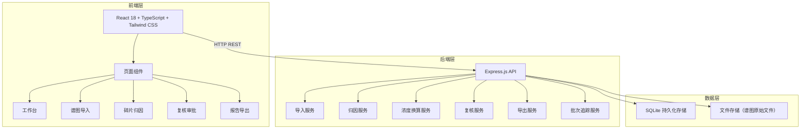
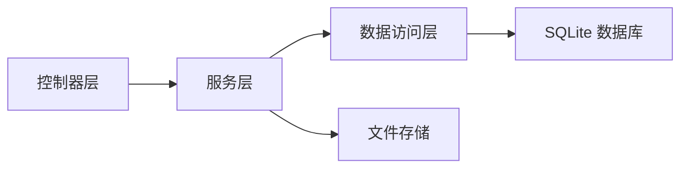
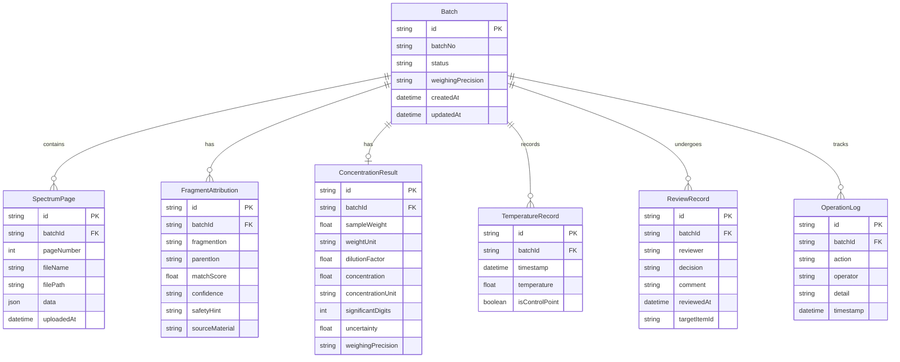

## 1. 架构设计



## 2. 技术说明

- 前端：React@18 + TypeScript + Tailwind CSS@3 + Vite
- 状态管理：Zustand
- 图表：Recharts（温度曲线、浓度可视化）
- 路由：react-router-dom v6
- 后端：Express@4 + TypeScript（ESM 模式）
- 数据库：SQLite（better-sqlite3），服务重启后数据持久化
- 文件存储：本地文件系统（uploads 目录）
- 初始化工具：vite-init

## 3. 路由定义

| 路由 | 用途 |
|------|------|
| / | 工作台首页：批次总览、待处理任务、处理痕迹、安全提示 |
| /import | 谱图导入：分页上传、称量精度设置、数据预校验 |
| /attribution/:batchId | 碎片归因：归属分析、浓度换算、温度曲线、安全提示 |
| /review | 复核审批：审核列表、状态推进、复核意见 |
| /export | 报告导出：报告预览、一致性校验、多格式导出 |

## 4. API 定义

### 4.1 批次管理

```typescript
interface Batch {
  id: string;
  batchNo: string;
  status: "imported" | "analyzing" | "pending_review" | "approved" | "rejected" | "exported";
  weighingPrecision: "0.1mg" | "0.01mg" | "1mg";
  createdAt: string;
  updatedAt: string;
}

// POST /api/batches - 创建批次
// GET /api/batches - 获取批次列表
// GET /api/batches/:id - 获取批次详情
// PATCH /api/batches/:id/status - 推进批次状态
```

### 4.2 谱图数据

```typescript
interface SpectrumPage {
  id: string;
  batchId: string;
  pageNumber: number;
  fileName: string;
  filePath: string;
  data: SpectrumData;
  uploadedAt: string;
}

interface SpectrumData {
  peaks: Array<{ mz: number; intensity: number }>;
  retentionTime: number;
  temperature?: number;
}

// POST /api/batches/:batchId/spectra - 上传谱图页
// GET /api/batches/:batchId/spectra - 获取所有谱图页
// GET /api/batches/:batchId/spectra/check - 校验谱图完整性（缺页检测）
```

### 4.3 碎片归因

```typescript
interface FragmentAttribution {
  id: string;
  batchId: string;
  fragmentIon: string;
  parentIon: string;
  matchScore: number;
  confidence: "high" | "medium" | "low";
  safetyHint?: string;
  sourceMaterial?: string;
}

// POST /api/batches/:batchId/attributions - 执行归因分析
// GET /api/batches/:batchId/attributions - 获取归因结果
```

### 4.4 浓度换算

```typescript
interface ConcentrationResult {
  id: string;
  batchId: string;
  sampleWeight: number;
  weightUnit: string;
  dilutionFactor: number;
  concentration: number;
  concentrationUnit: string;
  significantDigits: number;
  uncertainty: number;
  weighingPrecision: string;
}

// POST /api/batches/:batchId/concentration - 计算浓度
// GET /api/batches/:batchId/concentration - 获取浓度结果
```

### 4.5 温度曲线

```typescript
interface TemperatureRecord {
  id: string;
  batchId: string;
  timestamp: string;
  temperature: number;
  isControlPoint: boolean;
}

// POST /api/batches/:batchId/temperatures - 添加温度记录
// GET /api/batches/:batchId/temperatures - 获取温度曲线数据
```

### 4.6 复核

```typescript
interface ReviewRecord {
  id: string;
  batchId: string;
  reviewer: "quality_supervisor" | "material_engineer";
  decision: "approved" | "pending_review" | "rejected";
  comment: string;
  reviewedAt: string;
  targetItemId?: string;
}

// POST /api/batches/:batchId/reviews - 提交复核意见
// GET /api/batches/:batchId/reviews - 获取复核记录
// PATCH /api/batches/:batchId/reviews/:id - 更新复核状态
```

### 4.7 报告导出

```typescript
interface ExportRequest {
  batchId: string;
  format: "pdf" | "csv";
}

interface ConsistencyCheckResult {
  isConsistent: boolean;
  mismatches: Array<{
    field: string;
    uiValue: string;
    exportValue: string;
  }>;
}

// POST /api/batches/:batchId/export - 导出报告
// GET /api/batches/:batchId/consistency-check - 一致性校验
```

### 4.8 操作日志

```typescript
interface OperationLog {
  id: string;
  batchId: string;
  action: string;
  operator: string;
  detail: string;
  timestamp: string;
}

// GET /api/batches/:batchId/logs - 获取操作日志（处理痕迹）
```

### 4.9 错误响应格式

```typescript
interface ApiError {
  code: string;
  message: string;
  actionableHint: string;
  missingData?: string[];
}

// 示例：
// {
//   "code": "SPECTRA_INCOMPLETE",
//   "message": "谱图数据不完整",
//   "actionableHint": "请补充以下缺失页面的谱图数据",
//   "missingData": ["第3页", "第7页"]
// }
```

## 5. 服务端架构图



## 6. 数据模型

### 6.1 数据模型定义



### 6.2 数据定义语言

```sql
CREATE TABLE batches (
  id TEXT PRIMARY KEY,
  batch_no TEXT NOT NULL UNIQUE,
  status TEXT NOT NULL DEFAULT 'imported',
  weighing_precision TEXT NOT NULL DEFAULT '0.1mg',
  created_at TEXT NOT NULL DEFAULT (datetime('now')),
  updated_at TEXT NOT NULL DEFAULT (datetime('now'))
);

CREATE TABLE spectrum_pages (
  id TEXT PRIMARY KEY,
  batch_id TEXT NOT NULL REFERENCES batches(id),
  page_number INTEGER NOT NULL,
  file_name TEXT NOT NULL,
  file_path TEXT NOT NULL,
  data TEXT NOT NULL,
  uploaded_at TEXT NOT NULL DEFAULT (datetime('now')),
  UNIQUE(batch_id, page_number)
);

CREATE TABLE fragment_attributions (
  id TEXT PRIMARY KEY,
  batch_id TEXT NOT NULL REFERENCES batches(id),
  fragment_ion TEXT NOT NULL,
  parent_ion TEXT NOT NULL,
  match_score REAL NOT NULL,
  confidence TEXT NOT NULL,
  safety_hint TEXT,
  source_material TEXT
);

CREATE TABLE concentration_results (
  id TEXT PRIMARY KEY,
  batch_id TEXT NOT NULL UNIQUE REFERENCES batches(id),
  sample_weight REAL NOT NULL,
  weight_unit TEXT NOT NULL DEFAULT 'mg',
  dilution_factor REAL NOT NULL DEFAULT 1,
  concentration REAL NOT NULL,
  concentration_unit TEXT NOT NULL DEFAULT 'μg/mL',
  significant_digits INTEGER NOT NULL,
  uncertainty REAL NOT NULL,
  weighing_precision TEXT NOT NULL
);

CREATE TABLE temperature_records (
  id TEXT PRIMARY KEY,
  batch_id TEXT NOT NULL REFERENCES batches(id),
  timestamp TEXT NOT NULL,
  temperature REAL NOT NULL,
  is_control_point INTEGER NOT NULL DEFAULT 0
);

CREATE TABLE review_records (
  id TEXT PRIMARY KEY,
  batch_id TEXT NOT NULL REFERENCES batches(id),
  reviewer TEXT NOT NULL,
  decision TEXT NOT NULL,
  comment TEXT,
  reviewed_at TEXT NOT NULL DEFAULT (datetime('now')),
  target_item_id TEXT
);

CREATE TABLE operation_logs (
  id TEXT PRIMARY KEY,
  batch_id TEXT NOT NULL REFERENCES batches(id),
  action TEXT NOT NULL,
  operator TEXT NOT NULL,
  detail TEXT,
  timestamp TEXT NOT NULL DEFAULT (datetime('now'))
);

CREATE INDEX idx_spectrum_pages_batch ON spectrum_pages(batch_id);
CREATE INDEX idx_fragment_attributions_batch ON fragment_attributions(batch_id);
CREATE INDEX idx_temperature_records_batch ON temperature_records(batch_id);
CREATE INDEX idx_review_records_batch ON review_records(batch_id);
CREATE INDEX idx_operation_logs_batch ON operation_logs(batch_id);
CREATE INDEX idx_batches_status ON batches(status);
```
