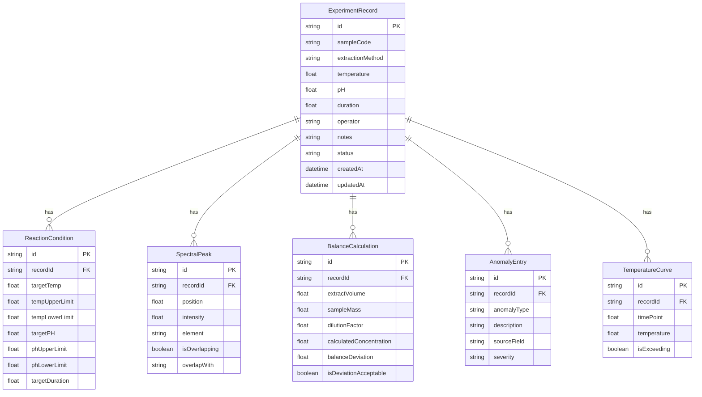

## 1. 架构设计

```mermaid
flowchart TB
    subgraph "前端层"
        "React 18 + TypeScript"
        "Tailwind CSS"
        "Zustand 状态管理"
        "React Router DOM"
    end
    subgraph "数据层"
        "Mock 数据引擎"
        "样例数据集"
    end
    "前端层" --> "数据层"
```

纯前端架构，无需后端服务。数据通过 Zustand store 管理，样例数据内置，导出为浏览器端 JSON/CSV 生成。

## 2. 技术说明

- **前端**：React@18 + TypeScript + Tailwind CSS@3 + Vite
- **初始化工具**：vite-init
- **状态管理**：Zustand
- **路由**：React Router DOM v6
- **图表**：Recharts（温度曲线、pH折线、谱图模拟）
- **图标**：lucide-react
- **后端**：无（纯前端，数据存储于 Zustand + localStorage）
- **数据库**：无（使用内存 + localStorage 持久化）

## 3. 路由定义

| 路由 | 用途 |
|------|------|
| `/` | 首页/仪表盘，展示样例记录概览与快速入口 |
| `/records` | 实验记录列表，支持新增/编辑/删除 |
| `/records/:id` | 单条记录详情，含完整性评分与表单编辑 |
| `/analysis/:id` | 配平计算与谱图判读，温度/pH越界判定 |
| `/review` | 复核与分级总览，异常留痕汇总 |
| `/export` | 报告导出页，对账校验与报告生成 |

## 4. 数据模型

### 4.1 数据模型定义



### 4.2 结论分级枚举

| 分级 | 标识 | 条件 |
|------|------|------|
| 可直接用 | ✅ | 完整度100%、配平偏差<5%、无峰重叠、温度/pH均在范围内 |
| 需复核 | ⚠️ | 存在1-2项轻微异常（单点越界、轻微重叠、偏差5-10%） |
| 数据坏 | ❌ | 多处空值、配平偏差>15%、温度曲线断裂、备注含故障关键词 |

## 5. 关键算法说明

### 5.1 完整性评分

遍历记录所有必填字段，空值计为缺失，总分 = (已填字段数 / 必填字段数) × 100%。

### 5.2 配平偏差计算

偏差 = |计算浓度 - 标称浓度| / 标称浓度 × 100%

### 5.3 谱峰重叠检测

相邻峰间距 < 半峰宽之和的50%时判定为重叠。

### 5.4 温度/pH越界检测

逐点比对温度曲线和pH记录与反应条件的上下限，超限点标记为越界。
