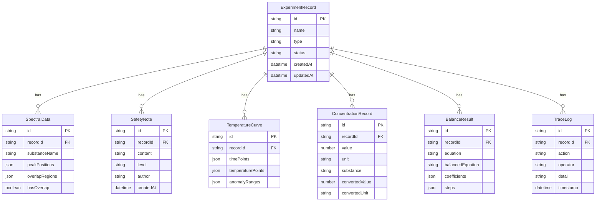

## 1. 架构设计

```mermaid
flowchart TB
    subgraph "前端层"
        "React 18 + TypeScript"
        "Zustand 状态管理"
        "Tailwind CSS"
        "Recharts 图表"
    end
    subgraph "数据层"
        "本地 Mock 数据"
        "Zustand Store 持久化"
        "CSV/JSON 导出"
    end
    subgraph "工具层"
        "浓度换算引擎"
        "配平计算引擎"
        "谱峰重叠检测算法"
        "重复导入检测"
        "溯源链路构建"
    end
    "前端层" --> "工具层"
    "工具层" --> "数据层"
```

## 2. 技术说明

- 前端：React@18 + TypeScript + Tailwind CSS@3 + Vite
- 初始化工具：vite-init
- 后端：无（纯前端，数据存储在 Zustand store + localStorage）
- 数据库：无（使用 Mock 数据 + localStorage 持久化）
- 图表：Recharts（轻量 React 图表库）
- 状态管理：Zustand
- 路由：react-router-dom@6

## 3. 路由定义

| 路由 | 用途 |
|------|------|
| `/` | 看板首页：温度曲线、安全状态、告警列表 |
| `/concentration` | 浓度换算：日常入口，换算计算器+安全上下文 |
| `/balance` | 配平计算：方程配平+解释说明 |
| `/spectral` | 谱图复核：谱图+谱峰重叠+安全备注同轮复核 |
| `/trace` | 记录溯源：从结果倒查来源与处理记录 |

## 4. 数据模型

### 4.1 数据模型定义



### 4.2 核心数据结构

所有数据存储在 Zustand store 中，同步持久化到 localStorage。导出时直接从 store 读取，确保界面摘要与导出文件使用同一数据源。

关键设计原则：
- **统一数据源**：图表、明细表、导出文件均从同一 Zustand store 读取
- **溯源链路**：每条 TraceLog 关联 recordId，形成完整操作时间线
- **重复检测**：导入时按 recordId + action + timestamp 去重
- **导出一致性**：导出函数直接序列化 store 中对应状态，与界面显示的状态字段一致

## 5. 关键算法

### 5.1 谱峰重叠检测

对谱图峰值数据，计算相邻峰的半峰宽重叠比例。重叠比例超过阈值（默认 30%）则标记为重叠，生成坏记录。

### 5.2 配平计算

基于代数法求解化学方程式配平系数，逐步展示配平过程与原子守恒验证。

### 5.3 重复导入检测

导入数据时，按 (recordId, dataType, timestamp) 三元组去重，已有记录则更新而非新增，避免同一事件产生两份结论。

### 5.4 溯源链路构建

从任意记录 ID 出发，沿 TraceLog 时间线反向追溯，展示从原始录入到最终结论的完整处理链路。
