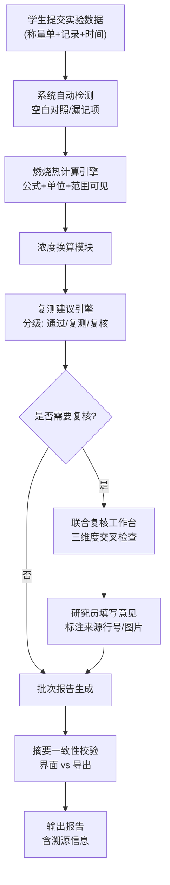

## 1. 产品概述

燃烧热实验批改工具是面向药化专业教学场景的计算与复核系统，旨在将依赖经验传帮带的实验批改流程标准化、可视化。系统将传统的人工批改经验转化为结构化的计算工具、复核清单和批次追踪机制，让新研究员和学生都能理解"空白对照缺失为什么要复核"等关键判断逻辑。

- 目标用户：药化专业学生、新入职研究员、资深审核员
- 核心价值：把经验驱动的批改逻辑转化为可解释、可追溯的标准化流程
- 解决问题：新人看不懂批改依据、批次结论前后不一致、追问时无法溯源到原始记录

## 2. 核心功能

### 2.1 用户角色

| 角色 | 进入方式 | 核心权限 |
|------|---------|---------|
| 学生用户 | 直接访问 | 输入实验数据、查看计算结果、识别需要复核的项目 |
| 研究员 | 直接访问 | 复核标记项目、填写复核意见、导出批次报告 |
| 审核员 | 直接访问 | 全功能使用、追踪批次历史、对比界面摘要与导出文件 |

### 2.2 功能模块

1. **数据录入页**：称量单数据、实验记录、反应时间录入，支持原始行号和来源备注
2. **计算工具页**：燃烧热公式计算、浓度换算、复测建议引擎，公式和单位人眼可见
3. **复核工作台**：空白对照检查、称量单/实验记录/反应时间的联合复核清单
4. **批次报告页**：批次追踪时间线、结论来源标注、界面摘要与导出一致性校验
5. **帮助说明页**：适用范围、失败原因库、空目录启动指南、第一份样例位置

### 2.3 页面详情

| 页面名称 | 模块名称 | 功能描述 |
|---------|---------|------------|
| 数据录入页 | 称量单录入 | 支持按原始表格行号输入样品质量、苯甲酸质量，关联图片名/来源备注 |
| 数据录入页 | 实验记录录入 | 温度变化值、燃烧时间、异常标记，保留原始记录行号 |
| 数据录入页 | 反应时间检查 | 漏记检测与标记，自动进入复核流程 |
| 计算工具页 | 燃烧热公式区 | 公式展示 + 单位标注 + 适用范围说明，每步计算可追溯 |
| 计算工具页 | 浓度换算器 | 质量浓度 ↔ 摩尔浓度换算，自动修正温度、压强系数 |
| 计算工具页 | 复测建议引擎 | 根据偏差范围、空白对照情况给出"直接通过/建议复测/必须复核"结论 |
| 复核工作台 | 联合复核清单 | 称量单 × 实验记录 × 反应时间三维度交叉检查清单 |
| 复核工作台 | 复核原因说明 | 点击即展示"空白对照缺失为什么要复核"等经验说明 |
| 批次报告页 | 批次时间线 | 从录入到计算到复核的全流程追踪，每条操作关联来源 |
| 批次报告页 | 摘要一致性 | 实时对比界面显示结论与待导出内容，不一致时高亮预警 |
| 批次报告页 | 导出功能 | 导出PDF/Excel，保留原始行号、图片名、来源备注 |
| 帮助说明页 | 公式手册 | 所有计算公式、物理意义、适用条件、常见失败原因 |
| 帮助说明页 | 启动指南 | 空目录启动步骤：依赖安装 → 启动命令 → 第一份样例位置 |

## 3. 核心流程

学生录入称量单、实验记录、反应时间 → 系统自动检测空白对照与漏记项 → 计算引擎执行燃烧热计算和浓度换算 → 复测建议引擎分级标记（可直接用/需复核）→ 联合复核清单启动 → 研究员处理复核项 → 批次报告生成 → 界面摘要与导出内容一致性校验 → 输出带溯源信息的报告

## 4. 用户界面设计

### 4.1 设计风格

- 主色调：深蓝 #1e3a5f（科研专业感）+ 琥珀金 #d4a038（警告/复核标记）
- 辅助色：墨绿 #2d5a3d（通过标记）、砖红 #a0342b（必须复核标记）
- 背景：微带噪点纹理的浅灰 #f5f5f2，营造纸质实验记录本氛围
- 按钮风格：直角微圆角（2px），带轻微内阴影，复刻实验室记录板质感
- 字体：标题用 "Noto Serif SC"（衬线体，学术感），正文用 "Noto Sans SC"，代码/公式用 "JetBrains Mono"
- 图标：lucide-react，线性风格，颜色随状态变化
- 装饰元素：数据卡片带细边框（类似实验记录本的表格线），关键公式区域用米黄色背景高亮

### 4.2 页面设计概述

| 页面名称 | 模块名称 | UI元素 |
|---------|---------|--------|
| 数据录入页 | 称量单录入 | 表格形式，行号列冻结，每行可关联图片名/备注，输入框带浅米色背景 |
| 计算工具页 | 公式展示区 | 米黄色卡片衬底，公式居中放大显示，下方标注单位和适用范围，失败原因可折叠展开 |
| 计算工具页 | 结果分级展示 | 绿色卡片（可直接使用）、琥珀色卡片（建议复测）、砖红色卡片（必须找研究员复核），视觉差异明显 |
| 复核工作台 | 联合清单 | 三栏网格布局（称量单/实验记录/反应时间），每行有检查项和状态勾选，异常项红色边框闪烁提示 |
| 批次报告页 | 时间线 | 左侧垂直时间线，节点带图标（录入📝/计算🧮/复核🔍/导出📤），右侧显示操作详情和来源备注 |
| 批次报告页 | 一致性校验 | 并排双栏对比界面摘要与导出预览，差异处用红色虚线框高亮 |
| 帮助说明页 | 启动指南 | 编号步骤卡片，代码块带深色背景，命令可一键复制 |

### 4.3 响应式设计

- Desktop 优先设计，主内容区最小宽度 1024px
- 平板端：复核工作台三栏变两栏+一折叠
- 移动端：核心计算和结果展示保留，数据录入简化为表格式分步输入
- 所有表格支持横向滚动，原始行号列始终固定可见

### 4.4 动效与交互

- 页面加载：各卡片按顺序淡入（staggered reveal，每个延迟 80ms）
- 状态切换：结果卡片从琥珀色→绿色时有颜色过渡动画（0.4s ease）
- 公式展开：点击公式时下方区域平滑展开，显示推导过程和注意事项
- 复核标记：勾选复核项时有轻微的完成对勾动画
- 悬停效果：表格行悬停时背景变为极浅蓝色（#e8f0f8）
