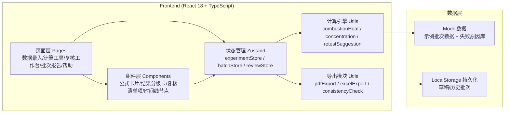
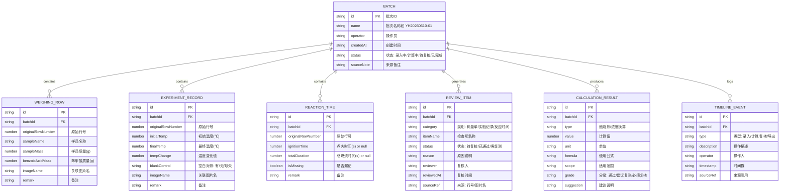

## 1. 架构设计



## 2. 技术描述

- 前端框架：React 18 + TypeScript
- 构建工具：Vite 5
- 样式方案：TailwindCSS 3 + CSS Variables（主题定制）
- 状态管理：Zustand（轻量级，支持中间件持久化）
- 路由：react-router-dom 6
- 图标库：lucide-react
- Excel 导出：xlsx (SheetJS)
- PDF 导出：jspdf + html2canvas
- 后端：无（纯前端应用，数据存储在 LocalStorage，使用 Mock 数据演示）
- 数据库：LocalStorage 持久化 + 内置 Mock 批次样例

## 3. 路由定义

| 路由 | 页面用途 |
|------|---------|
| / | 首页，快速入口导航 + 当前批次概览 |
| /data-entry | 数据录入页：称量单、实验记录、反应时间 |
| /calculator | 计算工具页：燃烧热公式、浓度换算、复测建议 |
| /review | 复核工作台：三维度联合复核清单 |
| /batch-report | 批次报告页：时间线、一致性校验、导出 |
| /help | 帮助说明页：公式手册、启动指南、样例位置 |

## 4. 数据模型

### 4.1 数据模型 ER 图



### 4.2 核心计算逻辑（公式）

燃烧热计算公式：
$$Q_v = \frac{W \times (t_n - t_0 + \Delta t) - q \times m}{M}$$

其中：
- Qv：恒容燃烧热 (J/g)
- W：水当量 (J/℃)
- tn - t0：温度变化值 (℃)
- Δt：温度校正值 (℃)
- q：点火丝燃烧热 (J/g)，标准值 1400 J/g
- m：点火丝质量 (g)
- M：样品质量 (g)

浓度换算：
$$c = \frac{m \times 1000}{M_m \times V}$$

其中：
- c：摩尔浓度 (mol/L)
- m：溶质质量 (g)
- Mm：摩尔质量 (g/mol)
- V：溶液体积 (mL)

### 4.3 失败原因库（内置）

| 错误码 | 失败原因 | 触发条件 | 处理建议 |
|-------|---------|---------|---------|
| E001 | 空白对照缺失 | experiment_record.blankControl === '缺失' | 必须复核，建议补充空白实验或由研究员确认 |
| E002 | 温度偏差超限 | \|tempChange - expected\| > 0.5℃ | 建议复测，检查温度计校准和搅拌均匀性 |
| E003 | 反应时间漏记 | reaction_time.isMissing === true | 进入联合复核，核实实验过程记录 |
| E004 | 称量质量异常 | sampleMass 超出 [0.5, 1.5]g 范围 | 检查称量单原始记录，确认是否为特殊样品 |
| E005 | 燃烧热结果偏离 | 计算值与理论值偏差 > 5% | 必须研究员复核，可能涉及样品纯度问题 |

## 5. 项目结构

```
src/
├── pages/
│   ├── Home.tsx              # 首页导航 + 批次概览
│   ├── DataEntry.tsx         # 数据录入页
│   ├── Calculator.tsx        # 计算工具页
│   ├── Review.tsx            # 复核工作台
│   ├── BatchReport.tsx       # 批次报告页
│   └── Help.tsx              # 帮助说明页
├── components/
│   ├── FormulaCard.tsx       # 公式展示卡片（含单位、适用范围、失败原因）
│   ├── ResultGradeCard.tsx   # 分级结果卡片（通过/复测/复核）
│   ├── WeighingTable.tsx     # 称量单表格
│   ├── ExperimentTable.tsx   # 实验记录表格
│   ├── TimeTable.tsx         # 反应时间表
│   ├── ReviewChecklist.tsx   # 复核清单组件
│   ├── BatchTimeline.tsx     # 批次时间线
│   ├── ConsistencyPanel.tsx  # 一致性校验面板
│   └── SourceBadge.tsx       # 来源标注徽章（行号/图片名）
├── store/
│   ├── experimentStore.ts    # 实验数据状态管理
│   ├── batchStore.ts         # 批次追踪状态
│   └── reviewStore.ts        # 复核流程状态
├── utils/
│   ├── calculations.ts       # 燃烧热、浓度换算计算逻辑
│   ├── retestEngine.ts       # 复测建议引擎
│   ├── export.ts             # PDF/Excel 导出
│   ├── consistency.ts        # 摘要一致性校验
│   └── failureReasons.ts     # 失败原因库
├── data/
│   └── mockBatch.ts          # 示例批次数据（第一份样例）
├── types/
│   └── index.ts              # TypeScript 类型定义
├── App.tsx
├── main.tsx
└── index.css
```

## 6. 空目录启动说明

面向首次使用的开发者：

```bash
# 1. 依赖安装
pnpm install
# 或
npm install

# 2. 启动开发服务器
pnpm dev
# 或
npm run dev

# 3. 第一份样例位置
# 启动后浏览器自动打开，首页点击 "载入示例批次 YH20260610-01"
# 对应数据文件: src/data/mockBatch.ts
# 包含完整的称量单(6行)、实验记录(3组)、含1处反应时间漏记、1处空白对照缺失
```
