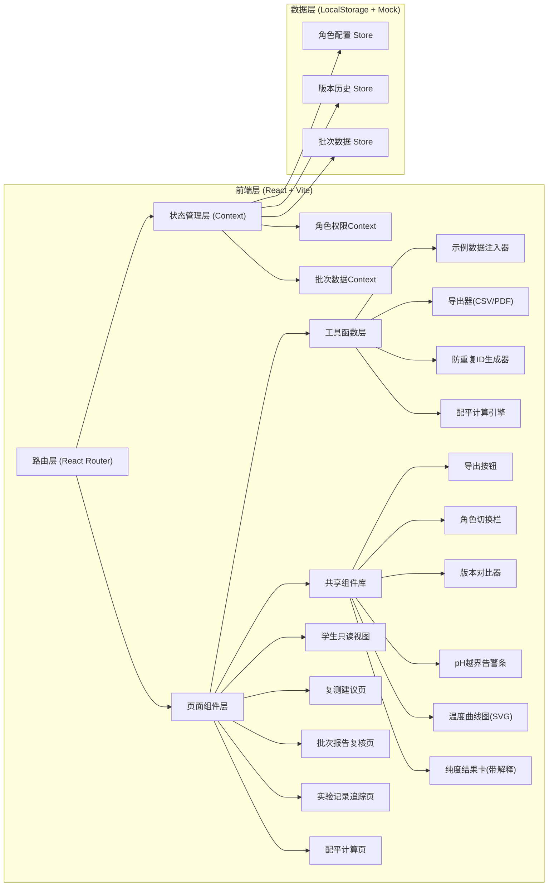
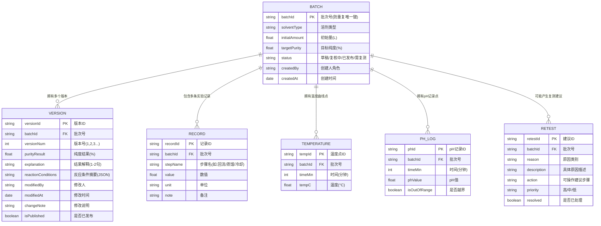

## 1. 架构设计

## 2. 技术说明
- **前端框架**：React@18 + React Router@6 + Vite@5
- **样式方案**：Tailwind CSS@3 + CSS 自定义属性（主题变量）
- **状态管理**：React Context（轻量，避免过度工程）
- **数据持久化**：LocalStorage（模拟后端，首次加载自动注入示例数据）
- **图表方案**：原生 SVG 绘制温度曲线（无需额外图表库，保持轻量）
- **导出方案**：CSV 原生生成 + 浏览器打印为 PDF（界面一致）
- **字体资源**：Google Fonts 外链加载 DM Serif Display + Noto Sans SC

## 3. 路由定义
| 路由 | 页面 | 角色权限 |
|------|------|----------|
| `/` | 首页仪表盘（快捷入口 + 统计） | 全部 |
| `/balance` | 配平计算页（日常入口） | 环境监测员、老师 |
| `/records` | 实验记录追踪页 | 全部（学生仅见已发布） |
| `/review/:batchId` | 批次报告复核页 | 环境监测员、老师 |
| `/retest` | 复测建议页（月底/课前入口） | 环境监测员、老师 |
| `/student/:batchId` | 学生只读视图 | 学生（也可老师切换查看） |

## 4. 数据模型

### 4.1 ER 图

### 4.2 防重复机制
- **批次号生成规则**：`SOL-{溶剂缩写}-{YYYYMMDD}-{序号3位}`，如 `SOL-ETOH-20260610-001`
- **去重逻辑**：新建批次时校验 (溶剂类型 + 日期 + 初始量 + 目标纯度) 组合，若存在则提示"此条件已有批次 XXXX，是否查看？"而非重复创建
- **版本防冲突**：修改时基于 `versionNum` 乐观锁，若版本号不匹配则提示"已有新版本，请先查看最新内容"

### 4.3 初始示例数据
首次加载自动注入 3 个完整批次：
1. **批次 SOL-ETOH-20260608-001**：乙醇回收，纯度 96.2% ✅ 已发布（正常案例）
2. **批次 SOL-ACE-20260609-001**：丙酮回收，纯度 91.5% ⚠️ pH越界（异常案例，需讲解）
3. **批次 SOL-MEOH-20260610-001**：甲醇回收，纯度 88.7% 🔄 待复测（复测案例）

每个批次含：反应条件 5 条、温度曲线 12 个点、pH 记录 8 个点、版本历史 2 条、复测建议 1 条。

## 5. 核心业务规则

| 规则编号 | 规则内容 | 触发场景 |
|----------|----------|----------|
| R1 | 配平计算缺参数时，提示"缺少XX参数，请补充"（如"缺少回流温度，无法计算理论回收率"）而非抛出内部错误 | 配平计算表单提交 |
| R2 | 任何纯度结果必须附带 1-2 句专业解释，为空时禁止提交并提示 | 实验记录保存 |
| R3 | 修改批次报告必须填写修改说明，自动生成新版本，旧版只读不可删除 | 复核页保存修改 |
| R4 | 导出内容的状态标签、纯度数值、解释文字必须与界面当前显示完全一致 | 点击导出按钮 |
| R5 | 学生视图仅展示 `isPublished=true` 的最新版本，不提供版本切换入口 | 学生角色访问 |
| R6 | 同轮复核必须同时显示反应条件、温度曲线、pH越界三要素，缺一则页头告警 | 打开复核页 |
| R7 | 复测建议必须包含可操作的具体步骤（如"补测蒸馏30分钟、45分钟、60分钟温度点"） | 生成复测建议 |
