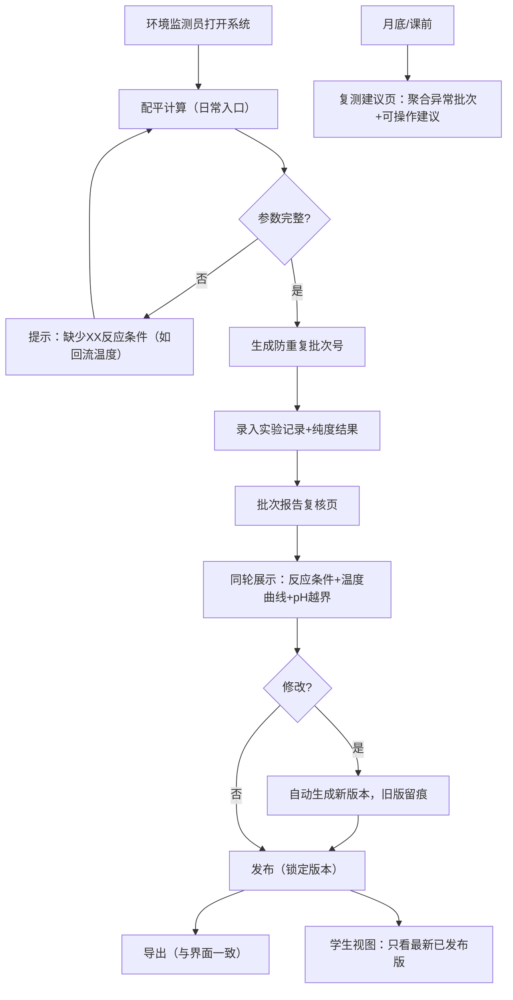

## 1. 产品概述
溶剂回收纯度追踪系统 — 解决实验室溶剂回收流程中数据不一致、报告各说各话的核心问题。
- 面向环境监测员（主操作）、老师/工程师（复核讲解）、学生（学习查看）三类角色
- 核心价值：版本可控的数据溯源、可解释的实验结果、防重复的批次管理、一致的导出视图

## 2. 核心特性

### 2.1 用户角色
| 角色 | 登录方式 | 核心权限 |
|------|----------|----------|
| 环境监测员 | 角色切换选择 | 配平计算、录入实验数据、修改批次报告、导出、复核全部数据 |
| 老师/工程师 | 角色切换选择 | 查看全部批次、复核结果、查看复测建议、讲解用视图 |
| 学生 | 角色切换选择 | 只读查看已发布批次报告、实验记录、当前批次处理条件 |

### 2.2 功能模块
1. **配平计算页（日常入口）**：溶剂配平参数计算 → 生成批次草稿 → 关联实验记录
2. **实验记录追踪页**：批次列表 → 纯度结果卡片（带解释说明）→ 版本对比
3. **批次报告复核页**：同轮展示反应条件/温度曲线/pH越界 → 修改记录留痕 → 发布给学生
4. **复测建议页（月底/课前入口）**：聚合需复测批次 → 原因说明 → 操作建议
5. **学生只读视图**：已发布报告 → 实验记录讲解模式 → 无双份结论

### 2.3 页面详情
| 页面名称 | 模块名称 | 功能描述 |
|----------|----------|----------|
| 配平计算页 | 配平参数表单 | 输入溶剂类型、初始量、目标纯度，实时计算回收率；缺少参数时给出可操作提示而非错误 |
| 配平计算页 | 批次草稿生成 | 一键生成批次号，防重复（同批次+同条件不重复建单） |
| 实验记录追踪页 | 批次卡片列表 | 显示批次号、纯度结果、状态标签；每个结果旁附1-2句专业解释 |
| 实验记录追踪页 | 版本历史对比 | 展示修改前后差异，标注修改人/时间，老师可直接用于讲解 |
| 批次报告复核页 | 同轮复核三要素 | 反应条件参数表、温度曲线图、pH越界告警并列展示 |
| 批次报告复核页 | 修改留痕 | 任何改动自动生成新版本，旧版保留不可删，防各说各话 |
| 批次报告复核页 | 发布状态切换 | 标记"已发布"后学生可见，版本锁定 |
| 复测建议页 | 聚合仪表盘 | 按需复测原因分类（纯度不达标、pH越界、曲线异常） |
| 复测建议页 | 建议操作卡片 | 每条建议附具体操作步骤（如"补充反应温度3记录点"） |
| 学生视图 | 已发布报告 | 只显示最新已发布版本，无旧版入口，无重复结论 |
| 学生视图 | 讲解模式 | 结果+解释并列，反应条件/温度/pH同屏，突出"处理的是眼前这批具体材料" |
| 全局 | 角色切换栏 | 顶部快速切换三种角色视角 |
| 全局 | 示例数据注入 | 首次打开自动加载3条完整批次示例数据 |
| 全局 | 导出功能 | 导出PDF/CSV内容与界面摘要完全一致，状态标签同步 |

## 3. 核心流程
环境监测员日常：打开配平计算 → 输入参数（缺参数给可操作提示）→ 生成批次 → 录入实验记录 → 复核三要素 → 修改生成新版本 → 发布 → 导出（内容与页面一致）
月底/课前：打开复测建议 → 查看聚合原因 → 按建议操作
学生：切换学生角色 → 查看已发布最新版本 → 看同屏三要素理解具体批次

## 4. 用户界面设计

### 4.1 设计风格
- **主色调**：实验室蓝 `#1E4D8C` + 化学绿 `#2D9A6F`，强调专业可信赖感
- **辅助色**：告警橙 `#E8873A`（pH越界）、纯度色阶（从浅红到深绿随纯度渐变）
- **按钮风格**：圆角8px，轻微阴影，悬停上浮2px
- **字体**：标题用 'DM Serif Display'（衬线，学术气质），正文用 'Noto Sans SC'（清晰可读）
- **布局风格**：卡片式分区，左侧导航栏 + 顶部角色切换 + 主内容区
- **图标风格**：线性 outline 图标（烧瓶、烧杯、温度计、pH试纸等化学元素）

### 4.2 页面设计概览
| 页面名称 | 模块名称 | UI元素 |
|----------|----------|--------|
| 配平计算页 | 表单区 | 大输入框配单位标签，实时计算结果浮层，缺参提示用橙色边框+文字 |
| 实验记录追踪页 | 卡片列表 | 纯度结果用大号渐变色数字，旁附斜体解释文字；版本标签用徽章样式 |
| 批次报告复核页 | 三栏复核 | 左反应条件表格、中温度曲线SVG图、右pH越界时间轴；修改对比用删除线/下划线标注 |
| 复测建议页 | 仪表盘 | 顶部统计卡（需复测/已完成/达标率），下方建议卡片逐条列出原因和具体步骤 |
| 学生视图 | 讲解模式 | 更大字体，更宽行间距，解释框用浅蓝底边框突出，三要素同屏不折叠 |

### 4.3 响应式
- 桌面优先（≥1280px），复核页三栏并列
- 平板（768-1279px）：复核页改为上下堆叠，导航栏折叠为顶部标签
- 移动端（<768px）：卡片单列，图表自适应宽度，角色切换改为底部抽屉
