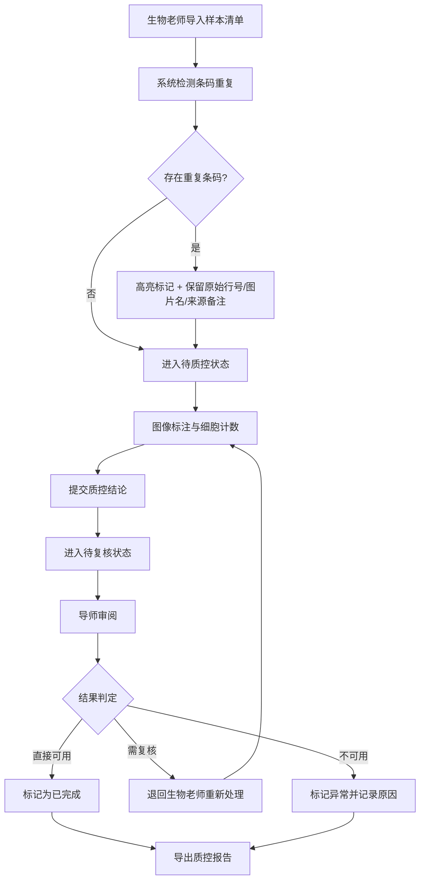

## 1. 产品概述

细胞计数质控台是面向生物实验室的样本质控管理系统，解决生物老师样本清单与显微照片的质控流程问题。系统覆盖样本导入、复核、状态推进、报告导出全流程，重点保障条码重复检测、样本质控、图像标注和差异分析的稳定性，重启服务后可追溯历史处理痕迹。

- 目标用户：生物老师（执行质控操作）、导师（审阅质控结果）
- 核心价值：让质控流程可追溯、重复条码可定位、结论可追溯来源

## 2. 核心功能

### 2.1 用户角色

| 角色 | 说明 | 核心权限 |
|------|------|----------|
| 生物老师 | 实验室操作人员，负责样本导入与复核 | 导入样本、图像标注、提交质控、查看差异分析 |
| 导师 | 审阅人员，关注结果可用性 | 查看质控结果、区分可用/不可用记录、导出报告、追溯问题来源 |

### 2.2 功能模块

1. **质控工作台**：样本导入、状态流转、批量操作
2. **图像标注**：显微照片查看、细胞计数标注、标注保存
3. **差异分析**：质控结论与来源材料对比、异常标记
4. **导师视图**：结果概览、可用/不可用分类、问题追溯
5. **报告中心**：报告导出、处理历史查询

### 2.3 页面详情

| 页面名称 | 模块名称 | 功能描述 |
|----------|----------|------------|
| 质控工作台 | 样本导入区 | 支持 CSV/Excel 导入，自动检测条码重复，显示原始行号、图片名、来源备注 |
| 质控工作台 | 样本列表 | 展示样本状态（待导入/待质控/待复核/已完成/异常），支持状态推进 |
| 质控工作台 | 条码重复提示 | 重复条码高亮，保留所有重复记录的溯源信息 |
| 图像标注页 | 图片预览 | 显微照片查看、缩放、标注区域选择 |
| 图像标注页 | 计数标注 | 细胞点位标注、自动计数、标注保存与修改 |
| 差异分析页 | 差异对比 | 质控结论 vs 原始材料对比，异常项标记 |
| 差异分析页 | 来源追溯 | 点击异常项可回溯至原始行号、图片名、备注 |
| 导师视图 | 结果概览 | 按状态分类统计：直接可用 / 需复核 / 不可用 |
| 导师视图 | 问题列表 | 不可用记录及原因、需生物老师复核的项目 |
| 报告中心 | 报告导出 | 导出质控报告（含处理历史、异常记录） |
| 报告中心 | 历史查询 | 按时间、批次查询历史处理记录 |

## 3. 核心流程

主要用户流程：生物老师导入样本清单 → 系统自动检测条码重复并标记 → 生物老师逐样本进行图像标注与质控 → 提交复核 → 导师审阅结果（区分可用/不可用/需复核） → 导出报告。

## 4. 用户界面设计

### 4.1 设计风格

- 主色调：深青色（#0F766E）代表实验室专业感，搭配琥珀色（#D97706）作为状态警示色
- 辅助色：蓝灰色系作为中性色，数据表格使用斑马纹提升可读性
- 按钮风格：圆角 6px，主按钮实心填充，次要按钮描边，悬停有微阴影
- 字体：标题使用 Lora 衬线字体增强学术感，正文使用 IBM Plex Sans 保证数据表格清晰度
- 布局风格：左侧导航 + 右侧内容区，数据卡片采用紧凑信息密度
- 状态标识：使用彩色徽章（Badge）+ 图标组合，避免仅靠颜色区分

### 4.2 页面设计概览

| 页面名称 | 模块名称 | UI 元素 |
|----------|----------|----------|
| 质控工作台 | 顶部操作栏 | 导入按钮、批量状态操作、搜索筛选、状态标签筛选 |
| 质控工作台 | 样本表格 | 行高紧凑，重复条码行使用浅琥珀色背景 + 警告图标，操作列含状态推进按钮 |
| 质控工作台 | 导入弹窗 | 文件拖拽区、字段映射预览、重复检测结果预览 |
| 图像标注页 | 左侧图片区 | 大图预览、缩放控制、标注工具栏 |
| 图像标注页 | 右侧信息面板 | 样本信息、标注计数、质控结论输入、保存按钮 |
| 导师视图 | 顶部统计卡片 | 三栏卡片：直接可用 / 需复核 / 不可用，各含数量与占比 |
| 导师视图 | 问题记录表 | 不可用记录列表，含异常原因、溯源链接（跳转原始行/图片/备注） |
| 导师视图 | 状态快速筛选 | Tab 切换：全部 / 直接可用 / 需复核 / 不可用 |

### 4.3 响应式

桌面端优先设计，1280px 以上为最佳体验。平板端表格支持横向滚动，移动端折叠导航为汉堡菜单。

### 4.4 测试路径

内置重复导入测试场景：提供测试数据文件（含 3 条重复条码样本），验证导入时系统是否正确标记、保留溯源信息、不覆盖已有数据。
