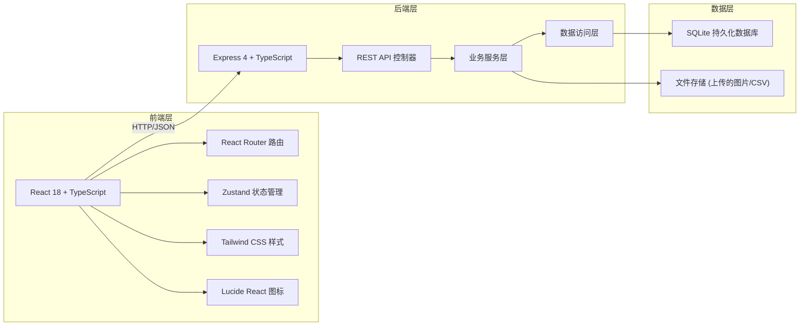
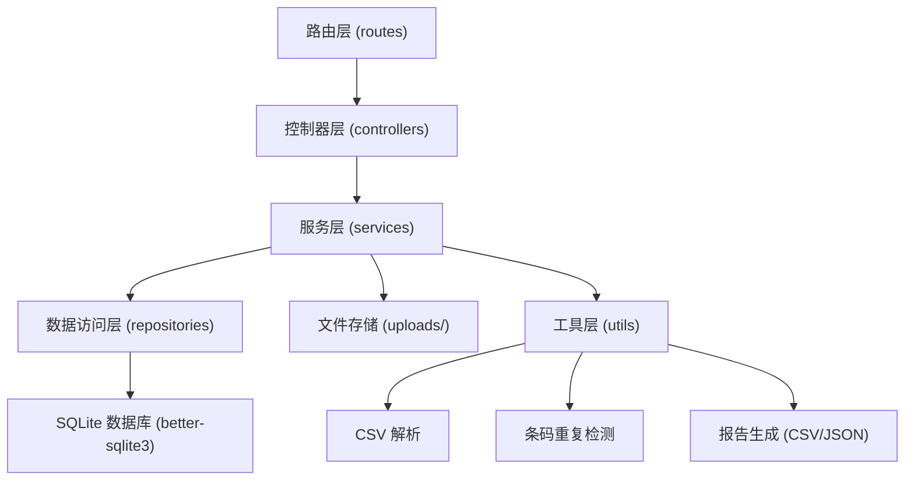
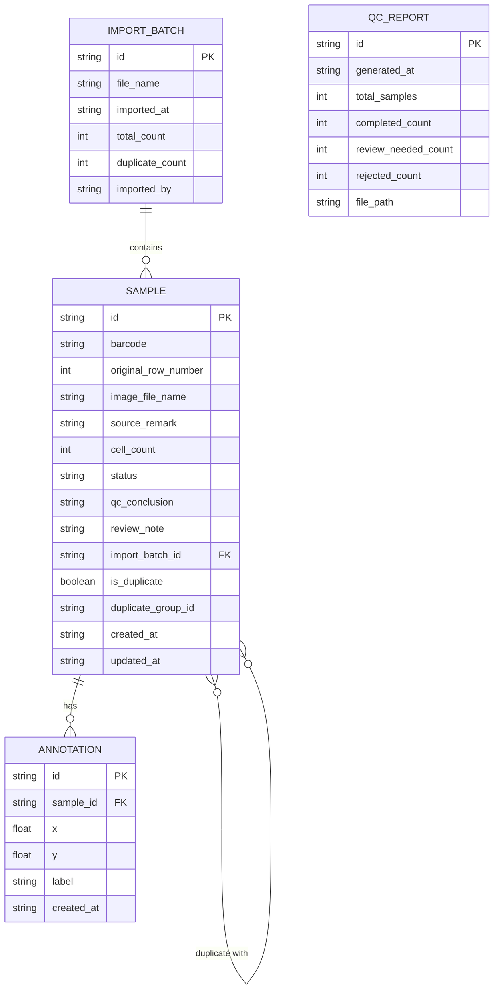

## 1. 架构设计



## 2. 技术描述

- 前端：React@18 + TypeScript + Tailwind CSS@3 + Vite + Zustand + React Router + Lucide React
- 初始化工具：vite-init（react-express-ts 模板）
- 后端：Express@4 + TypeScript (ESM)
- 数据库：better-sqlite3（同步 API，轻量持久化，重启后数据保留）
- 文件上传：multer 中间件处理 CSV/图片上传
- 数据解析：csv-parse 处理样本清单导入

## 3. 路由定义

| 路由 | 用途 |
|------|------|
| / | 质控工作台（样本列表 + 导入操作） |
| /annotation/:sampleId | 图像标注页 |
| /diff-analysis | 差异分析页 |
| /supervisor | 导师视图（结果概览） |
| /reports | 报告中心（导出 + 历史查询） |

## 4. API 定义

### 4.1 类型定义

```typescript
// shared/types.ts

export type SampleStatus = 
  | 'pending_import'   // 待导入
  | 'pending_qc'       // 待质控
  | 'pending_review'   // 待复核
  | 'completed'        // 已完成（直接可用）
  | 'review_needed'    // 需复核
  | 'rejected';        // 不可用

export interface Sample {
  id: string;
  barcode: string;
  originalRowNumber: number;    // 原始行号
  imageFileName: string | null; // 图片文件名
  sourceRemark: string | null;  // 来源备注
  cellCount: number | null;     // 细胞计数
  status: SampleStatus;
  qcConclusion: string | null;  // 质控结论
  reviewNote: string | null;    // 复核备注
  importBatchId: string;        // 导入批次ID
  isDuplicate: boolean;         // 是否条码重复
  duplicateGroupId: string | null; // 重复组ID
  createdAt: string;
  updatedAt: string;
}

export interface Annotation {
  id: string;
  sampleId: string;
  x: number;
  y: number;
  label: string;
  createdAt: string;
}

export interface ImportBatch {
  id: string;
  fileName: string;
  importedAt: string;
  totalCount: number;
  duplicateCount: number;
  importedBy: string;
}

export interface QCReport {
  id: string;
  generatedAt: string;
  totalSamples: number;
  completedCount: number;
  reviewNeededCount: number;
  rejectedCount: number;
  filePath: string;
}
```

### 4.2 API 接口

| Method | Path | 描述 | 请求/响应 |
|--------|------|------|-----------|
| GET | /api/samples | 获取样本列表（支持状态筛选、条码搜索） | Query: status, search, page, pageSize → { list: Sample[], total: number } |
| POST | /api/samples/import | 导入样本清单（CSV 文件） | FormData: file → { batch: ImportBatch, samples: Sample[], duplicates: Sample[][] } |
| GET | /api/samples/:id | 获取样本详情 | → Sample |
| PATCH | /api/samples/:id | 更新样本（状态、质控结论等） | Body: Partial\<Sample\> → Sample |
| POST | /api/samples/:id/status | 推进样本状态 | Body: { status: SampleStatus, note?: string } → Sample |
| GET | /api/samples/:id/annotations | 获取样本标注 | → Annotation[] |
| POST | /api/samples/:id/annotations | 添加标注点 | Body: { x, y, label } → Annotation |
| DELETE | /api/annotations/:id | 删除标注点 | → { success: boolean } |
| GET | /api/diff-analysis | 差异分析数据 | → { samples: Sample[], anomalies: Sample[] } |
| GET | /api/supervisor/overview | 导师视图概览 | → { total, completed, reviewNeeded, rejected, byStatus: Record\<SampleStatus, number\> } |
| GET | /api/reports | 报告列表 | → QCReport[] |
| POST | /api/reports/generate | 生成质控报告 | Body: { filters } → QCReport |
| GET | /api/reports/:id/download | 下载报告 | → 文件流 |
| GET | /api/duplicates | 获取所有重复条码组 | → Sample[][] |

## 5. 服务器架构图



## 6. 数据模型

### 6.1 ER 图



### 6.2 DDL 语句

```sql
-- migrations/001_init.sql

CREATE TABLE IF NOT EXISTS import_batches (
  id TEXT PRIMARY KEY,
  file_name TEXT NOT NULL,
  imported_at TEXT NOT NULL,
  total_count INTEGER NOT NULL DEFAULT 0,
  duplicate_count INTEGER NOT NULL DEFAULT 0,
  imported_by TEXT NOT NULL DEFAULT 'system'
);

CREATE TABLE IF NOT EXISTS samples (
  id TEXT PRIMARY KEY,
  barcode TEXT NOT NULL,
  original_row_number INTEGER NOT NULL,
  image_file_name TEXT,
  source_remark TEXT,
  cell_count INTEGER,
  status TEXT NOT NULL DEFAULT 'pending_qc',
  qc_conclusion TEXT,
  review_note TEXT,
  import_batch_id TEXT NOT NULL,
  is_duplicate INTEGER NOT NULL DEFAULT 0,
  duplicate_group_id TEXT,
  created_at TEXT NOT NULL,
  updated_at TEXT NOT NULL,
  FOREIGN KEY (import_batch_id) REFERENCES import_batches(id)
);

CREATE INDEX IF NOT EXISTS idx_samples_barcode ON samples(barcode);
CREATE INDEX IF NOT EXISTS idx_samples_status ON samples(status);
CREATE INDEX IF NOT EXISTS idx_samples_duplicate_group ON samples(duplicate_group_id);
CREATE INDEX IF NOT EXISTS idx_samples_batch ON samples(import_batch_id);

CREATE TABLE IF NOT EXISTS annotations (
  id TEXT PRIMARY KEY,
  sample_id TEXT NOT NULL,
  x REAL NOT NULL,
  y REAL NOT NULL,
  label TEXT NOT NULL DEFAULT 'cell',
  created_at TEXT NOT NULL,
  FOREIGN KEY (sample_id) REFERENCES samples(id)
);

CREATE INDEX IF NOT EXISTS idx_annotations_sample ON annotations(sample_id);

CREATE TABLE IF NOT EXISTS qc_reports (
  id TEXT PRIMARY KEY,
  generated_at TEXT NOT NULL,
  total_samples INTEGER NOT NULL DEFAULT 0,
  completed_count INTEGER NOT NULL DEFAULT 0,
  review_needed_count INTEGER NOT NULL DEFAULT 0,
  rejected_count INTEGER NOT NULL DEFAULT 0,
  file_path TEXT NOT NULL
);
```
