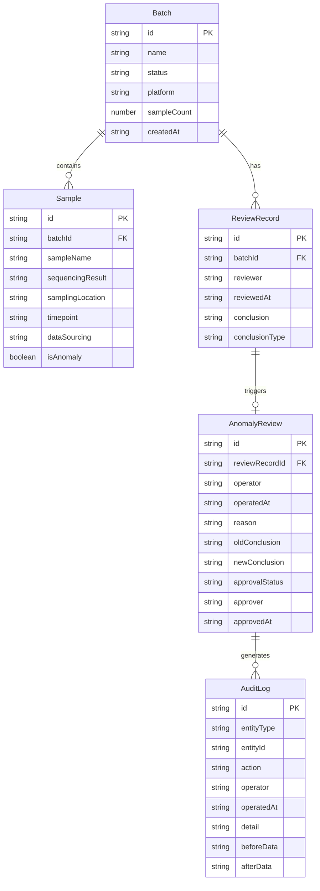

## 1. 架构设计

```mermaid
flowchart TB
    subgraph "前端层"
        "React 18 + TypeScript"
        "TailwindCSS"
        "Zustand 状态管理"
        "Recharts 聚类可视化"
    end
    subgraph "数据层"
        "Mock数据服务"
        "本地状态持久化"
    end
    "React 18 + TypeScript" --> "Zustand 状态管理"
    "Zustand 状态管理" --> "Mock数据服务"
    "React 18 + TypeScript" --> "Recharts 聚类可视化"
```

纯前端方案，所有数据通过Mock数据服务提供，状态通过Zustand管理并持久化到localStorage。

## 2. 技术说明

- 前端：React@18 + TypeScript + TailwindCSS@3 + Vite
- 初始化工具：vite-init
- 后端：无（纯前端，Mock数据）
- 数据库：无（localStorage持久化 + Mock初始数据）
- 可视化：Recharts（散点图/聚类图）
- 状态管理：Zustand
- 路由：react-router-dom

## 3. 路由定义

| 路由 | 用途 |
|------|------|
| / | 批次复核主页：批次列表、数据合并、聚类可视化 |
| /review/:batchId | 复核详情页：测序数据表、结论面板、异常标记 |
| /anomaly/:batchId | 异常复核页：前后对比、图像标注、修改记录 |
| /audit | 审计日志页：操作时间线、筛选过滤 |

## 4. 数据模型

### 4.1 数据模型定义



### 4.2 数据定义

核心TypeScript类型：

```typescript
interface Batch {
  id: string;
  name: string;
  status: 'pending' | 'passed' | 'anomaly';
  platform: string;
  sampleCount: number;
  createdAt: string;
}

interface Sample {
  id: string;
  batchId: string;
  sampleName: string;
  sequencingResult: string;
  samplingLocation: string;
  timepoint: string;
  dataSourcing: 'old_table' | 'group_supplement' | 'merged';
  isAnomaly: boolean;
  umapX: number;
  umapY: number;
  clusterId: string;
}

interface ReviewRecord {
  id: string;
  batchId: string;
  reviewer: string;
  reviewedAt: string;
  conclusion: string;
  conclusionType: 'pass' | 'fail' | 'anomaly_detected';
  samplesReviewed: string[];
}

interface AnomalyReview {
  id: string;
  reviewRecordId: string;
  batchId: string;
  operator: string;
  operatedAt: string;
  reason: string;
  oldConclusion: string;
  newConclusion: string;
  approvalStatus: 'pending' | 'approved' | 'rejected';
  approver: string | null;
  approvedAt: string | null;
  changedSamples: string[];
}

interface AuditLog {
  id: string;
  entityType: 'batch' | 'review' | 'anomaly';
  entityId: string;
  action: string;
  operator: string;
  operatedAt: string;
  detail: string;
  beforeData: Record<string, unknown> | null;
  afterData: Record<string, unknown> | null;
}
```

## 5. 组件架构

```
src/
├── components/
│   ├── layout/          # 布局组件
│   │   ├── Sidebar.tsx
│   │   └── AppLayout.tsx
│   ├── batch/           # 批次相关组件
│   │   ├── BatchCard.tsx
│   │   ├── BatchList.tsx
│   │   └── DataMergePanel.tsx
│   ├── review/          # 复核相关组件
│   │   ├── SampleTable.tsx
│   │   ├── ClusterChart.tsx
│   │   ├── ConclusionPanel.tsx
│   │   └── AnomalyMarker.tsx
│   ├── anomaly/         # 异常复核组件
│   │   ├── BeforeAfterCompare.tsx
│   │   ├── ChartAnnotation.tsx
│   │   └── ModificationForm.tsx
│   └── audit/           # 审计日志组件
│       ├── TimelineList.tsx
│       └── TimelineDetail.tsx
├── pages/
│   ├── HomePage.tsx
│   ├── ReviewDetailPage.tsx
│   ├── AnomalyReviewPage.tsx
│   └── AuditLogPage.tsx
├── store/
│   ├── useBatchStore.ts
│   ├── useReviewStore.ts
│   └── useAuditStore.ts
├── data/
│   └── mockData.ts      # 包含边界样例的完整Mock数据
├── types/
│   └── index.ts
├── utils/
│   └── auditLogger.ts
├── App.tsx
└── main.tsx
```

## 6. 关键交互逻辑

### 6.1 数据合并流程
- 旧表数据与群补充数据通过样本ID自动匹配
- 匹配成功的字段标记为`merged`来源
- 仅存在于一方的数据标记对应来源
- 冲突字段（如采样地点不一致）橙色高亮，需人工确认

### 6.2 三方一致性联动
- 聚类图上点击某个聚类簇 → 表格自动滚动到对应样本行并高亮 → 文字结论高亮对应段落
- 表格中选中某行 → 聚类图上对应点放大脉冲 → 结论文字联动
- 时间点缺失的样本在三个视图中均以红色警示标记

### 6.3 异常复核前后对比
- 左右分栏对称布局
- 聚类图差异：新增样本用绿色三角、移除样本用红色叉号、位置变动用虚线箭头
- 表格差异：变更行用渐变背景标注，变更单元格高亮
- 结论差异：文字对比用删除线标注旧内容，下划线标注新内容

### 6.4 审计日志记录规则
- 任何结论变更自动生成审计日志
- 日志包含：操作人、时间戳、操作类型、变更前数据、变更后数据
- 审计日志不可删除，仅可追加
