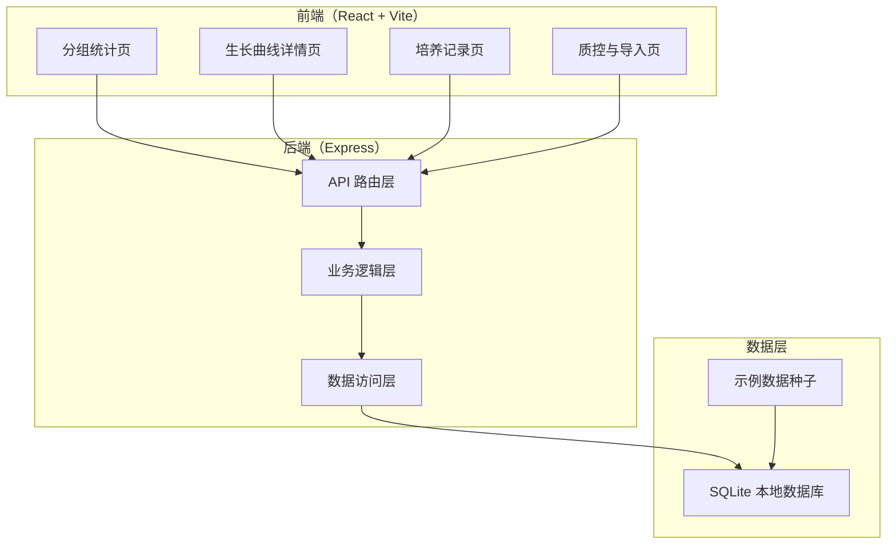
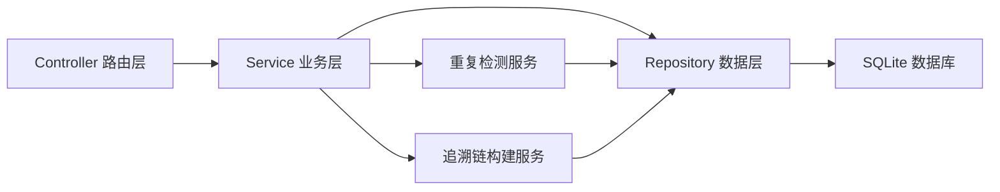
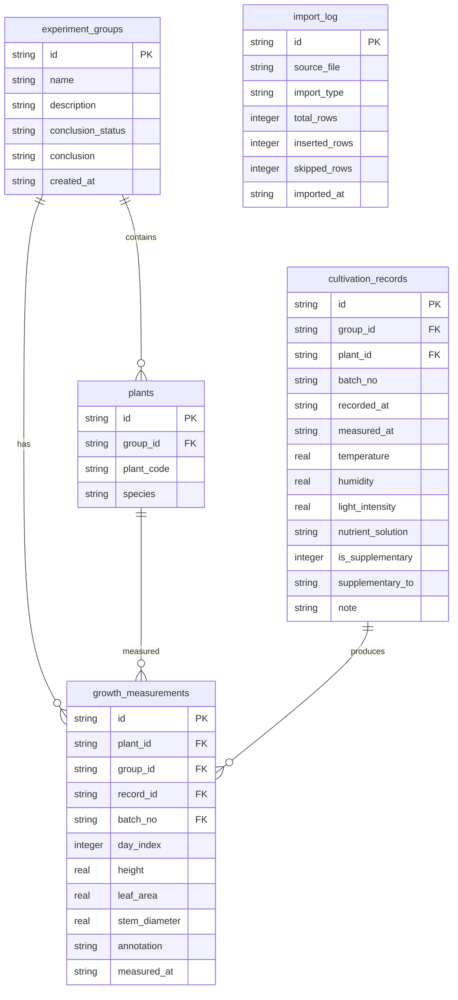

## 1. 架构设计



## 2. 技术说明

- 前端：React@18 + TypeScript + Tailwind CSS@3 + Vite
- 状态管理：Zustand
- 图表库：Recharts（生长曲线折线图）
- 初始化工具：vite-init（react-express-ts 模板）
- 后端：Express@4 + TypeScript（ESM 格式）
- 数据库：SQLite（better-sqlite3），本地文件存储
- 数据导入：multer 处理文件上传，papaparse 解析 CSV

## 3. 路由定义

| 路由 | 用途 |
|------|------|
| `/` | 分组统计页（日常入口） |
| `/curve/:groupId` | 生长曲线详情页 |
| `/records` | 培养记录页 |
| `/qc` | 质控与导入页 |

## 4. API 定义

### 4.1 分组统计

| 方法 | 路径 | 说明 |
|------|------|------|
| GET | `/api/groups` | 获取所有实验组列表及统计摘要 |
| GET | `/api/groups/:id` | 获取单个实验组详情 |

### 4.2 生长曲线

| 方法 | 路径 | 说明 |
|------|------|------|
| GET | `/api/groups/:id/curves` | 获取某组所有生长曲线数据 |
| GET | `/api/groups/:id/conclusion` | 获取某组最终结论（末页） |

### 4.3 培养记录

| 方法 | 路径 | 说明 |
|------|------|------|
| GET | `/api/records` | 获取培养记录列表（支持筛选） |
| POST | `/api/records` | 新增培养记录（含补录标记） |
| GET | `/api/records/batch/:batchNo` | 按试剂批号追溯关联记录与结论 |

### 4.4 质控与导入

| 方法 | 路径 | 说明 |
|------|------|------|
| GET | `/api/qc/summary` | 获取质控摘要（异常率、缺失率、完整性） |
| POST | `/api/import/json` | 导入 JSON 数据 |
| POST | `/api/import/csv` | 导入 CSV 数据 |
| POST | `/api/import/check-duplicates` | 检查导入数据中的重复项 |
| POST | `/api/import/resolve-conflict` | 解决重复冲突（覆盖/跳过/合并） |

### 4.5 示例数据

| 方法 | 路径 | 说明 |
|------|------|------|
| POST | `/api/seed` | 初始化示例数据（首次启动时调用） |
| GET | `/api/seed/status` | 检查是否已初始化示例数据 |

### 4.6 TypeScript 类型定义

```typescript
interface ExperimentGroup {
  id: string;
  name: string;
  description: string;
  plantCount: number;
  lastMeasuredAt: string;
  conclusionStatus: "normal" | "abnormal" | "pending";
  conclusion?: string;
  createdAt: string;
}

interface GrowthMeasurement {
  id: string;
  groupId: string;
  plantId: string;
  measuredAt: string;
  dayIndex: number;
  height: number;
  leafArea: number;
  stemDiameter: number;
  annotation: "normal" | "abnormal" | "pending";
  recordId: string;
  batchNo: string;
}

interface CultivationRecord {
  id: string;
  groupId: string;
  plantId: string;
  batchNo: string;
  recordedAt: string;
  measuredAt: string;
  temperature: number;
  humidity: number;
  lightIntensity: number;
  nutrientSolution: string;
  isSupplementary: boolean;
  supplementaryTo?: string;
  note?: string;
}

interface DuplicateConflict {
  existing: CultivationRecord;
  incoming: CultivationRecord;
  matchFields: string[];
}

interface QCSummary {
  totalRecords: number;
  abnormalRate: number;
  missingRate: number;
  annotationCompleteness: number;
  monthlyTrend: { month: string; abnormalRate: number; missingRate: number }[];
}
```

## 5. 服务端架构图



## 6. 数据模型

### 6.1 数据模型定义



### 6.2 数据定义语言

```sql
CREATE TABLE IF NOT EXISTS experiment_groups (
  id TEXT PRIMARY KEY,
  name TEXT NOT NULL,
  description TEXT,
  conclusion_status TEXT NOT NULL DEFAULT 'pending' CHECK(conclusion_status IN ('normal','abnormal','pending')),
  conclusion TEXT,
  created_at TEXT NOT NULL DEFAULT (datetime('now'))
);

CREATE TABLE IF NOT EXISTS plants (
  id TEXT PRIMARY KEY,
  group_id TEXT NOT NULL REFERENCES experiment_groups(id),
  plant_code TEXT NOT NULL,
  species TEXT,
  UNIQUE(group_id, plant_code)
);

CREATE TABLE IF NOT EXISTS cultivation_records (
  id TEXT PRIMARY KEY,
  group_id TEXT NOT NULL REFERENCES experiment_groups(id),
  plant_id TEXT NOT NULL REFERENCES plants(id),
  batch_no TEXT NOT NULL,
  recorded_at TEXT NOT NULL,
  measured_at TEXT NOT NULL,
  temperature REAL,
  humidity REAL,
  light_intensity REAL,
  nutrient_solution TEXT,
  is_supplementary INTEGER NOT NULL DEFAULT 0,
  supplementary_to TEXT REFERENCES cultivation_records(id),
  note TEXT
);

CREATE TABLE IF NOT EXISTS growth_measurements (
  id TEXT PRIMARY KEY,
  plant_id TEXT NOT NULL REFERENCES plants(id),
  group_id TEXT NOT NULL REFERENCES experiment_groups(id),
  record_id TEXT NOT NULL REFERENCES cultivation_records(id),
  batch_no TEXT NOT NULL,
  day_index INTEGER NOT NULL,
  height REAL,
  leaf_area REAL,
  stem_diameter REAL,
  annotation TEXT NOT NULL DEFAULT 'normal' CHECK(annotation IN ('normal','abnormal','pending')),
  measured_at TEXT NOT NULL
);

CREATE TABLE IF NOT EXISTS import_log (
  id TEXT PRIMARY KEY,
  source_file TEXT NOT NULL,
  import_type TEXT NOT NULL CHECK(import_type IN ('json','csv')),
  total_rows INTEGER NOT NULL,
  inserted_rows INTEGER NOT NULL,
  skipped_rows INTEGER NOT NULL DEFAULT 0,
  imported_at TEXT NOT NULL DEFAULT (datetime('now'))
);

CREATE INDEX idx_plants_group ON plants(group_id);
CREATE INDEX idx_measurements_plant ON growth_measurements(plant_id);
CREATE INDEX idx_measurements_group ON growth_measurements(group_id);
CREATE INDEX idx_measurements_record ON growth_measurements(record_id);
CREATE INDEX idx_measurements_batch ON growth_measurements(batch_no);
CREATE INDEX idx_records_batch ON cultivation_records(batch_no);
CREATE INDEX idx_records_group ON cultivation_records(group_id);
CREATE INDEX idx_records_supplementary ON cultivation_records(is_supplementary);
CREATE UNIQUE INDEX idx_duplicate_check ON cultivation_records(plant_id, measured_at, batch_no);
```
