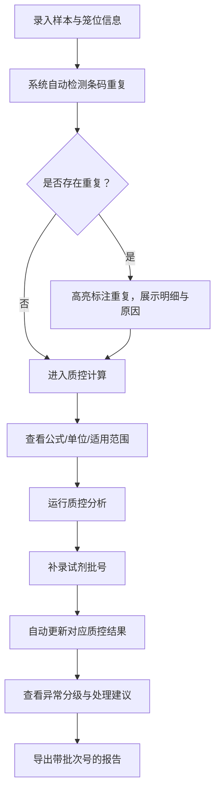
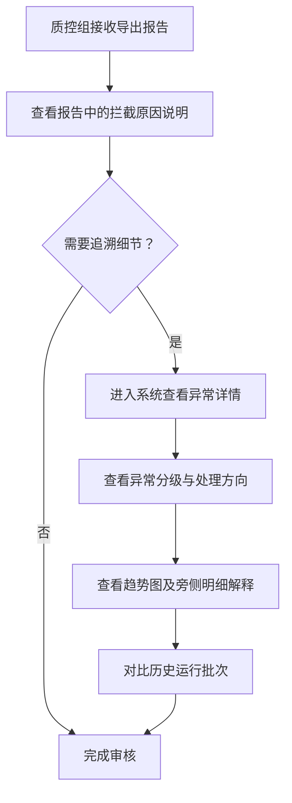

## 1. 产品概述

小鼠笼位健康台账是面向医院检验师和质控组的检验质量计算与管理工具，解决样本条码重复、质控差异分析、异常分级判断等核心问题，避免因时间点缺失、口径不一致导致的返工。

- **目标用户**：医院检验师（日常使用）、质控组（审核报告）
- **核心价值**：计算过程透明可追溯、质控分析持续迭代、异常原因清晰可执行、导出报告完整可解释

## 2. 核心功能

### 2.1 用户角色

| 角色 | 使用场景 | 核心权限 |
|------|----------|----------|
| 医院检验师 | 日常录入样本、运行计算、补录试剂批号 | 全功能操作、数据录入、运行分析、导出报告 |
| 质控组 | 审核质控结果、查看异常明细、追溯原因 | 查看报告、查看异常详情、导出质控报告 |

### 2.2 功能模块

1. **计算工具面板**：公式展示、单位说明、适用范围、失败原因
2. **样本管理**：样本录入、条码查重、笼位台账
3. **质控分析**：差异分析、试剂批号联动、质控持续更新
4. **异常中心**：异常分级、处理建议、明细追溯
5. **报告导出**：带运行批次标识、含拦截原因说明

### 2.3 页面详情

| 页面名称 | 模块名称 | 功能描述 |
|----------|----------|----------|
| 计算工具页 | 公式展示区 | 展示所有计算公式、单位、适用范围，支持展开查看推导过程 |
| 计算工具页 | 输入参数区 | 可输入参数进行实时计算，显示失败原因及修正建议 |
| 样本台账页 | 样本列表 | 笼位维度的样本台账，支持按笼位、时间、条码筛选 |
| 样本台账页 | 条码重复检测 | 自动检测重复条码，高亮标注并展示重复明细 |
| 质控分析页 | 质控趋势图 | 样本质控趋势折线图，旁附数据明细表格 |
| 质控分析页 | 试剂批号管理 | 补录/更新试剂批号后自动重新计算对应质控结果 |
| 异常中心页 | 异常分级卡片 | 按"补材料"和"改口径"分类展示异常，非单一红色数字 |
| 异常中心页 | 异常详情 | 每个异常展示原因、影响范围、建议操作、历史处理记录 |
| 报告导出页 | 导出配置 | 选择导出范围、运行批次标识、报告格式 |
| 报告导出页 | 预览下载 | 在线预览报告内容，文件名含运行批次号便于区分 |

## 3. 核心流程

### 3.1 检验师日常工作流程

检验师登录后，首先录入当日样本和笼位信息。系统自动检测条码重复并提示。随后运行质控计算，可查看公式细节和单位说明。补录试剂批号后，质控结果自动更新。最后导出带批次号的报告，质控组可直接查看拦截原因。

### 3.2 质控组审核流程

质控组接收导出报告后，可直接在报告中查看条码重复的拦截原因。如需追溯，可进入系统查看异常详情、趋势图旁的明细解释、以及历史运行对比。

## 4. 用户界面设计

### 4.1 设计风格

- **主色调**：深蓝灰系（专业、稳重），辅以医学蓝作为强调色
- **辅助色**：
  - 警告黄：需关注但不紧急
  - 提示蓝：信息补充
  - 行动绿：可正常进行
  - 异常橙：需要补材料
  - 口径紫：需要改口径
- **按钮风格**：直角微圆角，扁平设计，明确的层次区分
- **字体**：系统无衬线字体为主，数字使用等宽字体便于比对
- **布局风格**：卡片式布局，左侧导航，主内容区信息密度适中
- **图标风格**：线性图标，简洁清晰，医学检验相关图标

### 4.2 页面设计概述

| 页面名称 | 模块名称 | UI 元素 |
|----------|----------|---------|
| 计算工具页 | 公式展示区 | 折叠面板、公式高亮、单位标签、适用范围标签、失败原因说明卡片 |
| 样本台账页 | 条码重复检测 | 重复行高亮、重复明细弹窗、重复原因说明、影响范围提示 |
| 质控分析页 | 质控趋势图 | SVG 折线图、右侧数据明细表、数据点悬浮详情、试剂批号标记 |
| 异常中心页 | 异常分级卡片 | 两栏布局（补材料/改口径）、卡片计数、颜色区分、展开详情 |
| 报告导出页 | 导出配置 | 批次号自动生成、预览区域、下载按钮带文件名预览 |

### 4.3 响应式

- 桌面端优先设计，适配 1280px 及以上宽度
- 平板端自适应，导航可折叠
- 表格类数据支持横向滚动查看

### 4.4 数据可视化

- **质控趋势图**：SVG 折线图，不依赖第三方图表库，保持轻量
- **异常分布**：简单条形图展示各类型异常数量
- **明细解释**：所有图表旁侧必须配有数据明细表格，不能仅靠颜色传达信息
- **历史对比**：支持双批次叠加对比，用不同线型区分
