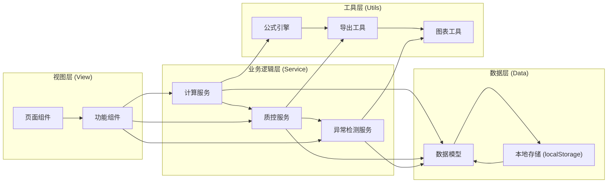
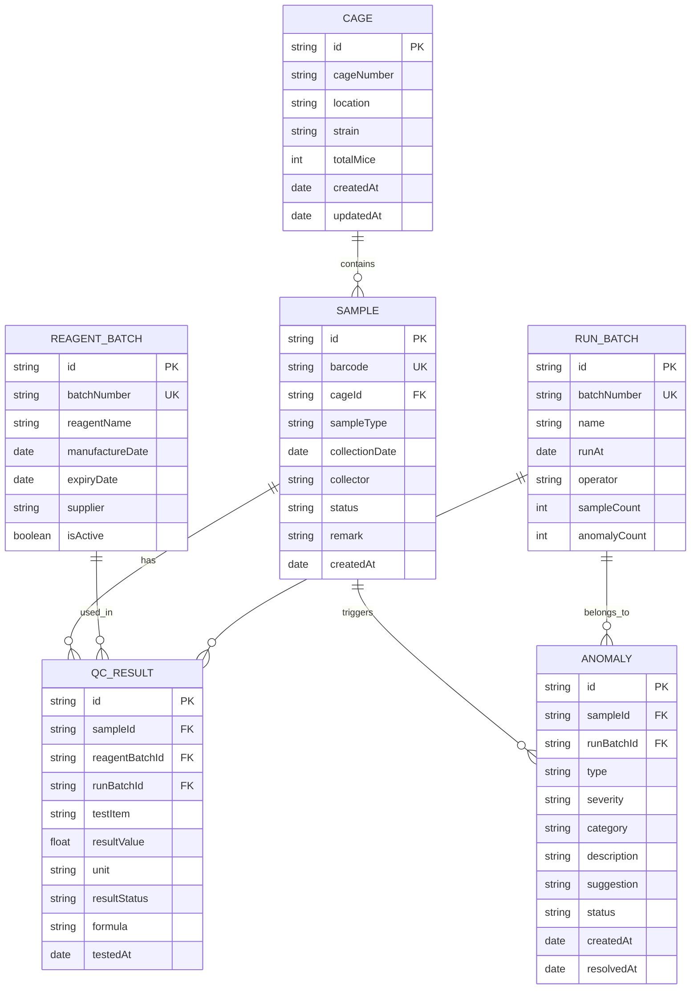

## 1. 架构设计

本项目为纯前端应用，采用浏览器本地存储持久化数据，无需后端服务。整体采用分层架构，确保数据、业务逻辑和视图分离。



## 2. 技术描述

- **前端框架**：React@18 + TypeScript
- **构建工具**：Vite@5
- **样式方案**：Tailwind CSS@3
- **路由管理**：React Router@6
- **状态管理**：React Context + useReducer（轻量级，避免过度工程化）
- **数据持久化**：localStorage（封装自定义 Hook）
- **图表实现**：原生 SVG 实现（轻量、无依赖，配合简单工具函数）
- **导出功能**：原生 JS 生成 CSV / HTML 报告（无第三方依赖）

## 3. 路由定义

| 路由路径 | 页面名称 | 用途 |
|----------|----------|------|
| / | 工作台概览 | 快捷入口、今日数据概览、异常提醒 |
| /calculator | 计算工具 | 公式展示、参数输入、实时计算、失败原因 |
| /samples | 样本台账 | 笼位台账、样本列表、条码重复检测 |
| /quality-control | 质控分析 | 质控趋势图、试剂批号管理、差异分析 |
| /anomalies | 异常中心 | 异常分级、处理建议、明细追溯 |
| /export | 报告导出 | 导出配置、预览、下载 |

## 4. 数据模型

### 4.1 数据模型定义



### 4.2 数据字段说明

#### 异常类型分类
- **补材料类 (category: supplement)**：数据缺失、时间点缺失、试剂批号缺失、样本信息不全
- **改口径类 (category: recalibration)**：质控超限、计算口径不一致、方法学差异、参考范围变更

### 4.3 本地存储键名

| 键名 | 数据类型 | 说明 |
|------|----------|------|
| mhc_cages | Cage[] | 笼位数据 |
| mhc_samples | Sample[] | 样本数据 |
| mhc_qc_results | QcResult[] | 质控结果 |
| mhc_reagent_batches | ReagentBatch[] | 试剂批号 |
| mhc_anomalies | Anomaly[] | 异常记录 |
| mhc_run_batches | RunBatch[] | 运行批次 |
| mhc_formulas | Formula[] | 计算公式配置 |

## 5. 核心模块设计

### 5.1 公式引擎模块

- 支持配置化公式定义，包含公式表达式、单位、适用范围、失败条件
- 实时计算，输入参数变更即触发计算
- 失败原因溯源：计算失败时返回具体失败节点和修正建议

### 5.2 条码重复检测模块

- 录入时实时查重，支持前缀匹配、精确匹配
- 重复检测结果包含：重复条码、重复次数、关联样本、首次录入时间、最近录入时间
- 导出报告中自动包含重复条码拦截原因说明

### 5.3 质控差异分析模块

- 试剂批号与质控结果关联，补录批号后自动重算关联质控
- 支持批次间质控结果差异比对
- 非一次性判断：记录每次运行的质控状态，可追溯历史变化

### 5.4 异常分级模块

- 按处理方向分类展示（补材料 / 改口径）
- 每个异常包含：异常描述、影响范围、建议操作、关联样本
- 异常状态流转：待处理 → 处理中 → 已解决

### 5.5 导出报告模块

- 文件名格式：`小鼠笼位健康台账_运行批次号_导出时间.csv`
- 报告内容包含：样本明细、质控结果、异常清单、拦截原因说明
- 纯前端生成，支持 CSV 和 HTML 两种格式

## 6. 项目目录结构

```
src/
├── components/          # 通用组件
│   ├── Layout/         # 布局组件
│   ├── Chart/          # 图表组件
│   ├── Table/          # 表格组件
│   └── common/         # 通用UI组件
├── pages/              # 页面组件
│   ├── Dashboard/
│   ├── Calculator/
│   ├── Samples/
│   ├── QualityControl/
│   ├── Anomalies/
│   └── Export/
├── services/           # 业务逻辑服务
│   ├── calculator.ts
│   ├── qc.ts
│   ├── anomaly.ts
│   └── export.ts
├── store/              # 状态管理
│   ├── index.ts
│   └── reducers/
├── models/             # 数据模型定义
│   └── index.ts
├── utils/              # 工具函数
│   ├── formula.ts
│   ├── storage.ts
│   ├── date.ts
│   └── chart.ts
├── hooks/              # 自定义 Hooks
│   ├── useLocalStorage.ts
│   └── useQcCalculation.ts
├── data/               # Mock 数据 / 初始数据
│   └── mockData.ts
├── App.tsx
├── main.tsx
└── index.css
```
