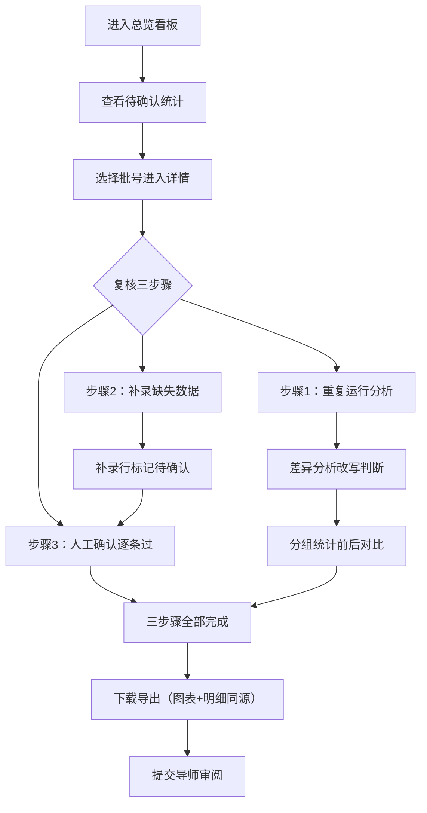
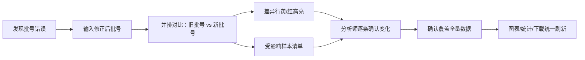

## 1. 产品概述

蛋白电泳条带标注复核工作台，解决生信分析师日常"凑表格核对"低效问题。围绕**试剂批号**这一主线，整合显微照片、采样地点、差异分析结果，统一数据源供图表/明细/下载共享。支持重复运行、补录、人工确认三大复核流程，批号修改后新旧结论并排对比，内置真实"坏数据"样例供导师审阅前演示。

- 目标用户：生信分析师、实验室PI、复核导师
- 核心价值：一条批号线串起全流程、三步骤复核无死角、改批号即见影响范围、数据一处变处处同步

---

## 2. 核心功能

### 2.1 用户角色

| 角色 | 使用场景 | 核心权限 |
|------|----------|----------|
| 生信分析师 | 日常复核、补录、重复运行分析 | 全功能操作、导出结果 |
| 复核导师 | 审阅标注结论、查看坏数据样例 | 只读浏览、对比查看 |

### 2.2 功能模块

1. **总览看板**：批号分布统计、条带质量分布图、最新差异分析变化、快速操作入口
2. **批号追踪主线**：按试剂批号聚合关联的样本、显微照片、采样地点、分析历史
3. **条带标注明细**：表格化展示条带位置、分子量、灰度值、标注状态、人工确认标记
4. **差异分析对比**：同一批号多轮分析前后结果对比、分组统计变化可视化
5. **批号修改并排视图**：旧批号 vs 新批号结论对比、受影响样本清单、差异高亮
6. **复核工作流**：重复运行分析、手动补录缺失数据、逐条人工确认三件事闭环
7. **数据下载**：统一数据源导出CSV/JSON，图表与明细同批数据
8. **坏数据样例集**：内置真实感异常数据（拖尾、过曝、条带缺失、批号笔误等）

### 2.3 页面详情

| 页面名称 | 模块名称 | 功能描述 |
|----------|----------|----------|
| 总览看板 | 统计卡片区 | 批号总数、待确认数、异常样本数、近7日变化趋势 |
| 总览看板 | 质量分布图 | 各批号条带质量分布柱状图 + 质量阈值参考线 |
| 总览看板 | 差异变化滚动 | 最近被差异分析改写判断的样本，旧→新标注并排 |
| 总览看板 | 快捷操作栏 | 重复运行、补录入库、导出结果、切换坏数据演示模式 |
| 批号详情 | 批号时间线 | 该批号所有分析轮次（Run1/Run2/Run3）纵向时间轴 |
| 批号详情 | 关联资源面板 | 显微照片缩略图、采样地点地图标记、试剂信息卡片 |
| 批号详情 | 条带标注表格 | 可筛选、排序、人工确认勾选、补录编辑行 |
| 批号详情 | 差异分组统计 | 按分组维度展示改前/改后标注数量变化 |
| 批号对比 | 并排对比视图 | 左右两栏：旧批号结论 vs 新批号结论，差异行高亮 |
| 批号对比 | 影响范围清单 | 受本次批号修改波及的所有样本ID与变化类型 |
| 复核工作台 | 三步骤进度卡 | 重复运行→补录→人工确认 进度指示与跳转 |
| 复核工作台 | 重复运行配置 | 选择算法参数、批量样本、确认后触发新一轮分析 |
| 复核工作台 | 补录表单 | 手动填写缺失字段、上传显微照片、备注异常说明 |
| 复核工作台 | 人工确认列表 | 逐条/批量勾选确认、支持驳回重审、加签意见 |
| 下载中心 | 数据预览 | 即将导出数据的行数、字段、批号范围预览 |
| 下载中心 | 格式选择 | CSV/JSON/PDF报告、附带图表、勾选包含原始照片 |
| 样例演示 | 坏数据案例库 | 6种典型异常场景卡片，点击加载对应模拟数据 |
| 样例演示 | 演示模式切换 | 一键切换真实数据/演示数据，红色水印标注"演示样例" |

---

## 3. 核心流程

### 3.1 日常复核工作流

生信分析师进入工作台 → 检查待确认列表 → 触发重复运行（使用最新算法）→ 系统生成差异报告 → 对缺失值补录 → 逐条人工确认 → 导出统一结果包 → 提交导师审阅。

### 3.2 试剂批号修改流程

发现批号笔误 → 输入新批号 → 系统拉取新批号历史分析 → 并排展示旧/新结论 → 高亮差异行 → 列出受影响样本 → 分析师确认覆盖 → 所有图表/统计实时刷新 → 下载数据自动同步最新结论。

### 3.3 坏数据演示流程

切换演示模式 → 从案例库选择一种异常（如"条带拖尾+批号笔误"组合）→ 页面加载模拟数据 → 展示异常在各模块的表现 → 导师查看如何被系统检出/人工复核修正。

---

## 4. 用户界面设计

### 4.1 设计风格

**学术科研仪表盘风格**——冷静克制、信息密度高、信任感强。

- **主色调**：深蓝墨色 `#0f2744`（主背景）、实验室蓝 `#2563eb`（主操作）、确认绿 `#059669`
- **辅助色**：差异黄 `#d97706`、异常红 `#dc2626`、补录紫 `#7c3aed`
- **中性色**：冷灰阶 `zinc-100/200/400/600/800`
- **按钮风格**：方角微圆（3px）、薄边框、按下凹陷阴影
- **字体**：标题用 `DM Serif Display`（衬线体，学术感）、正文表格用 `JetBrains Mono`（等宽，数字对齐）、辅助文字用 `Noto Sans SC`
- **布局**：顶部面包屑 + 左侧批号树 + 中央主工作区 + 右侧差异面板的三栏式
- **图标**：Lucide 线性图标，统一 16px/18px，hover 时变蓝并轻微放大
- **质感**：毛玻璃导航栏、表格斑马纹、卡片 1px 内描边、微弱噪点背景纹理

### 4.2 页面设计概览

| 页面名称 | 模块名称 | UI元素与动效 |
|----------|----------|--------------|
| 总览看板 | 统计卡片 | 4张卡片横向排列，数字滚动进入（staggered 60ms），hover 微上浮 2px |
| 总览看板 | 质量分布图 | SVG 柱状图，柱顶悬停显示 tooltip 浮层，超出阈值柱体变红色 |
| 总览看板 | 差异变化滚动 | 纵向无限滚动卡片，旧结论灰色删除线、新结论绿色加粗，差值徽章 |
| 批号详情 | 时间线 | 左侧竖线，节点圆点脉冲动画，点击轮次展开该轮条带数据 |
| 批号详情 | 并排对比表 | 左右双列固定表头滚动区，差异单元格黄色背景 + 右箭头 → |
| 批号详情 | 分组统计 | 上下对称条形图（上=改前，下=改后），中间零点轴对齐 |
| 复核工作台 | 三步骤卡 | 顶部阶梯式进度条，当前步骤蓝色发光边框，已完成绿色对勾 |
| 复核工作台 | 人工确认行 | hover 出现确认/驳回按钮，确认后行变浅绿 + 左侧对勾标记划入 |
| 样例演示 | 案例卡片 | 斜角切边设计、封面异常缩略图、hover 翻转显示处理建议 |
| 全局 | 水印 | 演示模式下全页面浅灰斜纹"DEMO SAMPLE"水印 |

### 4.3 响应式

- **桌面优先**（1440px+）：三栏完整布局，表格 12 列完整展示
- **平板**（1024px）：右侧差异面板折叠为抽屉，表格减少至 8 列
- **移动端**（<768px）：仅保留批号列表+单条详情，表格改为卡片式纵向排列

### 4.4 动效与微交互

- 页面加载：统计数字从 0 滚动至目标值（800ms ease-out）
- 表格行：点击人工确认时，背景色从白→浅绿 300ms 渐变，左侧对勾图标滑入
- 差异高亮：新旧批号切换时，差异行先闪黄 400ms 再渐变为常驻浅黄
- 重复运行触发：进度条从左到右流动，完成后弹出差异计数徽章（bounce 动画）
- 下载按钮：点击后出现环形进度，完成后变为绿色对勾并触发浏览器下载
