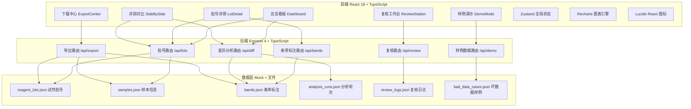
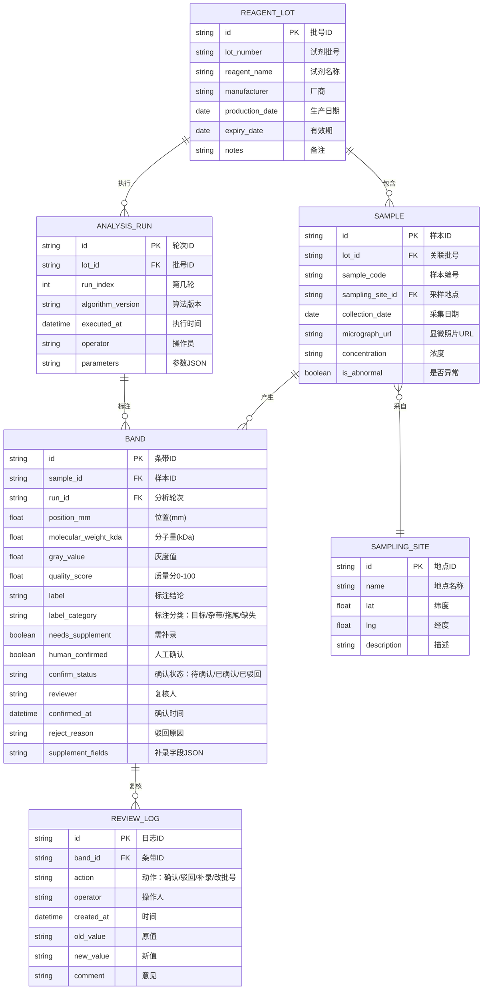

## 1. 架构设计



---

## 2. 技术说明

- **前端**：React@18 + TypeScript@5 + Vite@5 + TailwindCSS@3 + Zustand@4 + React Router@6 + Recharts@2 + Lucide React@0.400
- **初始化工具**：vite-init（react-express-ts 模板）
- **后端**：Express@4 + TypeScript@5 + CORS + ts-node 开发运行
- **数据层**：JSON 文件模拟 + 内存缓存，无需数据库
- **设计原则**：前后端类型共享（shared/types 目录），单一数据源，所有图表/表格/下载读取同一份内存数据

---

## 3. 路由定义

| 路由（前端） | 页面组件 | 用途 |
|--------------|----------|------|
| `/` | Dashboard 总览看板 | 统计卡片、质量分布、差异滚动、快捷入口 |
| `/lot/:lotId` | LotDetail 批号详情 | 时间线、关联资源、条带表格、分组统计 |
| `/compare/:oldLotId/:newLotId` | SideBySide 并排对比 | 旧批号 vs 新批号、差异高亮、影响清单 |
| `/review` | ReviewStation 复核工作台 | 三步骤进度、重复运行配置、补录、人工确认 |
| `/export` | ExportCenter 下载中心 | 数据预览、格式选择、导出 |
| `/demo` | DemoMode 样例演示 | 坏数据案例库、演示模式切换 |

| 路由（后端 API） | 方法 | 用途 |
|------------------|------|------|
| `/api/lots` | GET | 获取所有批号列表（含统计） |
| `/api/lots/:id` | GET | 获取单批号详情（样本、照片、地点） |
| `/api/lots/:id/timeline` | GET | 获取批号分析轮次时间线 |
| `/api/lots/compare/:oldId/:newId` | GET | 对比两批号结论，返回差异行 + 影响清单 |
| `/api/bands` | GET | 获取条带标注列表（支持批号、轮次筛选） |
| `/api/bands/:id` | PATCH | 更新条带标注（补录字段） |
| `/api/diff/run` | POST | 触发重复运行分析，返回差异报告 |
| `/api/diff/group-stats/:lotId` | GET | 获取某批号分组统计改前/改后数据 |
| `/api/review/steps` | GET | 获取复核三步骤进度状态 |
| `/api/review/confirm` | POST | 人工确认/驳回条带标注 |
| `/api/review/supplement` | POST | 提交补录数据 |
| `/api/export/preview` | POST | 预览导出数据（行数、字段、批号范围） |
| `/api/export/download` | POST | 下载 CSV/JSON/PDF（同源数据） |
| `/api/demo/cases` | GET | 获取坏数据案例列表 |
| `/api/demo/load/:caseId` | POST | 加载指定案例的模拟数据到内存 |

---

## 4. 数据模型

### 4.1 ER 图



### 4.2 坏数据样例（6 种典型场景）

| Case ID | 场景名称 | 模拟内容 | 教学目的 |
|---------|----------|----------|----------|
| BAD001 | 条带拖尾污染 | 3个样本出现 position_mm 异常偏大 + quality_score<30 + 灰度值连续递增 | 识别电泳拖尾，需人工补录备注 |
| BAD002 | 过曝照片 | 2张 micrograph 标记为 overexposed，灰度值全部>250，无法自动标注 | 触发补录流程，需重新上传照片 |
| BAD003 | 批号笔误 | lot_number 为 "RGT-2024-065" 应为 "RGT-2024-056"，导致 12 个样本挂错批号 | 演示批号修改并排对比，影响范围可视化 |
| BAD004 | 条带缺失 | 5个样本目标条带(45kDa)未检出，label_category="缺失"，needs_supplement=true | 人工确认判断：确为缺失还是算法漏检 |
| BAD005 | 采样地点缺失 | 8个样本 sampling_site_id 为空，采集日期早于生产日期 | 补录关键元数据，交叉验证合理性 |
| BAD006 | 差异分析改写 | 同一批号 Run1 标注 18 条"目标"，Run2 改用新算法后变为 14 条目标+4条杂带 | 分组统计前后变化，高亮 4 条改判样本 |

---

## 5. 前端状态管理（Zustand Store）

```typescript
// src/store/useWorkbenchStore.ts
interface WorkbenchState {
  // 数据
  lots: ReagentLot[];
  samples: Sample[];
  bands: Band[];
  analysisRuns: AnalysisRun[];
  reviewLogs: ReviewLog[];
  samplingSites: SamplingSite[];

  // UI 状态
  currentLotId: string | null;
  compareLotIds: [string | null, string | null];
  reviewStep: 1 | 2 | 3; // 1=重复运行,2=补录,3=人工确认
  isDemoMode: boolean;
  currentDemoCase: string | null;

  // 筛选
  filters: {
    qualityMin: number;
    labelCategory: string[];
    confirmStatus: string[];
    runIndex: number | null;
  };

  // Actions
  fetchAllData: () => Promise<void>;
  selectLot: (id: string) => void;
  setCompareLots: (oldId: string, newId: string) => void;
  triggerDiffRun: (lotId: string, params: any) => Promise<DiffReport>;
  supplementBand: (bandId: string, fields: any) => Promise<void>;
  confirmBand: (bandId: string, pass: boolean, comment?: string) => Promise<void>;
  confirmBatchBands: (ids: string[], pass: boolean) => Promise<void>;
  loadDemoCase: (caseId: string) => Promise<void>;
  toggleDemoMode: () => void;
  exportData: (format: 'csv' | 'json' | 'pdf', opts: any) => Promise<Blob>;
  updateFilters: (patch: Partial<WorkbenchState['filters']>) => void;
}
```

---

## 6. 共享类型（shared/types）

前后端共用的核心接口类型：
- `ReagentLot`, `Sample`, `SamplingSite`, `AnalysisRun`
- `Band`, `ReviewLog`, `DiffReport`, `DiffRow`
- `ExportOptions`, `ExportPreview`, `DemoCase`
- `ReviewStepProgress`, `GroupStats`, `TimelineNode`

保证 API 返回值、Store、UI 组件使用完全相同的类型定义。
