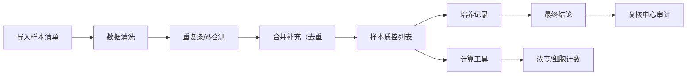

## 1. 产品概述

"临床样本条码追踪"是一款面向生物教学场景的样本管理与计算工具，帮助生物老师和学生处理临床样本数据，支持样本导入、质控追踪、计算分析与复核全流程。

- 核心价值：解决样本清单数据混乱、重复导入冲突、计算过程不透明、数据溯源困难等痛点，让样本管理从"人工查表"升级为"一键追溯"。

## 2. 核心功能

### 2.1 用户角色

| 角色 | 登录方式 | 核心权限 |
|------|-----------|----------|
| 生物老师 | 本地身份切换 | 完整功能：导入样本、人工修正、复核审计、计算配置 |
| 学生 | 本地身份切换 | 查看样本、使用计算工具、查看结论溯源 |

### 2.2 功能模块

1. **样本质控（日常入口）**：样本列表、条码搜索、状态筛选、培养记录与结论联动
2. **样本导入**：Excel/CSV 文件导入、脏数据清洗、导入批次管理、重复条码合并
3. **计算工具**：浓度稀释计算、细胞计数计算、公式说明（公式/单位/适用范围/失败原因）
4. **复核中心**：人工修正记录、重复导入审计、补录记录追踪
5. **数据溯源**：原始行号、来源文件、图片名、来源备注

### 2.3 页面详情

| 页面名称 | 模块名称 | 功能描述 |
|---------|---------|---------|
| 样本质控 | 顶部导航 | 身份切换、模块跳转、搜索框 |
| 样本质控 | 样本列表 | 条码、样本信息、状态标签、操作按钮 |
| 样本质控 | 样本详情抽屉 | 培养记录时间线、最终结论、溯源信息 |
| 样本导入 | 文件上传区 | 拖拽上传、文件选择、导入预览 |
| 样本导入 | 数据清洗预览 | 脏数据标记、清洗规则、导入确认 |
| 计算工具 | 计算器面板 | 公式选择、输入表单、实时计算结果 |
| 计算工具 | 公式说明卡 | 公式、单位、适用范围、失败原因 |
| 复核中心 | 修正记录列表 | 修正前后对比、操作人、时间 |
| 复核中心 | 重复导入审计 | 重复条码列表、合并结果、合并详情 |

## 3. 核心流程

老师日常工作流程：

1. 老师导入 Excel/CSV 样本清单
2. 系统自动清洗脏数据，标记异常记录
3. 系统检测重复条码，采用合并补充策略
4. 日常在"样本质控"页面查看和追踪样本
5. 使用计算工具进行浓度/细胞计数计算
6. 记录培养过程和最终结论
7. 月底/课前在"复核中心"审计修正记录和重复导入

学生使用流程：

1. 进入"样本质控"查看样本
2. 点击样本查看培养记录和结论
3. 使用计算工具辅助实验计算
4. 可追溯到原始数据来源

## 4. 用户界面设计

### 4.1 设计风格

- **主色调**：深青色（医疗科技感的深青色 + 暖橙色（提醒/操作）
- **辅助色**：浅灰、浅青、柔和渐变
- **按钮风格**：圆角矩形，轻微阴影，hover 有浮起效果
- **字体**：思源黑体 / PingFang SC，标题加粗，正文清晰易读
- **布局风格**：左侧导航 + 右侧内容区，卡片式布局
- **图标风格**：线性图标，简洁现代

### 4.2 页面设计概览

| 页面名称 | 模块名称 | UI 元素 |
|---------|---------|---------|
| 样本质控 | 列表区 | 表格布局、状态色标、搜索框、筛选标签 |
| 样本质控 | 详情抽屉 | 右侧滑入、时间线、溯源标签 |
| 样本导入 | 上传区 | 拖拽区域、文件图标、进度条 |
| 计算工具 | 计算器 | 左侧公式卡片、输入框、结果高亮 |
| 复核中心 | 审计列表 | 对比视图、时间戳、操作人 |

### 4.3 响应式

- Desktop-first 设计，适配 1280px 及以上
- 平板端自适应，表格可横向滚动
- 移动端简化导航折叠，列表单列展示
