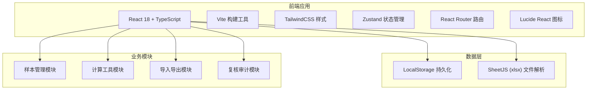
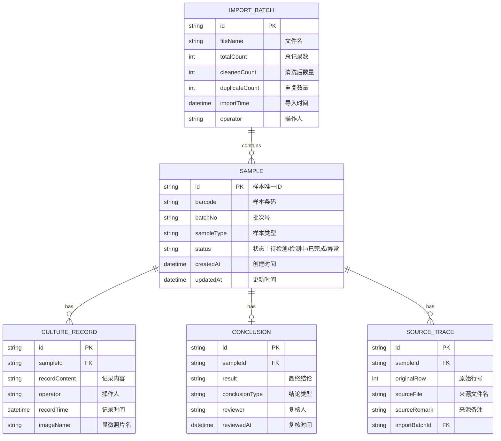

## 1. 架构设计



## 2. 技术描述

- **前端框架**：React@18 + TypeScript
- **构建工具**：Vite@5
- **样式方案**：TailwindCSS@3
- **状态管理**：Zustand@4
- **路由管理**：react-router-dom@6
- **图标库**：lucide-react
- **Excel 解析**：xlsx (SheetJS)
- **数据持久化**：LocalStorage（前端纯前端应用，数据存储在浏览器本地）

## 3. 路由定义

| 路由路径 | 页面名称 | 说明 |
|---------|---------|------|
| / | 样本质控 | 日常入口，样本列表与追踪 |
| /import | 样本导入 | Excel/CSV 导入与数据清洗 |
| /calculator | 计算工具 | 浓度稀释、细胞计数计算 |
| /review | 复核中心 | 修正记录与重复导入审计 |

## 4. 数据模型

### 4.1 数据模型定义



### 4.2 核心数据结构定义

```typescript
// 样本状态枚举
enum SampleStatus {
  PENDING = 'pending',
  TESTING = 'testing',
  COMPLETED = 'completed',
  ABNORMAL = 'abnormal'
}

// 样本信息
interface Sample {
  id: string;
  barcode: string;
  batchNo: string;
  sampleType: string;
  status: SampleStatus;
  name?: string;
  concentration?: number;
  cellCount?: number;
  remark?: string;
  createdAt: string;
  updatedAt: string;
}

// 培养记录
interface CultureRecord {
  id: string;
  sampleId: string;
  content: string;
  operator: string;
  recordTime: string;
  imageName?: string;
}

// 最终结论
interface Conclusion {
  id: string;
  sampleId: string;
  result: string;
  conclusionType: string;
  reviewer?: string;
  reviewedAt?: string;
  isManualCorrected: boolean;
  correctionReason?: string;
}

// 溯源信息
interface SourceTrace {
  id: string;
  sampleId: string;
  originalRow: number;
  sourceFile: string;
  sourceRemark?: string;
  importBatchId: string;
}

// 导入批次
interface ImportBatch {
  id: string;
  fileName: string;
  totalCount: number;
  cleanedCount: number;
  duplicateCount: number;
  importTime: string;
  operator: string;
  isReimport: boolean;
}

// 计算工具配置
interface CalculatorConfig {
  id: string;
  name: string;
  formula: string;
  unit: string;
  applicableScope: string;
  failureReasons: string[];
  inputFields: CalculatorField[];
}

interface CalculatorField {
  key: string;
  label: string;
  unit: string;
  type: 'number' | 'select';
  options?: string[];
}

// 修正记录
interface CorrectionRecord {
  id: string;
  sampleId: string;
  fieldName: string;
  oldValue: string;
  newValue: string;
  operator: string;
  operateTime: string;
  reason: string;
}
```

## 5. 项目结构

```
src/
├── components/          # 公共组件
│   ├── Layout/         # 布局组件
│   ├── SampleTable/    # 样本表格
│   ├── SampleDrawer/   # 样本详情抽屉
│   ├── StatusTag/      # 状态标签
│   └── TraceInfo/      # 溯源信息
├── pages/              # 页面
│   ├── QualityControl/ # 样本质控
│   ├── SampleImport/   # 样本导入
│   ├── Calculator/     # 计算工具
│   └── ReviewCenter/   # 复核中心
├── store/              # 状态管理
│   ├── sampleStore.ts
│   ├── importStore.ts
│   └── calculatorStore.ts
├── utils/              # 工具函数
│   ├── excelParser.ts
│   ├── dataCleaner.ts
│   ├── dedup.ts
│   └── calculations.ts
├── types/              # 类型定义
│   └── index.ts
├── data/               # 模拟数据
│   └── mockData.ts
├── App.tsx
├── main.tsx
└── index.css
```
