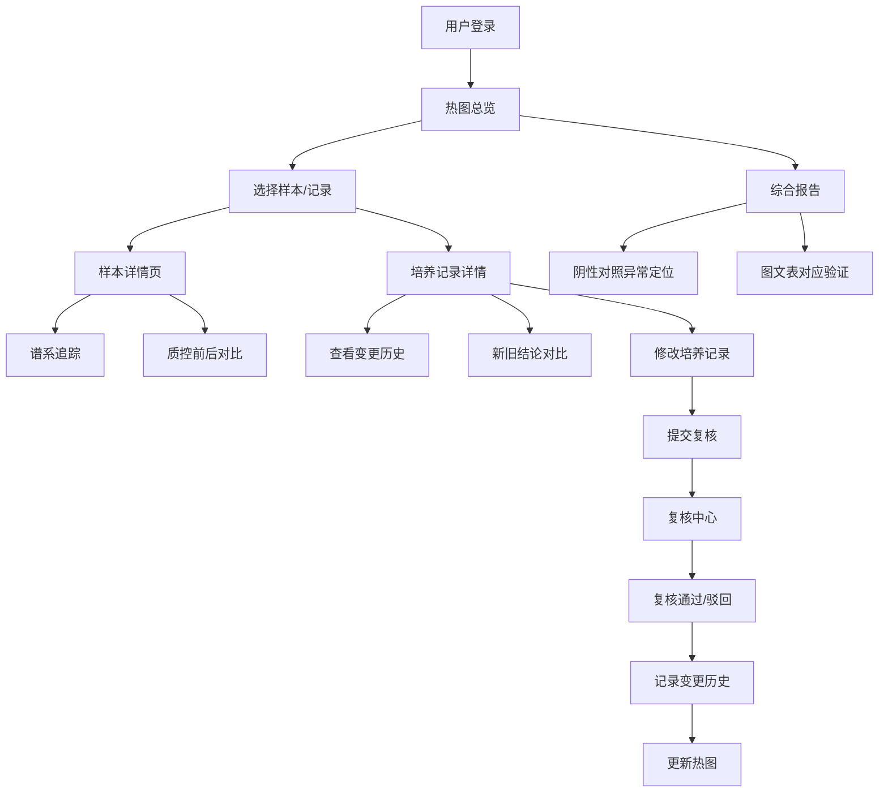

## 1. 产品概述

微生物丰度热图分析平台是一个面向生物实验室的可视化质量控制系统，解决培养记录、复核意见、样本清单口径不统一的问题。平台提供可复现的样例数据、谱系追踪、变更历史记录和阴性对照异常追溯功能，让学生和实验室技师能够清晰追溯数据来源、对比新旧结论、查看质控差异。

- **目标用户**：实验室技师、学生、复核人员
- **核心价值**：图、表、文字三者统一口径，所有变更可追溯，质控差异可视化

## 2. 核心功能

### 2.1 用户角色

| 角色 | 说明 | 核心权限 |
|------|------|----------|
| 实验室技师 | 日常操作培养记录，处理样本 | 查看热图、修改培养记录、提交复核申请 |
| 复核人员 | 审核低质量读段、异常数据 | 复核通过/驳回、查看变更历史 |
| 学生 | 学习使用、查看报告 | 查看热图、查看报告、追溯阴性对照异常 |

### 2.2 功能模块

1. **热图总览页**：微生物丰度热图可视化、样本列表、质控状态概览
2. **培养记录模块**：培养记录详情、编辑历史、新旧对比
3. **样本清单模块**：样本信息、谱系追踪、质控前后对比
4. **复核意见模块**：复核记录、低质量读段处理、变更追溯
5. **报告页面**：综合报告、阴性对照异常定位、图文表对应

### 2.3 页面详情

| 页面名称 | 模块名称 | 功能描述 |
|---------|---------|----------|
| 热图总览页 | 热图主视图 | 交互式热图，支持悬停查看详情、点击跳转样本 |
| 热图总览页 | 样本清单侧边栏 | 样本列表、筛选、质控状态标记 |
| 热图总览页 | 质控概览卡片 | 整体质控统计、阴性对照状态、异常数量 |
| 培养记录详情页 | 记录详情 | 完整培养记录信息、当前状态 |
| 培养记录详情页 | 变更历史时间线 | 谁改的、什么时候改的、为什么改，完整追溯链 |
| 培养记录详情页 | 新旧结论并排对比 | 修改前后数据并列展示，差异高亮 |
| 样本详情页 | 谱系追踪 | 样本处理全流程追踪，关键节点标记 |
| 样本详情页 | 质控前后对比 | 谱系追踪改变判断前后的质控数据对比 |
| 复核中心页 | 待复核列表 | 低质量读段、异常数据待处理列表 |
| 复核中心页 | 复核操作 | 复核通过/驳回、填写复核意见 |
| 综合报告页 | 报告概览 | 图文表三者对应的完整报告 |
| 综合报告页 | 阴性对照异常定位 | 明确标记异常出现在哪份材料、哪个环节 |

## 3. 核心流程

### 3.1 主流程描述

用户进入平台后，首先看到微生物丰度热图总览，可通过热图或样本清单进入具体样本详情。样本详情中可查看培养记录、谱系追踪、质控对比。实验室技师可修改培养记录，修改后进入复核流程。复核人员审核后记录变更历史，新旧结论并排展示。学生查看综合报告时，可追溯阴性对照异常的具体位置和原因。

### 3.2 核心流程图

## 4. 用户界面设计

### 4.1 设计风格

- **设计方向**：科研专业风格 + 现代数据可视化美学，采用实验室蓝绿色调，传达精准、可信的专业感
- **主色调**：深蓝 #0F2B46 作为主色，搭配青绿 #2DD4BF 作为强调色
- **辅助色**：热图渐变色系（蓝-青-黄-红），状态色（成功绿、警告橙、错误红）
- **字体**：标题使用 Instrument Serif 传达学术感，正文使用 Inter 保证可读性
- **布局风格**：三栏布局（侧边导航 + 主内容区 + 信息面板），卡片式模块，大量数据表格
- **视觉元素**：细微网格背景、玻璃态卡片、精准的分隔线、数据驱动的色彩
- **图标风格**：线性细图标，专业简洁

### 4.2 页面设计概览

| 页面名称 | 模块名称 | UI元素 |
|---------|---------|--------|
| 热图总览页 | 热图主视图 | 大尺寸交互式热图、悬停tooltip、点击高亮、行列聚类标签 |
| 热图总览页 | 样本清单侧边栏 | 可折叠列表、状态色标签、筛选器、搜索框 |
| 热图总览页 | 质控概览卡片 | 数字指标、进度环、状态指示灯、趋势小箭头 |
| 培养记录详情页 | 变更历史时间线 | 竖向时间线、用户头像、时间戳、变更原因标签、差异高亮 |
| 培养记录详情页 | 新旧对比 | 左右分栏布局、差异行高亮、联动滚动、变更标记 |
| 样本详情页 | 谱系追踪 | 横向流程图、节点卡片、状态连接线、关键节点标记 |
| 综合报告页 | 报告布局 | 分章节报告、图号表号对应、引用链接、异常红框标记 |

### 4.3 响应式设计

- 桌面端优先设计，核心热图区域需足够空间
- 平板端：侧边栏可折叠，信息面板改为底部抽屉
- 移动端：保留核心热图浏览功能，复杂操作建议桌面端

### 4.4 动效设计

- 热图加载：渐入 + 数据点依次点亮效果
- 状态变更：颜色过渡动画 + 轻微缩放反馈
- 时间线展开：竖向滑入 + 节点依次出现
- 对比切换：左右滑动过渡 + 差异区域闪烁高亮
- 悬停效果：卡片轻微上浮 + 阴影加深
