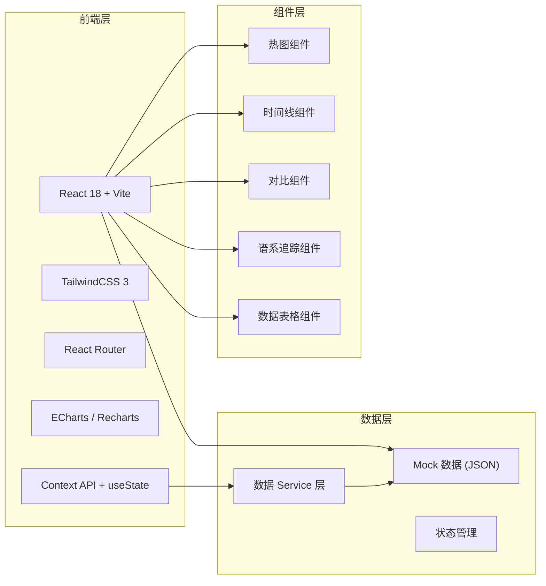
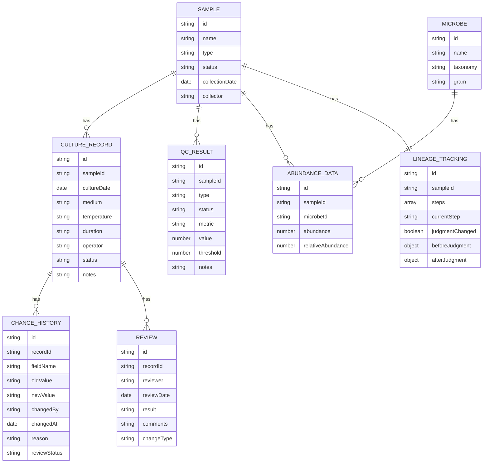

## 1. 架构设计



## 2. 技术描述

- **前端框架**：React 18 + TypeScript
- **构建工具**：Vite 5
- **样式方案**：TailwindCSS 3 + CSS Variables
- **路由管理**：React Router v6
- **数据可视化**：Recharts（图表）+ 自定义 SVG 热图组件
- **图标方案**：Lucide React
- **状态管理**：React Context + useState（轻量级）
- **后端/数据库**：无，使用 Mock 数据模拟真实场景
- **Mock 数据**：生成真实感的微生物丰度数据，包含坏数据样例

## 3. 路由定义

| 路由路径 | 页面名称 | 说明 |
|---------|---------|------|
| / | 热图总览页 | 默认首页，展示微生物丰度热图和样本清单 |
| /heatmap | 热图总览页 | 同首页 |
| /sample/:id | 样本详情页 | 样本信息、谱系追踪、质控对比 |
| /culture-record/:id | 培养记录详情页 | 记录详情、变更历史、新旧对比 |
| /review-center | 复核中心 | 待复核列表、复核操作 |
| /report | 综合报告页 | 图文表对应报告、阴性对照异常定位 |

## 4. 数据模型

### 4.1 数据模型定义



### 4.2 Mock 数据设计

1. **微生物丰度矩阵**：20 种微生物 × 15 个样本的丰度矩阵，包含正常数据和异常样本
2. **坏数据样例**：
   - 低质量读段样本（测序深度不足）
   - 污染样本（阴性对照出现阳性信号）
   - 异常丰度值（明显偏离正常范围）
   - 缺失值（部分微生物数据缺失）
3. **培养记录**：每个样本对应培养记录，包含修改历史
4. **变更历史**：模拟 3-5 条修改记录，包含不同修改原因
5. **谱系追踪**：样本处理全流程 5-7 个节点

## 5. 核心组件设计

| 组件名称 | 功能描述 | 关键属性 |
|---------|---------|---------|
| HeatmapChart | 微生物丰度热图 | data, microbes, samples, onCellClick, onCellHover |
| ChangeTimeline | 变更历史时间线 | changes, onSelectChange |
| CompareView | 新旧数据对比 | oldData, newData, fields, highlightDiff |
| LineageFlow | 谱系追踪流程图 | steps, currentStep, onStepClick |
| SampleList | 样本清单列表 | samples, filters, onSampleSelect |
| QCCard | 质控概览卡片 | metrics, status |
| ReportSection | 报告章节 | title, type, content, figureNumber |
| StatusBadge | 状态标签 | status, type, size |

## 6. 目录结构

```
src/
├── assets/           # 静态资源
├── components/       # 通用组件
│   ├── Heatmap/
│   ├── Timeline/
│   ├── Compare/
│   ├── Lineage/
│   ├── Tables/
│   └── UI/
├── pages/            # 页面组件
│   ├── HeatmapPage/
│   ├── SamplePage/
│   ├── CultureRecordPage/
│   ├── ReviewCenter/
│   └── ReportPage/
├── data/             # Mock 数据
│   ├── samples.ts
│   ├── microbes.ts
│   ├── abundance.ts
│   ├── cultureRecords.ts
│   ├── changeHistory.ts
│   └── reviews.ts
├── hooks/            # 自定义 Hooks
├── utils/            # 工具函数
├── types/            # TypeScript 类型定义
├── context/          # Context 状态
├── App.tsx
├── main.tsx
└── index.css
```
