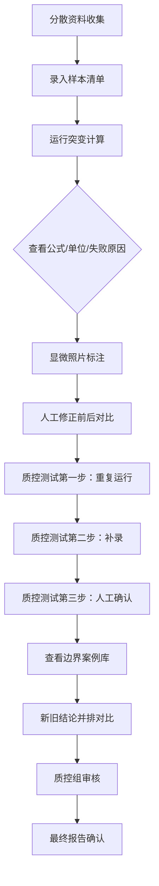

## 1. 产品概述

肿瘤样本突变报告计算工具，面向生物老师和质控组，整合分散的突变报告资料（复核意见、样本清单、显微照片及人工备注），提供统一的计算、核对、修正和质控流程。

- 目标用户：生物老师（数据录入与复核）、质控组（质量审核）
- 核心价值：将分散资料整合为标准化计算工具，提供公式透明化、人工修正可追溯、质控流程完整的突变报告处理系统

## 2. 核心功能

### 2.1 用户角色

| 角色 | 注册方式 | 核心权限 |
|------|----------|----------|
| 生物老师 | 系统内置 | 录入样本数据、运行计算、人工修正、标记复核意见 |
| 质控组 | 系统内置 | 查看完整报告、核对新旧结论、审核质控流程、确认最终结果 |

### 2.2 功能模块

1. **报告工作台**：样本清单、突变计算结果、公式说明、失败原因
2. **计算工具模块**：突变频率计算、质量阈值判断、参数配置
3. **图像标注对比**：显微照片标注前后对比、人工修正差异展示
4. **质控测试流程**：重复运行验证、补录数据测试、人工确认三步质控
5. **边界案例库**：样本条码重复、低质量读段等2-3个真实改变结果的案例
6. **新旧结论对比**：样本清单变更后，旧结论与新结论并排展示
7. **坏数据样例**：混入真实场景常见的小麻烦数据

### 2.3 页面详情

| 页面名称 | 模块名称 | 功能描述 |
|----------|----------|----------|
| 报告工作台 | 样本清单表格 | 展示样本条码、类型、录入来源、状态，支持搜索筛选 |
| 报告工作台 | 突变计算卡 | 实时计算突变频率、等位基因频率、覆盖深度，显示公式 |
| 报告工作台 | 公式说明面板 | 人能看懂的位置展示公式、单位、适用范围、失败原因 |
| 计算工具 | 参数配置 | 质量阈值、最小覆盖深度、突变频率下限等可调节参数 |
| 计算工具 | 计算引擎 | 根据输入自动计算并高亮异常值 |
| 图像标注对比 | 显微照片展示 | 显示标注前/标注后图像，支持切换和并排对比 |
| 图像标注对比 | 人工修正记录 | 展示标注改变导致的判断变化前后值 |
| 质控流程 | 三步测试 | 重复运行一致性、补录完整性、人工确认规范性逐一验证 |
| 边界案例库 | 条码重复案例 | 展示重复条码处理逻辑及结果变化 |
| 边界案例库 | 低质量读段案例 | 2-3个低质量读段阈值边界案例，每个都改变判定结果 |
| 新旧对比 | 并排视图 | 样本清单修改前后的结论、参数、结果左右并排展示 |
| 新旧对比 | 影响范围 | 高亮展示受变更影响的数据项 |
| 坏数据样例 | 混入测试 | 包含常见真实问题：条码格式错误、小数位异常、缺失值、单位混乱 |

## 3. 核心流程

生物老师从分散资料录入样本数据，运行突变计算工具，查看公式和失败原因说明；对显微照片进行人工标注修正，系统记录前后判断差异；完成后进入三步质控流程（重复运行、补录、人工确认），质控组查看边界案例和新旧结论并排对比后确认报告。

## 4. 用户界面设计

### 4.1 设计风格
- 主色调：深青色(#0F4C5C)专业稳重，辅助色琥珀橙(#E36414)强调关键数据
- 中性色：暖灰色系，减少视觉疲劳，适合长时间使用
- 按钮风格：微圆角矩形，按下有轻微凹陷反馈，状态色区分明确
- 字体：标题用思源宋体（学术感），正文用思源黑体（易读性）
- 布局：卡片式分区，左侧导航+中央内容区+右侧公式说明常驻面板
- 图标风格：线性Lucide图标，统一2px线宽

### 4.2 页面设计概览

| 页面名称 | 模块名称 | UI元素 |
|----------|----------|--------|
| 报告工作台 | 顶部状态栏 | 报告标题、进度指示、当前样本数、质控状态徽章 |
| 报告工作台 | 样本清单 | 斑马纹表格、状态色标签、条码列等宽字体 |
| 报告工作台 | 计算卡片 | 数值大号显示、单位上标、公式脚注、失败原因红色圆角提示框 |
| 计算工具 | 参数滑块 | 实时反馈数值、阈值线标记、超出范围红色警告 |
| 图像标注对比 | 左右分栏 | 标注前/标注后图像、差异区域虚线框高亮、时间戳 |
| 质控流程 | 步骤卡片 | 三步骤并排、完成打勾绿色、进行中脉冲动画、未完成灰色 |
| 边界案例库 | 案例卡片 | 每个案例独立卡片、结论变化用箭头和颜色（红→绿/绿→红）标示 |
| 新旧对比 | 分栏视图 | 中线分隔、左右标题标注"旧"/"新"、差异行背景高亮 |
| 坏数据样例 | 警告标识 | 黄色警告图标、问题描述tooltip、修正建议 |

### 4.3 响应式
- 桌面端优先设计（1440px+），生物实验室主要使用大屏显示器
- 平板端（768-1440px）：右侧公式面板折叠为抽屉
- 移动端：表格横向滚动，卡片堆叠布局

### 4.4 动效与微交互
- 页面加载：卡片依次淡入上移，错开80ms延迟
- 数值更新：变化数字0.3s内从旧值过渡到新值
- 状态切换：徽章颜色渐变+轻微缩放
- 悬停反馈：表格行浅蓝高亮，卡片阴影加深
