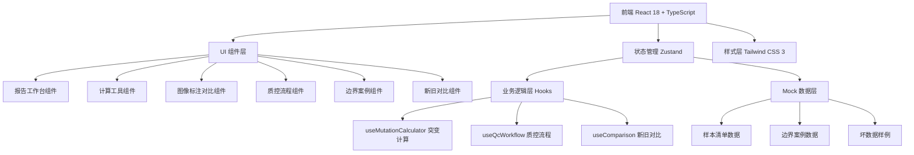
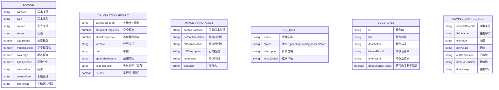

## 1. 架构设计



## 2. 技术描述

- 前端：React@18 + TypeScript + Vite
- 初始化工具：vite-init react-ts 模板
- 后端：无（纯前端工具，所有数据使用本地 Mock）
- 状态管理：Zustand
- 样式：Tailwind CSS 3
- 图标：lucide-react
- 路由：react-router-dom

## 3. 路由定义

| 路由 | 用途 |
|------|------|
| / | 报告工作台（主页面，包含样本清单、计算结果、公式说明） |
| /calculator | 计算工具（参数配置、实时计算） |
| /image-annotation | 图像标注对比（显微照片标注前后对比） |
| /qc-workflow | 质控流程（重复运行、补录、人工确认三步测试） |
| /edge-cases | 边界案例库（条码重复、低质量读段案例） |
| /comparison | 新旧结论对比（样本清单变更前后对比） |

## 4. 数据模型

### 4.1 数据模型定义



### 4.2 核心计算公式

突变频率(Mutation Frequency) = 突变读段数 / 总读段数 × 100%
等位基因频率(Allele Frequency) = 突变读段数 / (2 × 总读段数) × 100% （针对二倍体）
覆盖深度(Coverage) = 总读段数 / 目标区域长度

## 5. 目录结构

```
src/
├── components/
│   ├── SampleList.tsx          # 样本清单表格
│   ├── CalculationCard.tsx     # 突变计算卡片
│   ├── FormulaPanel.tsx        # 公式说明面板
│   ├── ParameterSlider.tsx     # 参数滑块
│   ├── ImageCompare.tsx        # 图像标注对比
│   ├── CorrectionDiff.tsx      # 人工修正差异
│   ├── QcSteps.tsx             # 质控三步流程
│   ├── EdgeCaseCard.tsx        # 边界案例卡片
│   ├── OldNewCompare.tsx       # 新旧结论并排对比
│   └── BadDataWarning.tsx      # 坏数据警告标识
├── pages/
│   ├── Workbench.tsx           # 报告工作台
│   ├── Calculator.tsx          # 计算工具页
│   ├── ImageAnnotation.tsx     # 图像标注页
│   ├── QcWorkflow.tsx          # 质控流程页
│   ├── EdgeCases.tsx           # 边界案例页
│   └── Comparison.tsx          # 新旧对比页
├── hooks/
│   ├── useMutationCalculator.ts # 突变计算逻辑
│   ├── useQcWorkflow.ts        # 质控流程逻辑
│   └── useSampleComparison.ts  # 样本对比逻辑
├── store/
│   └── useReportStore.ts       # Zustand 全局状态
├── data/
│   ├── mockSamples.ts          # Mock 样本数据
│   ├── mockEdgeCases.ts        # Mock 边界案例
│   └── mockBadData.ts          # Mock 坏数据样例
├── types/
│   └── index.ts                # TypeScript 类型定义
├── utils/
│   └── calculator.ts           # 计算工具函数
├── App.tsx
├── main.tsx
└── index.css
```
