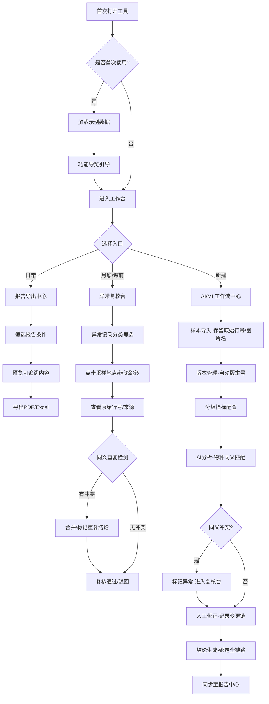

## 1. 产品概述

培养基批号追溯AI/ML工作流工具，专为药企研究员设计，解决培养基批号追溯中物种名同义混淆、样本版本链断裂、人工修正难以追踪等问题。通过串联样本、版本、人工修正和分组指标，实现从数据导入到报告导出的完整可追溯工作流。

- 核心用户：药企微生物/细胞培养研究员、质量复核人员
- 核心价值：消除物种名同义导致的结论混乱、保留完整追溯链、大幅降低复核人工成本

## 2. 核心功能

### 2.1 用户角色

| 角色 | 核心权限 |
|------|----------|
| 研究员 | 数据导入、AI/ML分析、人工修正、报告导出 |
| 复核人员 | 异常复核、结论追溯、版本对比、审批确认 |

### 2.2 功能模块

1. **工作台仪表盘**：数据概览、异常预警、快捷入口、月度复核进度
2. **AI/ML工作流中心**：样本导入→版本管理→分组指标→人工修正→模型分析→结论生成
3. **报告导出中心**（日常入口）：批号追溯报告、物种一致性报告、版本变更日志，日常工作主要入口
4. **异常复核台**（月底/课前入口）：异常记录列表、采样地点→结论跳转、原始记录回溯、同义冲突检测
5. **数据追溯视图**：版本时间轴、修正历史链、原始行号/图片名/来源备注保留

### 2.3 页面详情

| 页面名称 | 模块名称 | 功能描述 |
|----------|----------|----------|
| 工作台仪表盘 | 数据概览卡片 | 显示总批次数、待复核数、物种同义冲突数、本月报告数 |
| 工作台仪表盘 | 快捷入口区 | 报告导出（高亮主入口）、新建追溯、导入数据、月度复核 |
| 工作台仪表盘 | 异常预警列表 | 最新异常记录，显示批号、物种、问题类型、发生时间 |
| AI/ML工作流中心 | 样本导入模块 | 支持Excel/CSV导入，自动保留原始行号，解析来源备注和图片名 |
| AI/ML工作流中心 | 版本管理面板 | 版本号、变更时间、变更人、变更内容对比，支持版本回滚 |
| AI/ML工作流中心 | 分组指标配置 | 按培养基批号、采样地点、物种、培养条件分组，自定义指标权重 |
| AI/ML工作流中心 | 人工修正记录 | 修正前后对比、修正原因、修正人、修正时间戳，与结论绑定 |
| AI/ML工作流中心 | AI分析引擎 | 物种名同义匹配、批次聚类、异常检测、结论置信度评分 |
| AI/ML工作流中心 | 结论生成器 | 关联样本、版本、修正、指标，生成可追溯结论链 |
| 报告导出中心 | 报告模板选择 | 批号追溯报告、物种一致性报告、全链路审计报告 |
| 报告导出中心 | 报告预览与筛选 | 按批号范围、时间、物种筛选，实时预览可追溯内容 |
| 报告导出中心 | 导出操作 | PDF/Excel导出，包含完整追溯元数据 |
| 异常复核台 | 异常列表视图 | 待复核、已复核、已驳回分类，支持多条件筛选 |
| 异常复核台 | 采样地点→结论跳转 | 点击采样地点可直接跳转到对应结论记录，反之亦然 |
| 异常复核台 | 原始记录回溯 | 保留原始行号、图片名、来源备注，一键回到源数据行 |
| 异常复核台 | 同义冲突检测 | 高亮显示物种名同义记录，检测重复导入和补录冲突 |
| 数据追溯视图 | 版本时间轴 | 可视化展示样本全生命周期变更 |
| 数据追溯视图 | 修正历史链 | 人工修正→模型再分析→结论更新的完整链路 |
| 首次启动引导 | 示例数据加载 | 自动加载包含3个培养基批号、5条物种同义案例的示例数据集 |
| 首次启动引导 | 功能导览 | 逐步引导研究员熟悉报告导出入口、复核流程和追溯操作 |

## 3. 核心流程

研究员日常从报告导出入口开始工作，月底或课前进入异常复核台处理待办。数据导入时自动保留原始行号等追溯信息，AI引擎自动匹配物种名同义。人工修正与版本管理深度绑定，确保每一条结论都能回溯到源头。

## 4. 用户界面设计

### 4.1 设计风格
- **设计定位**：严谨专业的科研级工具，采用「工业蓝 + 科研白」主色调，辅以琥珀色预警和翡翠绿确认
- **主色**：#1E40AF（科研蓝）- 代表信任和专业
- **辅助色**：#F59E0B（琥珀黄）- 异常预警；#059669（翡翠绿）- 复核通过；#DC2626（警示红）- 严重冲突
- **背景**：#F8FAFC 浅灰底配 #FFFFFF 卡片，增加细微噪点纹理提升质感
- **字体**：标题使用「思源宋体 SemiBold」体现学术严谨，正文使用「思源黑体 Regular」确保可读性
- **按钮风格**：扁平化带2px圆角，主按钮蓝底白字带微妙内阴影，悬停时轻微上浮+0.3mm阴影扩散
- **布局风格**：左侧导航栏 + 顶部面包屑 + 主内容卡片网格，信息密度适中
- **图标风格**：线性图标搭配色块背景，统一24px网格

### 4.2 页面设计概览

| 页面名称 | 模块名称 | UI元素 |
|----------|----------|--------|
| 工作台仪表盘 | 数据概览卡片 | 4个大卡片横向排列，数值大号显示+趋势迷你图，蓝色渐变背景带微噪点 |
| 工作台仪表盘 | 快捷入口区 | 「报告导出」主入口放大高亮，其余入口采用图标+文字卡片，悬停上浮效果 |
| 工作台仪表盘 | 异常预警列表 | 列表左侧琥珀色圆点标记，hover时背景变为浅蓝，右侧「处理」按钮 |
| AI/ML工作流中心 | 步骤导航条 | 顶部横向6步流程条，当前步骤蓝色实心+脉冲动画，已完成步骤打勾 |
| AI/ML工作流中心 | 数据表格 | 斑马纹行，原始行号列灰色小字固定，修正列带黄色背景标记 |
| AI/ML工作流中心 | 版本对比面板 | 左右分栏对比，差异部分高亮红色（删除）和绿色（新增） |
| 报告导出中心 | 模板选择区 | 3个报告模板卡片，选中态蓝色边框+右下勾选标记 |
| 报告导出中心 | 预览区域 | 类Word文档白背景+阴影，页码底部居中 |
| 异常复核台 | 异常列表 | 左侧固定复选框列，同义冲突行整行淡红背景+冲突图标 |
| 异常复核台 | 跳转链接 | 采样地点和结论列文字蓝色带下划线，点击波纹效果跳转 |
| 异常复核台 | 原始记录抽屉 | 右侧滑出抽屉，等宽字体显示原始数据，行号用背景色块标记 |
| 数据追溯视图 | 时间轴 | 垂直时间轴，节点用圆形色块，连接线用虚线，hover放大节点 |

### 4.3 响应式
- 桌面优先（1440px基准），适配1920px大屏
- 平板（1024px）：左侧导航收起为图标栏
- 移动端不做强制适配，主要面向桌面端科研场景

### 4.4 动效规范
- 页面加载：卡片逐个淡入上浮（stagger 80ms）
- 按钮交互：hover时translateY(-1px) + box-shadow扩大，active时回弹
- 抽屉/模态：250ms cubic-bezier(0.4, 0, 0.2, 1)滑入
- 表格行：hover时背景色过渡150ms
