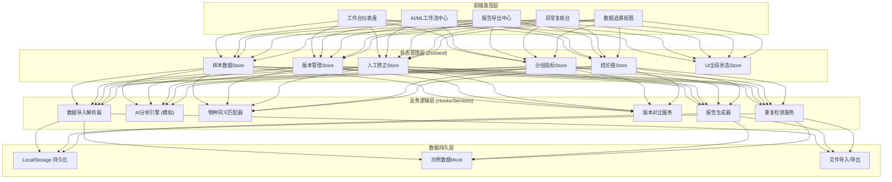
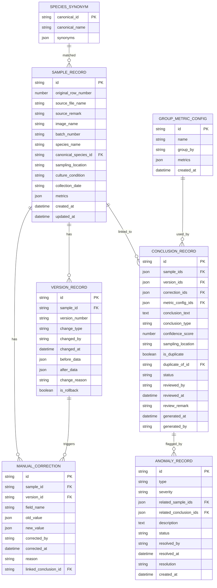

## 1. 架构设计



## 2. 技术描述

- **前端框架**: React@18 + TypeScript@5
- **构建工具**: Vite@5
- **样式方案**: TailwindCSS@3 + CSS Variables主题系统
- **状态管理**: Zustand@4（轻量、简洁、TS友好）
- **路由**: React Router@6
- **图标**: Lucide React（线性图标，符合科研工具风格）
- **表格**: TanStack Table@8（高性能虚拟滚动、排序筛选）
- **图表**: Recharts@2（趋势迷你图、指标可视化）
- **日期处理**: date-fns@3
- **文件处理**: xlsx@0.18（Excel导入导出）、jsPDF（PDF生成）
- **动效**: Framer Motion（页面过渡、微交互）
- **后端**: 无后端纯前端方案，LocalStorage + Mock数据
- **数据库**: LocalStorage持久化，示例数据内置

## 3. 路由定义

| 路由 | 页面组件 | 用途 |
|------|----------|------|
| `/` | Dashboard | 工作台仪表盘，数据概览和快捷入口 |
| `/workflow` | WorkflowCenter | AI/ML工作流中心，6步流程处理 |
| `/reports` | ReportCenter | 报告导出中心（日常主入口） |
| `/review` | ReviewCenter | 异常复核台（月底/课前入口） |
| `/trace/:sampleId` | TraceView | 数据追溯视图，版本时间轴和修正链 |
| `/onboarding` | Onboarding | 首次启动引导，示例数据加载 |

## 4. API定义（纯前端Mock服务）

```typescript
// 核心数据类型定义

// 样本记录
interface SampleRecord {
  id: string;
  originalRowNumber: number;      // 原始行号
  sourceFileName: string;         // 来源文件名
  sourceRemark?: string;          // 来源备注
  imageName?: string;             // 图片名
  batchNumber: string;            // 培养基批号
  speciesName: string;            // 物种名
  canonicalSpeciesId?: string;    // 标准物种ID（同义匹配后）
  samplingLocation: string;       // 采样地点
  cultureCondition: string;       // 培养条件
  collectionDate: string;         // 采集日期
  metrics: Record<string, number>; // 分组指标数据
  createdAt: string;
  updatedAt: string;
}

// 版本记录
interface VersionRecord {
  id: string;
  sampleId: string;
  versionNumber: string;          // 如 v1.0, v1.1
  changeType: 'import' | 'manual' | 'ai_suggest' | 'merge';
  changedBy: string;
  changedAt: string;
  beforeData: Partial<SampleRecord>;
  afterData: Partial<SampleRecord>;
  changeReason?: string;
  isRollback: boolean;
}

// 人工修正记录
interface ManualCorrection {
  id: string;
  sampleId: string;
  versionId: string;
  fieldName: string;
  oldValue: any;
  newValue: any;
  correctedBy: string;
  correctedAt: string;
  reason: string;
  linkedConclusionId?: string;
}

// 分组指标配置
interface GroupMetricConfig {
  id: string;
  name: string;
  groupBy: 'batch' | 'location' | 'species' | 'condition';
  metrics: Array<{
    key: string;
    label: string;
    weight: number;
    unit?: string;
  }>;
  createdAt: string;
}

// 结论记录
interface ConclusionRecord {
  id: string;
  sampleIds: string[];
  versionIds: string[];
  correctionIds: string[];
  metricConfigIds: string[];
  conclusionText: string;
  conclusionType: 'normal' | 'warning' | 'critical';
  confidenceScore: number;        // AI置信度 0-100
  samplingLocation: string;       // 用于跳转
  isDuplicate: boolean;           // 是否重复结论
  duplicateOfId?: string;         // 重复指向的结论ID
  status: 'pending' | 'approved' | 'rejected';
  reviewedBy?: string;
  reviewedAt?: string;
  reviewRemark?: string;
  generatedAt: string;
  generatedBy: string;
}

// 异常记录
interface AnomalyRecord {
  id: string;
  type: 'synonym_conflict' | 'duplicate_import' | 'metric_outlier' | 'missing_data';
  severity: 'low' | 'medium' | 'high';
  relatedSampleIds: string[];
  relatedConclusionIds: string[];
  description: string;
  status: 'pending' | 'resolved' | 'dismissed';
  resolvedBy?: string;
  resolvedAt?: string;
  resolution?: string;
  createdAt: string;
}

// 物种同义词典
interface SpeciesSynonym {
  canonicalId: string;
  canonicalName: string;
  synonyms: string[];
}

// Mock服务接口
interface TraceabilityService {
  // 样本CRUD
  importSamples(file: File): Promise<SampleRecord[]>;
  getSamples(filters?: SampleFilter): Promise<SampleRecord[]>;
  getSampleById(id: string): Promise<SampleRecord | null>;
  updateSample(id: string, data: Partial<SampleRecord>, reason: string): Promise<VersionRecord>;
  
  // 版本管理
  getVersionsBySample(sampleId: string): Promise<VersionRecord[]>;
  compareVersions(v1Id: string, v2Id: string): Promise<DiffResult>;
  rollbackToVersion(versionId: string, reason: string): Promise<VersionRecord>;
  
  // AI分析
  runAIAnalysis(sampleIds: string[]): Promise<{
    matchedSynonyms: Array<{sampleId: string, canonicalId: string}>;
    anomalies: AnomalyRecord[];
    suggestions: Array<{sampleId: string, field: string, suggestedValue: any}>;
  }>;
  
  // 同义匹配
  matchSpeciesSynonym(speciesName: string): Promise<SpeciesSynonym | null>;
  detectDuplicateConclusions(samples: SampleRecord[]): Promise<ConclusionRecord[]>;
  
  // 结论管理
  generateConclusions(workflowId: string): Promise<ConclusionRecord[]>;
  getConclusions(filters?: ConclusionFilter): Promise<ConclusionRecord[]>;
  mergeDuplicateConclusions(primaryId: string, duplicateIds: string[]): Promise<ConclusionRecord>;
  
  // 报告导出
  generateReport(type: ReportType, filters: ReportFilter): Promise<ReportData>;
  exportToExcel(reportData: ReportData): Promise<Blob>;
  exportToPDF(reportData: ReportData): Promise<Blob>;
  
  // 复核
  reviewConclusion(conclusionId: string, status: 'approved' | 'rejected', remark: string): Promise<ConclusionRecord>;
  resolveAnomaly(anomalyId: string, resolution: string): Promise<AnomalyRecord>;
}
```

## 5. 数据模型（LocalStorage Schema）



## 6. 前端目录结构

```
src/
├── assets/                  # 静态资源
│   ├── fonts/               # 思源字体文件
│   └── textures/            # 噪点纹理SVG
├── components/              # 通用组件
│   ├── layout/              # Layout, Sidebar, Breadcrumb
│   ├── ui/                  # Button, Card, Modal, Drawer, Badge
│   ├── table/               # DataTable, RowActions, CellRenderers
│   └── charts/              # MiniTrend, MetricChart
├── pages/                   # 页面组件
│   ├── Dashboard/
│   ├── WorkflowCenter/
│   │   ├── steps/           # 6个步骤子组件
│   │   └── components/
│   ├── ReportCenter/
│   ├── ReviewCenter/
│   ├── TraceView/
│   └── Onboarding/
├── store/                   # Zustand状态管理
│   ├── sampleStore.ts
│   ├── versionStore.ts
│   ├── correctionStore.ts
│   ├── conclusionStore.ts
│   ├── anomalyStore.ts
│   └── uiStore.ts
├── services/                # 业务逻辑服务
│   ├── importService.ts
│   ├── aiService.ts
│   ├── synonymService.ts
│   ├── versionService.ts
│   ├── reportService.ts
│   └── deduplicateService.ts
├── hooks/                   # 自定义Hooks
│   ├── useWorkflow.ts
│   ├── useTraceChain.ts
│   └── useReportExport.ts
├── types/                   # TypeScript类型定义
│   └── index.ts
├── mock/                    # Mock数据
│   ├── sampleData.ts        # 示例样本（3个批号+5条同义案例）
│   ├── speciesSynonyms.ts   # 同义词典
│   └── initMockData.ts      # 初始化逻辑
├── utils/                   # 工具函数
│   ├── storage.ts           # LocalStorage封装
│   ├── diff.ts              # 版本对比
│   ├── excel.ts             # Excel处理
│   └── formatters.ts        # 日期/数字格式化
├── styles/                  # 全局样式
│   ├── index.css            # Tailwind入口
│   └── theme.css            # CSS变量主题
├── router/                  # 路由配置
│   └── index.tsx
├── App.tsx
└── main.tsx
```

## 7. 关键技术决策

1. **无后端纯前端方案**：LocalStorage持久化，便于药企内网离线使用，避免数据出域合规风险
2. **Zustand而非Redux**：科研工具数据量中等，Zustand更简洁学习成本低，TS支持好
3. **TanStack Table**：处理大批量样本数据的虚拟滚动，排序筛选性能优异
4. **CSS变量主题**：便于后续深色模式扩展，科研工具可能需要长时间使用
5. **Framer Motion**：实现高质量微交互，提升专业感但不过度花哨
6. **示例数据内置**：首次启动即加载真实场景数据，研究员无需造表即可体验
