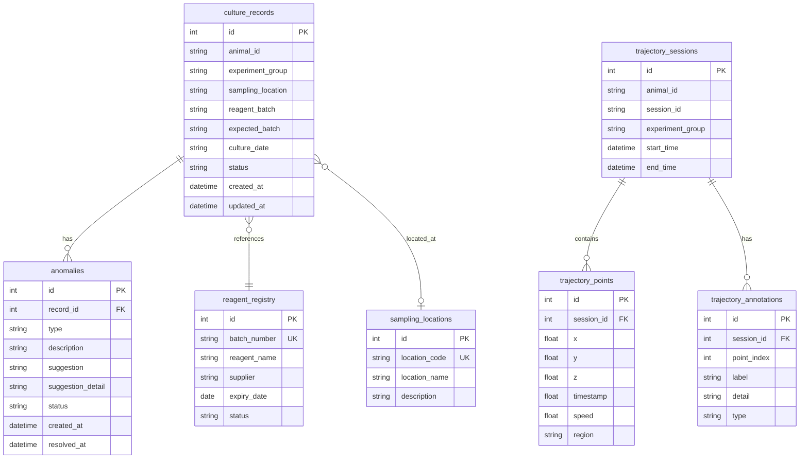

## 1. 架构设计

```mermaid
graph TB
    subgraph "前端 React"
        "仪表盘" --> "API Client"
        "培养记录管理" --> "API Client"
        "分组统计" --> "API Client"
        "异常复核" --> "API Client"
        "轨迹可视化" --> "API Client"
        "导出报告" --> "API Client"
    end
    subgraph "后端 Express"
        "API Client" --> "路由层"
        "路由层" --> "业务逻辑层"
        "业务逻辑层" --> "数据访问层"
    end
    subgraph "数据层"
        "数据访问层" --> "SQLite"
    end
```

## 2. 技术说明

- 前端：React@18 + Tailwind CSS@3 + Vite + Zustand
- 初始化工具：vite-init
- 后端：Express@4 + TypeScript（ESM）
- 数据库：SQLite（better-sqlite3），本地文件数据库
- 3D渲染：Three.js + @react-three/fiber + @react-three/drei
- 图表：Recharts
- 导出：jsPDF + xlsx

## 3. 路由定义

| 路由 | 用途 |
|------|------|
| / | 仪表盘，全局概览 |
| /records | 培养记录管理 |
| /statistics | 分组统计 |
| /anomalies | 异常复核 |
| /trajectory | 轨迹可视化 |
| /export | 导出报告 |

## 4. API 定义

### 4.1 培养记录

```typescript
interface CultureRecord {
  id: number;
  animal_id: string;
  experiment_group: string;
  sampling_location: string | null;
  reagent_batch: string;
  expected_batch: string;
  culture_date: string;
  status: "normal" | "pending_review" | "anomaly";
  created_at: string;
  updated_at: string;
}

// GET /api/records - 获取记录列表（支持筛选）
// GET /api/records/:id - 获取单条记录
// POST /api/records - 新增记录
// PUT /api/records/:id - 更新记录
// POST /api/records/validate - 批量校验
```

### 4.2 异常

```typescript
interface Anomaly {
  id: number;
  record_id: number;
  type: "batch_mismatch" | "boundary_unclear" | "data_missing";
  description: string;
  suggestion: "补充材料" | "修改口径" | "重新采样";
  suggestion_detail: string;
  status: "pending" | "resolved" | "ignored" | "escalated";
  created_at: string;
  resolved_at: string | null;
}

// GET /api/anomalies - 获取异常列表（支持按类型筛选）
// PUT /api/anomalies/:id - 更新异常状态
// GET /api/anomalies/summary - 异常分类汇总
```

### 4.3 分组统计

```typescript
interface GroupStatistics {
  group_name: string;
  total: number;
  normal: number;
  anomaly: number;
  pending_review: number;
  anomaly_rate: number;
}

// GET /api/statistics/groups - 分组统计
// GET /api/statistics/trends - 趋势数据
// GET /api/statistics/by-location - 按采样地点统计
```

### 4.4 轨迹

```typescript
interface TrajectoryPoint {
  x: number;
  y: number;
  z: number;
  timestamp: number;
  speed: number;
  region: string;
}

interface TrajectoryData {
  animal_id: string;
  session_id: string;
  points: TrajectoryPoint[];
  annotations: TrajectoryAnnotation[];
}

interface TrajectoryAnnotation {
  point_index: number;
  label: string;
  detail: string;
  type: "speed_change" | "region_entry" | "anomaly" | "landmark";
}

// GET /api/trajectory/:animalId - 获取轨迹数据
```

### 4.5 导出

```typescript
// POST /api/export/pdf - 生成PDF报告
// POST /api/export/excel - 生成Excel报告
// GET /api/export/preview - 报告预览数据
```

## 5. 数据模型

### 5.1 数据模型定义



### 5.2 数据定义语言

```sql
CREATE TABLE reagent_registry (
  id INTEGER PRIMARY KEY AUTOINCREMENT,
  batch_number TEXT NOT NULL UNIQUE,
  reagent_name TEXT NOT NULL,
  supplier TEXT NOT NULL,
  expiry_date TEXT NOT NULL,
  status TEXT NOT NULL DEFAULT 'active'
);

CREATE TABLE sampling_locations (
  id INTEGER PRIMARY KEY AUTOINCREMENT,
  location_code TEXT NOT NULL UNIQUE,
  location_name TEXT NOT NULL,
  description TEXT
);

CREATE TABLE culture_records (
  id INTEGER PRIMARY KEY AUTOINCREMENT,
  animal_id TEXT NOT NULL,
  experiment_group TEXT NOT NULL,
  sampling_location TEXT,
  reagent_batch TEXT NOT NULL,
  expected_batch TEXT NOT NULL,
  culture_date TEXT NOT NULL,
  status TEXT NOT NULL DEFAULT 'normal',
  created_at TEXT NOT NULL DEFAULT (datetime('now')),
  updated_at TEXT NOT NULL DEFAULT (datetime('now')),
  FOREIGN KEY (sampling_location) REFERENCES sampling_locations(location_code)
);

CREATE TABLE anomalies (
  id INTEGER PRIMARY KEY AUTOINCREMENT,
  record_id INTEGER NOT NULL,
  type TEXT NOT NULL,
  description TEXT NOT NULL,
  suggestion TEXT NOT NULL,
  suggestion_detail TEXT NOT NULL,
  status TEXT NOT NULL DEFAULT 'pending',
  created_at TEXT NOT NULL DEFAULT (datetime('now')),
  resolved_at TEXT,
  FOREIGN KEY (record_id) REFERENCES culture_records(id)
);

CREATE TABLE trajectory_sessions (
  id INTEGER PRIMARY KEY AUTOINCREMENT,
  animal_id TEXT NOT NULL,
  session_id TEXT NOT NULL,
  experiment_group TEXT NOT NULL,
  start_time TEXT NOT NULL,
  end_time TEXT NOT NULL
);

CREATE TABLE trajectory_points (
  id INTEGER PRIMARY KEY AUTOINCREMENT,
  session_id INTEGER NOT NULL,
  x REAL NOT NULL,
  y REAL NOT NULL,
  z REAL NOT NULL,
  timestamp REAL NOT NULL,
  speed REAL NOT NULL,
  region TEXT NOT NULL,
  FOREIGN KEY (session_id) REFERENCES trajectory_sessions(id)
);

CREATE TABLE trajectory_annotations (
  id INTEGER PRIMARY KEY AUTOINCREMENT,
  session_id INTEGER NOT NULL,
  point_index INTEGER NOT NULL,
  label TEXT NOT NULL,
  detail TEXT NOT NULL,
  type TEXT NOT NULL,
  FOREIGN KEY (session_id) REFERENCES trajectory_sessions(id)
);

CREATE INDEX idx_culture_records_status ON culture_records(status);
CREATE INDEX idx_culture_records_group ON culture_records(experiment_group);
CREATE INDEX idx_anomalies_type ON anomalies(type);
CREATE INDEX idx_anomalies_status ON anomalies(status);
CREATE INDEX idx_anomalies_record_id ON anomalies(record_id);
CREATE INDEX idx_trajectory_points_session ON trajectory_points(session_id);
CREATE INDEX idx_trajectory_annotations_session ON trajectory_annotations(session_id);
```
