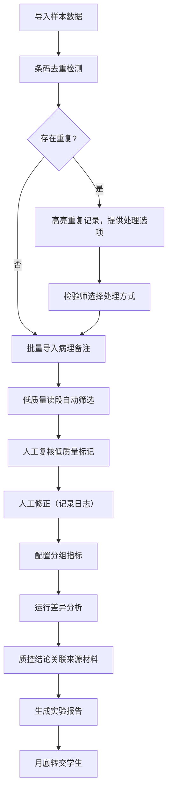
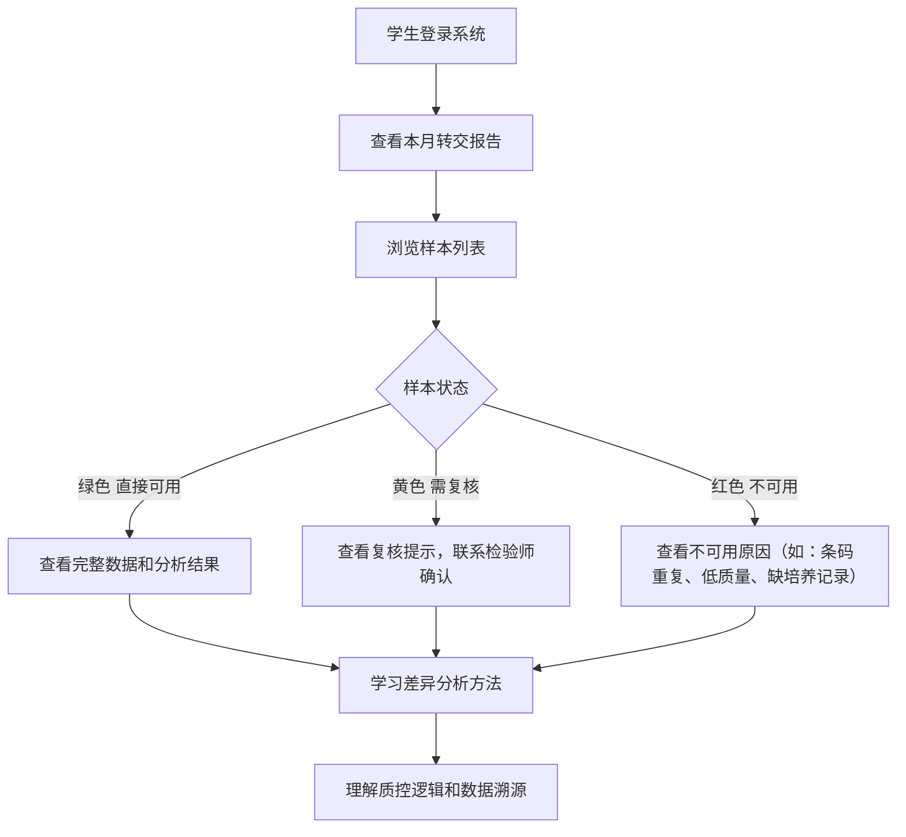
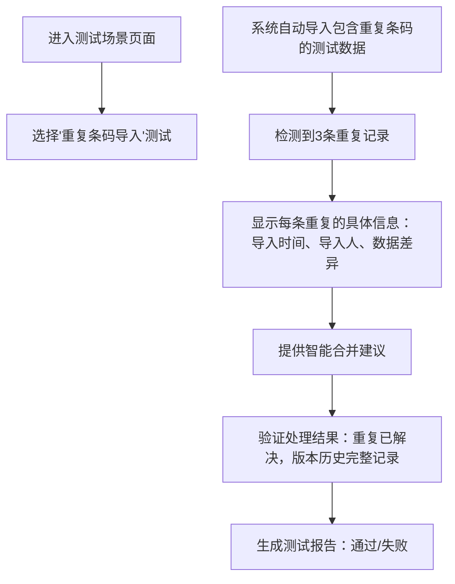

## 1. 产品概述

面向医院检验师和学生的叶绿素荧光实验报告AI/ML工作流工具，解决实验数据管理、质量控制、差异分析和报告导出的全流程问题。通过样本条码去重、版本追踪、人工修正日志和分组指标串联，确保数据可追溯，结果可复核。

- **核心目标**：把病理备注、质控数据、差异分析结果完整串联，让检验师高效工作，让学生清晰理解
- **目标用户**：医院检验师（数据管理、分析、导出）、学生（学习、查看结果、理解质控逻辑）
- **核心价值**：低质量数据自动识别、重复条码智能处理、失败场景可操作提示、结果可用性一目了然

## 2. 核心功能

### 2.1 用户角色

| 角色 | 登录方式 | 核心权限 |
|------|----------|----------|
| 医院检验师 | 账号登录 | 样本导入、病理备注管理、人工修正、差异分析、报告导出、测试场景运行 |
| 学生 | 账号登录/游客模式 | 查看实验结果、理解质控逻辑、查看可用/待复核标记、学习差异分析 |

### 2.2 功能模块

1. **仪表盘**：实验概览、质控统计、待处理任务、快速操作入口
2. **样本管理**：样本导入、条码去重、版本追踪、人工修正日志、分组管理
3. **质控中心**：低质量读段筛选、病理备注导入、质控结论关联来源材料
4. **差异分析**：组间差异统计、可视化图表、结果导出
5. **报告导出**：PDF/HTML报告生成、包含完整溯源链
6. **测试场景**：内置重复条码导入测试、数据完整性验证

### 2.3 页面详情

| 页面名称 | 模块名称 | 功能描述 |
|----------|----------|----------|
| 仪表盘 | 概览卡片 | 显示总样本数、高质量占比、待复核数、本月转交记录数 |
| 仪表盘 | 快捷操作 | 快速导入样本、运行差异分析、导出最新报告 |
| 样本管理 | 样本列表 | 表格展示样本信息，颜色标记质量状态，悬浮显示版本历史 |
| 样本管理 | 条码去重 | 自动检测重复条码，高亮显示冲突记录，提供合并/保留最新/标记作废选项 |
| 样本管理 | 人工修正 | 记录每次修正内容、修正人、修正时间，支持回滚 |
| 质控中心 | 低质量筛选 | 基于QC指标自动标记低质量读段，支持手动调整阈值 |
| 质控中心 | 备注导入 | 批量导入病理备注，按条码智能匹配样本 |
| 质控中心 | 来源追溯 | 每个质控结论可追溯到原始实验材料、设备、操作人员 |
| 差异分析 | 分组配置 | 灵活配置实验组/对照组，支持多组比较 |
| 差异分析 | 结果展示 | 火山图、热图、箱线图可视化，显著性标记 |
| 报告导出 | 报告生成 | 一键生成包含质控、差异、备注的完整报告 |
| 报告导出 | 学生视图 | 用颜色和图标清晰标记：绿色=直接可用、黄色=需复核、红色=不可用 |
| 测试场景 | 重复导入测试 | 一键运行样本条码重复导入测试用例，验证系统鲁棒性 |
| 错误提示 | 可操作提示 | 处理失败时显示具体缺失信息（如"缺少样本S003的培养记录，请联系检验科补充"） |

## 3. 核心流程

### 3.1 检验师工作流程



### 3.2 学生查看流程



### 3.3 重复导入测试流程



## 4. 用户界面设计

### 4.1 设计风格

- **主色调**：深科技蓝 (#0F3B5F) - 代表医学科研的严谨专业
- **辅助色**：
  - 质量绿 (#10B981) - 标记可用数据
  - 提醒黄 (#F59E0B) - 标记待复核数据
  - 警告红 (#EF4444) - 标记不可用数据
  - 分析紫 (#8B5CF6) - 差异分析可视化
- **按钮风格**：圆角8px，微立体阴影，hover时轻微上浮
- **字体**：
  - 标题：'Noto Serif SC' - 学术感、稳重
  - 正文：'Noto Sans SC' - 清晰易读
- **布局**：左侧导航 + 主内容区，卡片式模块，充足留白
- **图标风格**：线性图标，统一2px描边，医学科研主题

### 4.2 页面设计概述

| 页面名称 | 模块名称 | UI元素 |
|----------|----------|--------|
| 仪表盘 | 概览卡片 | 渐变背景、大数字动画、趋势箭头、悬浮放大效果 |
| 仪表盘 | 质控趋势图 | 面积图，渐变色填充，鼠标悬浮显示具体数值 |
| 样本管理 | 样本表格 | 斑马纹、行hover高亮、状态色标签、展开显示详情 |
| 样本管理 | 重复记录卡片 | 红色边框、闪烁提示、并列对比视图、操作按钮组 |
| 质控中心 | 质量热力图 | 单元格颜色深浅代表质量高低，点击查看详情 |
| 质控中心 | 可操作错误卡片 | 红边白底、具体问题描述、修复步骤指引、快捷操作按钮 |
| 差异分析 | 火山图 | 交互式，点击点显示样本信息，支持缩放 |
| 报告导出 | 学生视图 | 大尺寸状态图标、简明解释文字、"联系检验师"快捷按钮 |

### 4.3 响应式设计

- **桌面端**（>1200px）：完整功能布局，左侧固定导航，主内容区三列布局
- **平板端**（768-1200px）：左侧导航可折叠，主内容区两列布局
- **移动端**（<768px）：顶部导航栏，内容单列堆叠，核心功能优先展示
- **触摸优化**：按钮最小44x44px，表格支持横向滚动，重要操作二次确认

## 5. 关键交互细节

### 5.1 重复条码处理交互

1. 导入时实时检测重复，进度条旁显示"发现X条重复记录"
2. 点击弹出对比窗口，左右并列显示重复的两条记录
3. 高亮显示字段差异，提供"保留A"、"保留B"、"合并字段"、"全部标记作废"四个选项
4. 操作后自动记录版本历史，可追溯

### 5.2 可操作错误提示

当处理失败时，不是显示"内部错误"，而是：

```
❌ 处理失败
缺少以下培养记录：
• 样本S012：第3天温度记录缺失
• 样本S015：光照强度记录不完整
• 样本S021：培养基批号未填写

👉 下一步操作：
1. 联系检验科李老师补充上述记录
2. 补充后点击"重新处理"按钮
3. 紧急情况可勾选"跳过缺失记录继续（标记为待复核）"
```

### 5.3 学生友好结果展示

样本列表每行前面有大尺寸状态图标：
- 🟢 **可用**：鼠标悬浮显示"数据完整，质控通过，可直接使用"
- 🟡 **待复核**：鼠标悬浮显示"存在备注冲突，请联系检验师确认"
- 🔴 **不可用**：鼠标悬浮显示"条码重复，已标记作废，不可用于分析"

点击样本后，右侧面板显示完整的溯源链条：
原始材料 → 实验记录 → 质控过程 → 人工修正 → 差异分析 → 最终结论
