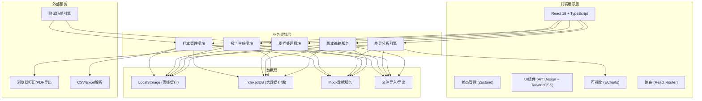
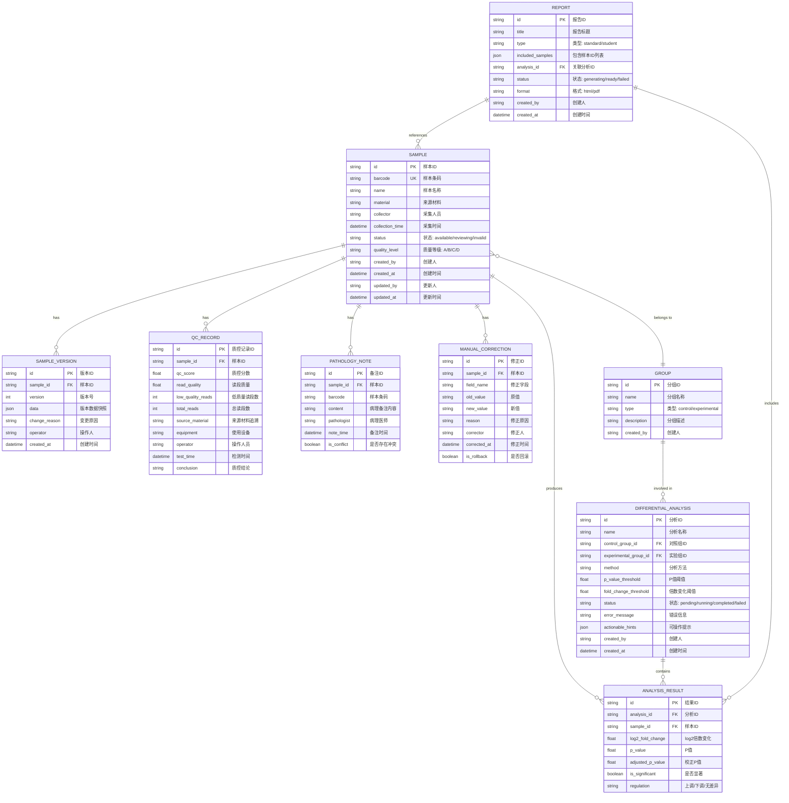

## 1. 架构设计



## 2. 技术描述

- **前端**：React@18 + TypeScript@5 + Vite@5
- **状态管理**：Zustand - 轻量级，支持时间旅行调试，适合版本追踪
- **UI框架**：Ant Design@5 + TailwindCSS@3 - 企业级组件库+原子化CSS
- **可视化**：ECharts@5 - 火山图、热图、箱线图等统计图表
- **数据存储**：IndexedDB (Dexie.js) - 本地存储大量实验数据
- **文件处理**：SheetJS (xlsx) + Papa Parse - Excel/CSV导入导出
- **PDF导出**：html2canvas + jsPDF - 客户端生成报告
- **路由**：React Router@6
- **图标**：@ant-design/icons + Lucide React

## 3. 路由定义

| 路由 | 页面 | 说明 |
|------|------|------|
| / | 仪表盘 | 实验概览、质控统计、快捷操作 |
| /samples | 样本管理 | 样本列表、条码去重、版本历史 |
| /samples/:id | 样本详情 | 单个样本完整信息、溯源链条 |
| /quality-control | 质控中心 | 低质量筛选、备注导入、来源追溯 |
| /differential-analysis | 差异分析 | 分组配置、统计分析、可视化 |
| /reports | 报告中心 | 报告列表、生成、导出、学生视图 |
| /test-scenarios | 测试场景 | 重复条码导入测试、系统验证 |

## 4. 数据模型

### 4.1 ER图



### 4.2 核心数据结构定义

```typescript
// 样本状态枚举
export enum SampleStatus {
  AVAILABLE = 'available',      // 可用 - 绿色
  REVIEWING = 'reviewing',      // 待复核 - 黄色
  INVALID = 'invalid',          // 不可用 - 红色
}

// 质量等级
export enum QualityLevel {
  A = 'A',  // 优秀
  B = 'B',  // 良好
  C = 'C',  // 一般
  D = 'D',  // 较差
}

// 样本接口
export interface Sample {
  id: string;
  barcode: string;
  name: string;
  material: string;
  collector: string;
  collectionTime: Date;
  status: SampleStatus;
  qualityLevel: QualityLevel;
  groupId?: string;
  createdAt: Date;
  createdBy: string;
  updatedAt: Date;
  updatedBy: string;
}

// 版本记录
export interface SampleVersion {
  id: string;
  sampleId: string;
  version: number;
  data: Sample;
  changeReason: string;
  operator: string;
  createdAt: Date;
}

// 质控记录
export interface QCRecord {
  id: string;
  sampleId: string;
  qcScore: number;
  readQuality: number;
  lowQualityReads: number;
  totalReads: number;
  sourceMaterial: string;
  equipment: string;
  operator: string;
  testTime: Date;
  conclusion: string;
}

// 病理备注
export interface PathologyNote {
  id: string;
  sampleId: string;
  barcode: string;
  content: string;
  pathologist: string;
  noteTime: Date;
  isConflict: boolean;
}

// 人工修正
export interface ManualCorrection {
  id: string;
  sampleId: string;
  fieldName: string;
  oldValue: string;
  newValue: string;
  reason: string;
  corrector: string;
  correctedAt: Date;
  isRollback: boolean;
}

// 分组
export interface Group {
  id: string;
  name: string;
  type: 'control' | 'experimental';
  description: string;
  createdBy: string;
  sampleIds: string[];
}

// 差异分析
export interface DifferentialAnalysis {
  id: string;
  name: string;
  controlGroupId: string;
  experimentalGroupId: string;
  method: string;
  pValueThreshold: number;
  foldChangeThreshold: number;
  status: 'pending' | 'running' | 'completed' | 'failed';
  errorMessage?: string;
  actionableHints?: {
    missingRecords: Array<{
      sampleId: string;
      sampleName: string;
      missingField: string;
      suggestion: string;
      contactPerson?: string;
    }>;
    nextSteps: string[];
  };
  createdAt: Date;
  createdBy: string;
}

// 分析结果
export interface AnalysisResult {
  id: string;
  analysisId: string;
  sampleId: string;
  log2FoldChange: number;
  pValue: number;
  adjustedPValue: number;
  isSignificant: boolean;
  regulation: 'up' | 'down' | 'none';
}

// 重复条码冲突
export interface BarcodeConflict {
  barcode: string;
  samples: Sample[];
  detectedAt: Date;
  resolution?: 'keep_newest' | 'keep_oldest' | 'merge' | 'mark_invalid';
  resolvedAt?: Date;
  resolvedBy?: string;
}

// 可操作错误
export interface ActionableError {
  errorCode: string;
  title: string;
  description: string;
  missingItems: Array<{
    sampleId: string;
    sampleName: string;
    issue: string;
  }>;
  nextSteps: string[];
  contactInfo?: {
    name: string;
    role: string;
  };
  canSkip: boolean;
  skipLabel?: string;
}
```

## 5. 核心模块设计

### 5.1 样本管理模块

```typescript
// 条码去重服务
class BarcodeDeduplicationService {
  detectConflicts(samples: Sample[]): BarcodeConflict[];
  resolveConflict(conflict: BarcodeConflict, resolution: string, operator: string): Sample[];
  mergeSamples(source: Sample, target: Sample): Sample;
}

// 版本追踪服务
class VersionControlService {
  createVersion(sample: Sample, changeReason: string, operator: string): SampleVersion;
  getVersions(sampleId: string): SampleVersion[];
  rollbackToVersion(sampleId: string, versionId: string, operator: string): Sample;
}
```

### 5.2 质控处理模块

```typescript
// 低质量读段筛选器
class LowQualityReadFilter {
  static DEFAULT_THRESHOLDS = {
    minQcScore: 30,
    minReadQuality: 20,
    maxLowQualityRatio: 0.2,
  };

  filterSample(sample: Sample, qcRecord: QCRecord, thresholds?: object): {
    passed: boolean;
    lowQualityReads: number;
    reasons: string[];
    suggestedAction: string;
  };

  batchFilter(samples: Sample[], qcRecords: QCRecord[]): Map<string, FilterResult>;
}

// 来源追溯服务
class SourceTracingService {
  buildTraceChain(sampleId: string): TraceNode[];
  getMaterialInfo(materialId: string): MaterialInfo;
  validateTraceChain(sampleId: string): ValidationResult;
}
```

### 5.3 差异分析引擎

```typescript
class DifferentialAnalysisEngine {
  async runAnalysis(analysis: DifferentialAnalysis, groups: Group[], samples: Sample[]): Promise<{
    success: boolean;
    results?: AnalysisResult[];
    error?: ActionableError;
  }>;

  private validateInput(groups: Group[], samples: Sample[]): ActionableError | null;
  private calculateStatistics(controlGroup: Sample[], experimentalGroup: Sample[]): AnalysisResult[];
  private adjustPValues(results: AnalysisResult[]): AnalysisResult[];
}
```

### 5.4 错误处理机制

```typescript
class ActionableErrorHandler {
  static createMissingRecordsError(missingSamples: Sample[]): ActionableError;
  static createBarcodeConflictError(conflicts: BarcodeConflict[]): ActionableError;
  static createQualityControlError(failedSamples: Sample[]): ActionableError;
  static createInsufficientDataError(controlCount: number, experimentalCount: number): ActionableError;

  static formatForDisplay(error: ActionableError): {
    title: string;
    description: string;
    bulletPoints: string[];
    steps: string[];
    primaryAction: { label: string; onClick: () => void };
    secondaryAction?: { label: string; onClick: () => void };
  };
}
```

### 5.5 学生视图转换器

```typescript
class StudentViewTransformer {
  static transformSampleForStudent(sample: Sample, qcRecord: QCRecord, notes: PathologyNote[]): StudentSampleView;
  static getStatusExplanation(status: SampleStatus): { icon: string; color: string; title: string; description: string };
  static buildLearningPath(sample: Sample, analysisResults: AnalysisResult[]): LearningStep[];
}
```

## 6. 测试场景引擎

### 6.1 重复条码导入测试

```typescript
interface TestScenario {
  id: string;
  name: string;
  description: string;
  setup(): Promise<void>;
  run(): Promise<TestResult>;
  teardown(): Promise<void>;
}

class DuplicateBarcodeImportTest implements TestScenario {
  id = 'duplicate-barcode-import';
  name = '重复条码导入测试';
  description = '验证系统能够正确检测和处理导入中的重复条码';

  async setup() {
    // 创建包含重复条码的测试数据
    const testSamples = this.generateTestDataWithDuplicates();
    await this.loadTestData(testSamples);
  }

  async run() {
    // 1. 导入第一批数据
    // 2. 导入第二批包含重复条码的数据
    // 3. 验证冲突检测是否正确
    // 4. 执行各种解决策略
    // 5. 验证版本历史是否完整
    // 6. 验证数据一致性
  }

  async teardown() {
    // 清理测试数据
  }

  private generateTestDataWithDuplicates(): Sample[] {
    return [
      { id: 'S001', barcode: 'BC001', name: '野生型样本-01', ... },
      { id: 'S002', barcode: 'BC002', name: '突变体样本-01', ... },
      { id: 'S003', barcode: 'BC001', name: '野生型样本-01-重复', ... }, // 重复条码
      { id: 'S004', barcode: 'BC003', name: '处理组样本-01', ... },
      { id: 'S005', barcode: 'BC002', name: '突变体样本-01-重复', ... }, // 重复条码
    ];
  }
}
```

## 7. 项目目录结构

```
src/
├── components/          # 通用组件
│   ├── layout/         # 布局组件
│   ├── tables/         # 表格组件
│   ├── charts/         # 图表组件
│   ├── forms/          # 表单组件
│   └── common/         # 通用UI组件
├── pages/              # 页面组件
│   ├── Dashboard/
│   ├── Samples/
│   ├── QualityControl/
│   ├── DifferentialAnalysis/
│   ├── Reports/
│   └── TestScenarios/
├── store/              # 状态管理
│   ├── sampleStore.ts
│   ├── qcStore.ts
│   ├── analysisStore.ts
│   └── uiStore.ts
├── services/           # 业务服务
│   ├── sampleService.ts
│   ├── barcodeService.ts
│   ├── versionService.ts
│   ├── qcService.ts
│   ├── analysisService.ts
│   └── reportService.ts
├── types/              # TypeScript类型定义
│   ├── index.ts
│   ├── sample.ts
│   ├── qc.ts
│   ├── analysis.ts
│   └── report.ts
├── utils/              # 工具函数
│   ├── errorHandler.ts
│   ├── statistics.ts
│   ├── fileHandler.ts
│   └── mockData.ts
├── tests/              # 测试场景
│   ├── scenarios/
│   │   ├── duplicateBarcodeTest.ts
│   │   └── dataIntegrityTest.ts
│   └── runner.ts
├── App.tsx
├── main.tsx
└── routes.tsx
```

## 8. 性能优化

1. **虚拟滚动**：样本表格使用虚拟滚动，支持10000+条数据流畅渲染
2. **懒加载**：图表和分析结果按需加载，首屏快速呈现
3. **IndexedDB缓存**：大数据本地存储，避免重复计算
4. **Web Worker**：差异分析和统计计算在Worker线程执行，不阻塞UI
5. **防抖节流**：搜索、筛选操作防抖，避免频繁重渲染
