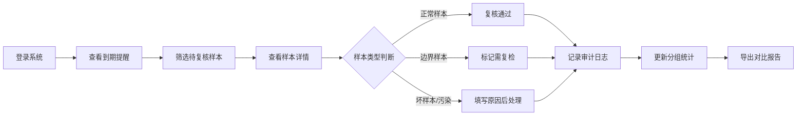

## 1. 产品概述

菌株保藏到期提醒系统，用于动物房管理员对菌株样本进行到期前的复核与管理，解决复核意见晚到、污染样本混入难以处理等核心痛点。

- 主要目的：实现菌株保藏到期前的智能提醒、分级复核、审计追踪和报告导出
- 解决问题：污染样本混入无法直接丢弃、分组统计改变判断缺乏对比、历史操作追溯困难
- 目标用户：动物房管理员、实验室质控人员

## 2. 核心功能

### 2.1 用户角色

| 角色 | 登录方式 | 核心权限 |
|------|----------|----------|
| 动物房管理员 | 用户名密码 | 样本复核、修改采样地点、人工确认、导出报告、查看历史 |
| 实验室管理员 | 用户名密码 | 补录样本、批量操作、系统设置、查看所有操作日志 |

### 2.2 功能模块

1. **样本列表页**：到期提醒概览、分类筛选（正常/边界/坏样本）、分组统计
2. **样本详情页**：样本基本信息、复核操作、历史版本对比、地点变更对比
3. **复核弹窗**：复核意见填写、状态变更（通过/驳回/需复检）、原因备注
4. **审计历史页**：操作日志、变更追溯、谁改的/什么时候/为什么改
5. **报告导出页**：分组统计对比、前后差别展示、Excel/PDF导出

### 2.3 页面详情

| 页面名称 | 模块名称 | 功能描述 |
|----------|----------|----------|
| 样本列表页 | 顶部统计面板 | 显示即将到期、今日到期、已过期样本数量，按状态分类统计 |
| 样本列表页 | 筛选工具栏 | 按保藏编号、采样地点、状态、到期时间范围筛选 |
| 样本列表页 | 分组统计卡片 | 按采样地点、菌株类型分组，展示各组判断分布 |
| 样本列表页 | 数据表格 | 展示样本列表，支持批量复核、批量导出 |
| 样本列表页 | 运行操作区 | 重复运行提醒、补录样本、人工确认三个核心操作入口 |
| 样本详情页 | 基本信息区 | 展示菌株编号、名称、保藏日期、到期日期、采样地点等 |
| 样本详情页 | 复核操作区 | 复核意见输入、状态选择、提交复核 |
| 样本详情页 | 历史对比区 | 上下排列展示旧结论与新结论，高亮差异部分 |
| 样本详情页 | 地点变更对比 | 并排展示采样地点修改前后的判断结果与统计影响 |
| 审计历史页 | 操作日志列表 | 时间线展示所有操作，包含操作人、时间、变更内容、原因 |
| 审计历史页 | 变更详情弹窗 | 展示变更前后的完整字段对比 |
| 报告导出页 | 统计对比区 | 展示分组统计改变判断的前后数据对比表格 |
| 报告导出页 | 导出操作区 | 选择导出格式、时间范围、包含字段 |

## 3. 核心流程

### 3.1 样本复核流程

动物房管理员每日登录系统 → 查看到期提醒列表 → 筛选待复核样本 → 逐一查看样本详情 → 识别正常/边界/坏样本 → 填写复核意见 → 提交复核 → 系统记录审计日志 → 分组统计自动更新 → 可导出包含前后差别的报告

### 3.2 污染样本处理流程

系统自动检测疑似污染样本 → 标记为坏样本但不自动丢弃 → 管理员人工复核 → 若确认污染则填写处理原因 → 若复核通过（特殊情况）则强制记录原因 → 历史记录永久保留谁、何时、为何通过污染样本

### 3.3 日常运行场景

1. **重复运行**：同一批次样本可多次运行提醒逻辑，每次运行生成独立批次号
2. **补录**：遗漏样本可随时补录，补录时需注明补录原因
3. **人工确认**：对系统自动判断有异议时，可人工强制确认并记录原因

## 4. 用户界面设计

### 4.1 设计风格

- 主色调：实验室蓝（#165DFF），代表专业与可信
- 辅助色：警戒橙（#FF7D00）用于边界样本、危险红（#F53F3F）用于坏样本、成功绿（#00B42A）用于正常样本
- 中性色： slate 色系，确保数据可读性
- 按钮风格：圆角 6px，悬停有微妙阴影变化，点击有缩放反馈
- 字体：标题使用思源黑体 Bold，正文使用思源黑体 Regular，数字使用等宽字体增强可读性
- 布局风格：顶部导航 + 左侧筛选 + 右侧主内容区的经典后台布局
- 图标：使用 lucide-react 线性图标，保持简洁统一

### 4.2 页面设计概述

| 页面名称 | 模块名称 | UI 元素 |
|----------|----------|----------|
| 样本列表页 | 统计面板 | 彩色卡片、数字动画、状态徽标、hover 上浮效果 |
| 样本列表页 | 数据表格 | 斑马纹、行 hover 高亮、状态标签颜色区分、操作按钮组 |
| 样本列表页 | 分组统计 | 分组卡片、饼图/柱状图、前后对比箭头、差异高亮 |
| 样本详情页 | 历史对比 | 双栏并排布局、删除线标记旧值、绿色背景标记新值、差异连接线 |
| 样本详情页 | 地点变更对比 | 左右两列布局、中间 VS 分隔、影响范围高亮展示 |
| 审计历史页 | 时间线 | 垂直时间线、彩色节点、操作人头像、展开/收起详情 |
| 报告导出页 | 统计对比 | 表格行背景色区分、增减箭头、百分比变化标注 |

### 4.3 响应式

- 桌面端优先设计，最小支持 1280px 宽度
- 平板端（1024px）：左侧筛选可折叠，表格支持横向滚动
- 移动端（768px）：统计面板变为垂直堆叠，表格转为卡片式列表

### 4.4 视觉细节

- 背景使用 subtle 网格纹理，增加实验室专业感
- 卡片使用分层阴影，营造深度感
- 状态标签使用渐变色填充 + 细微边框
- 表格行 hover 时有背景色过渡动画
- 重要操作按钮使用脉冲动画吸引注意
- 数据加载时使用骨架屏 + 渐变扫光效果
