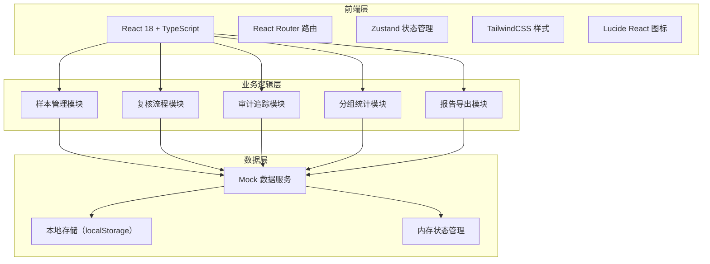
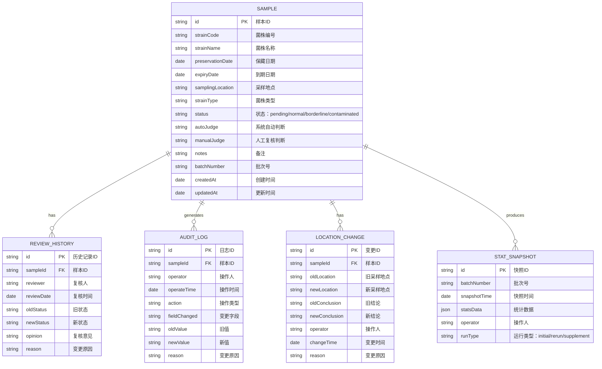

## 1. 架构设计



## 2. 技术描述

- 前端：React@18 + TypeScript@5 + TailwindCSS@3 + Vite@5
- 路由：react-router-dom@6
- 状态管理：zustand@4
- 图标：lucide-react@0.344
- 后端：无后端，纯前端应用，使用 Mock 数据 + localStorage 持久化
- 数据存储：localStorage 存储操作历史和用户数据

## 3. 路由定义

| 路由 | 页面组件 | 功能说明 |
|------|----------|----------|
| / | SampleListPage | 样本列表页，到期提醒概览 |
| /sample/:id | SampleDetailPage | 样本详情页，含复核操作和历史对比 |
| /audit | AuditLogPage | 审计历史页，操作日志时间线 |
| /report | ReportPage | 报告导出页，分组统计对比 |

## 4. 数据模型

### 4.1 数据模型定义



### 4.2 TypeScript 类型定义

```typescript
// 样本状态
type SampleStatus = 'pending' | 'normal' | 'borderline' | 'contaminated';

// 操作类型
type ActionType = 'create' | 'review' | 'update_location' | 'manual_confirm' | 'rerun' | 'supplement';

interface Sample {
  id: string;
  strainCode: string;
  strainName: string;
  preservationDate: string;
  expiryDate: string;
  samplingLocation: string;
  strainType: string;
  status: SampleStatus;
  autoJudge: SampleStatus;
  manualJudge?: SampleStatus;
  notes: string;
  batchNumber: string;
  createdAt: string;
  updatedAt: string;
  contaminationMarks?: string[];
}

interface ReviewHistory {
  id: string;
  sampleId: string;
  reviewer: string;
  reviewDate: string;
  oldStatus: SampleStatus;
  newStatus: SampleStatus;
  opinion: string;
  reason: string;
}

interface AuditLog {
  id: string;
  sampleId: string;
  operator: string;
  operateTime: string;
  action: ActionType;
  fieldChanged: string;
  oldValue: string;
  newValue: string;
  reason: string;
}

interface LocationChange {
  id: string;
  sampleId: string;
  oldLocation: string;
  newLocation: string;
  oldConclusion: SampleStatus;
  newConclusion: SampleStatus;
  operator: string;
  changeTime: string;
  reason: string;
  affectedStats: {
    oldGroupStats: Record<string, number>;
    newGroupStats: Record<string, number>;
  };
}

interface StatSnapshot {
  id: string;
  batchNumber: string;
  snapshotTime: string;
  statsData: {
    byLocation: Record<string, Record<SampleStatus, number>>;
    byStrainType: Record<string, Record<SampleStatus, number>>;
    total: Record<SampleStatus, number>;
  };
  operator: string;
  runType: 'initial' | 'rerun' | 'supplement';
  previousSnapshotId?: string;
}
```

### 4.3 初始 Mock 数据设计

**真实测试数据集（20条样本，包含三种类型）：**

1. **正常样本（12条）**：常规保藏菌株，状态良好，即将到期
   - 例如：大肠杆菌 DH5α、金黄色葡萄球菌 ATCC25923 等常用菌株
   - 保藏日期分布在 2023-2024 年，到期日期集中在 2026 年 6-8 月

2. **边界样本（5条）**：接近保质期、外观有轻微变化但仍可使用
   - 例如：部分培养基有轻微浑浊、菌落形态有变化但 PCR 检测阳性
   - 需要管理员仔细判断是否继续保藏

3. **坏样本/污染样本（3条）**：真实感强的污染数据
   - **样本1**：霉菌污染 - "2026年6月5日检查发现平板边缘有棉絮状菌丝生长，疑似青霉污染，菌落颜色变为灰绿色"
   - **样本2**：细菌污染 - "LB液体培养基浑浊，OD600=0.8（正常值<0.1），镜检发现有杂菌游动"
   - **样本3**：交叉污染 - "菌株编号 ST-0019，PCR 检测同时出现大肠杆菌和沙门氏菌特异性条带，可能是操作时交叉污染"

**设计要点：**
- 污染样本的描述要具体、专业，像日常工作中真实会遇到的问题
- 边界样本要有争议点，让不同管理员可能有不同判断
- 包含多个采样地点（动物房A区、B区、C区、SPF区、检疫区）
- 包含多种菌株类型（细菌、真菌、病毒、细胞株）
