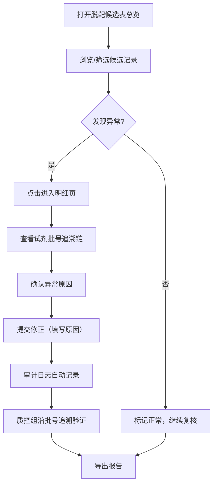
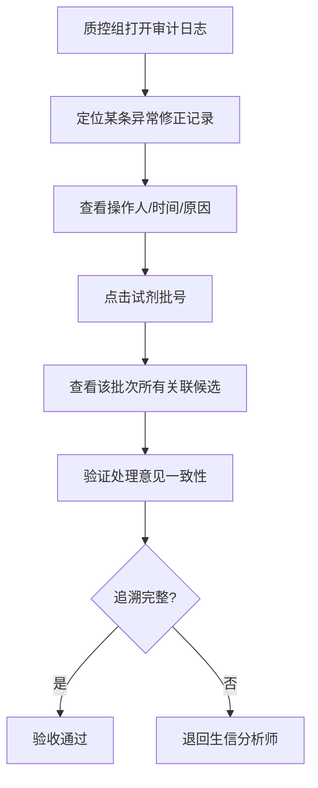

## 1. 产品概述

CRISPR 脱靶候选表管理系统——面向生信分析师与质控组，围绕试剂批号实现脱靶候选数据的可追溯管理。解决传统表格颜色标注和口头约定无法反查的问题，确保每条异常结论可追溯到试剂批号与处理意见，图表、明细与导出共享同一数据源。

- 目标用户：生信分析师（日常复核）、质控组（验收审计）
- 核心价值：单一数据源驱动看板/明细/导出，异常修正全程留痕，首次打开即有示例数据可操作

## 2. 核心功能

### 2.1 用户角色

| 角色 | 使用方式 | 核心权限 |
|------|----------|----------|
| 生信分析师 | 直接使用 | 录入/复核脱靶候选、标记异常、修正结论、导出报告 |
| 质控组 | 直接使用 | 查看脱靶候选表、沿试剂批号追溯异常、查看审计日志 |

### 2.2 功能模块

1. **脱靶候选表总览页**：数据表格 + 统计图表 + 筛选条件，所有视图共享同一数据源
2. **候选明细与追溯页**：单条候选详情 + 试剂批号追溯链 + 异常修正面板
3. **审计日志页**：修正历史完整记录（谁/何时/为何）
4. **数据导出页**：基于当前筛选条件导出 CSV/PDF
5. **说明文档页**：启动、导入、查看异常、导出结果四步操作指南

### 2.3 页面详情

| 页面名称 | 模块名称 | 功能描述 |
|----------|----------|----------|
| 脱靶候选表总览 | 数据表格 | 展示所有脱靶候选记录，支持按试剂批号、样本ID、异常状态筛选，行内标记异常状态 |
| 脱靶候选表总览 | 统计图表 | 按试剂批号汇总异常分布、候选位点数量趋势图，图表与表格共享筛选条件 |
| 脱靶候选表总览 | 筛选栏 | 试剂批号、日期范围、异常状态、处理意见等多维筛选 |
| 候选明细与追溯 | 候选详情 | 展示单条脱靶候选的完整信息：位点、序列、比对详情、对照结果 |
| 候选明细与追溯 | 试剂批号追溯链 | 从当前候选→样本→试剂批号→批次关联的所有异常记录 |
| 候选明细与追溯 | 异常修正面板 | 标记异常/复核通过，填写修正原因，提交后自动写入审计日志 |
| 审计日志 | 修正历史表 | 展示所有修正记录：操作人、操作时间、原值、新值、修正原因 |
| 审计日志 | 筛选与搜索 | 按试剂批号、操作人、时间范围筛选审计记录 |
| 数据导出 | 导出面板 | 基于当前筛选条件导出 CSV/PDF，导出结果与界面展示数据一致 |
| 说明文档 | 操作指南 | 启动、导入、查看异常、导出结果四步操作说明，无宣传性内容 |

## 3. 核心流程

**主流程：复核脱靶候选 → 发现异常 → 追溯试剂批号 → 修正并留痕 → 导出报告**

**质控验收流程：沿一条异常往回查**

## 4. 用户界面设计

### 4.1 设计风格

- 主色调：深青色（teal-700）+ 暖橙色（orange-500）异常高亮
- 辅助色：zinc 灰度体系
- 字体：JetBrains Mono（数据展示）+ Noto Sans SC（界面文案）
- 布局：左侧固定导航 + 右侧内容区，表格为主、图表辅助
- 交互：行点击进入明细，异常行橙色左边框标识，修正操作弹窗确认
- 图标：lucide-react 图标集

### 4.2 页面设计概述

| 页面名称 | 模块名称 | UI 元素 |
|----------|----------|----------|
| 脱靶候选表总览 | 筛选栏 | 输入框/下拉/日期选择器，水平排列于表格上方 |
| 脱靶候选表总览 | 数据表格 | 斑马纹表格，异常行橙色左边框，行悬停高亮，点击整行跳转明细 |
| 脱靶候选表总览 | 统计图表 | 左侧柱状图（按批号异常分布），右侧趋势线（候选数量） |
| 候选明细与追溯 | 候选详情卡片 | 白色卡片，分区块展示位点信息/比对结果/对照情况 |
| 候选明细与追溯 | 追溯链 | 垂直时间线样式，从候选→样本→批号逐级展开 |
| 候选明细与追溯 | 修正面板 | 右侧抽屉，含下拉选择处理意见 + 文本域填写原因 + 提交按钮 |
| 审计日志 | 历史表格 | 时间倒序，操作人列头像+姓名，修正原因可展开 |
| 数据导出 | 导出面板 | 当前筛选条件摘要 + 格式选择 + 导出按钮 |
| 说明文档 | 操作指南 | 步骤编号 + 代码块/截图占位 + 注意事项提示框 |

### 4.3 响应式设计

- 桌面端优先设计，最小宽度 1280px
- 表格区域横向可滚动
- 图表在窄屏下纵向堆叠

### 4.4 3D 场景

不适用
