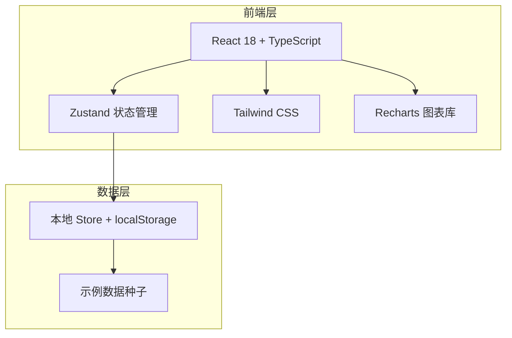
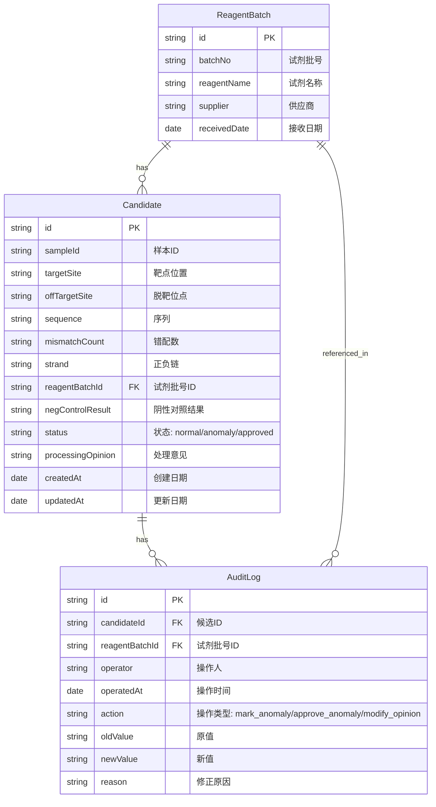

## 1. 架构设计



纯前端架构，无后端服务。所有数据存储在 Zustand store 中，通过 localStorage 持久化。首次打开时注入示例数据种子。

## 2. 技术说明

- 前端：React@18 + TypeScript + Tailwind CSS@3 + Vite
- 初始化工具：vite-init
- 状态管理：Zustand（含 persist 中间件自动 localStorage 持久化）
- 图表：Recharts
- 后端：无
- 数据库：无（前端 Zustand store + localStorage）

## 3. 路由定义

| 路由 | 用途 |
|------|------|
| `/` | 脱靶候选表总览页（数据表格 + 统计图表 + 筛选） |
| `/candidate/:id` | 候选明细与追溯页（详情 + 批号追溯 + 修正面板） |
| `/audit` | 审计日志页（修正历史记录） |
| `/export` | 数据导出页 |
| `/guide` | 说明文档页 |

## 4. API 定义

无后端 API。前端通过 Zustand store 直接操作数据。

### 核心数据操作接口（Zustand Actions）

```typescript
interface OffTargetStore {
  candidates: Candidate[]
  auditLogs: AuditLog[]
  reagentBatches: ReagentBatch[]
  filters: FilterState

  addCandidate: (candidate: Candidate) => void
  updateCandidate: (id: string, updates: Partial<Candidate>) => void
  markAnomaly: (id: string, reason: string, operator: string) => void
  approveAnomaly: (id: string, reason: string, operator: string) => void
  setFilters: (filters: Partial<FilterState>) => void
  getFilteredCandidates: () => Candidate[]
  getAuditLogsByBatch: (batchNo: string) => AuditLog[]
  getCandidatesByBatch: (batchNo: string) => Candidate[]
  exportData: (format: 'csv' | 'json') => string
}
```

## 5. 服务端架构图

不适用（纯前端项目）

## 6. 数据模型

### 6.1 数据模型定义



### 6.2 数据定义语言

```typescript
interface ReagentBatch {
  id: string
  batchNo: string
  reagentName: string
  supplier: string
  receivedDate: string
}

interface Candidate {
  id: string
  sampleId: string
  targetSite: string
  offTargetSite: string
  sequence: string
  mismatchCount: number
  strand: '+' | '-'
  reagentBatchId: string
  negControlResult: 'normal' | 'abnormal' | 'pending'
  status: 'normal' | 'anomaly' | 'approved'
  processingOpinion: string
  createdAt: string
  updatedAt: string
}

interface AuditLog {
  id: string
  candidateId: string
  reagentBatchId: string
  operator: string
  operatedAt: string
  action: 'mark_anomaly' | 'approve_anomaly' | 'modify_opinion'
  oldValue: string
  newValue: string
  reason: string
}

interface FilterState {
  batchNo: string
  dateRange: [string, string] | null
  status: string
  negControlResult: string
  search: string
}
```
