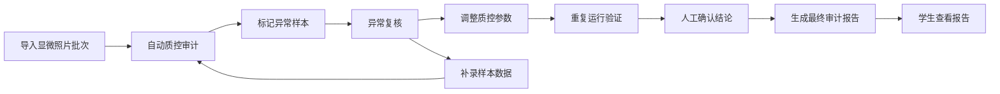

## 1. 产品概述

蛋白互作网络审计看板是面向药企研究员的专业级生物信息学质量控制工具，用于审计基于显微照片的蛋白互作网络分析结果，自动检测污染样本混入和数据异常，提供完整的复核追溯链路。

- 目标用户：药企研究员、实验室质量控制人员、学生实习生
- 核心价值：在真实显微照片分析流程中快速定位污染样本，确保实验数据可靠性，降低假阳性结论风险

## 2. 核心功能

### 2.1 用户角色

| 角色 | 注册方式 | 核心权限 |
|------|----------|----------|
| 药企研究员 | 内部账号 | 完整审计、复核、人工确认、下载报告 |
| 学生 | 实习生账号 | 查看最终报告、定位污染材料来源 |

### 2.2 功能模块

1. **审计看板主页**：质控概览图表、异常样本统计、审计批次列表
2. **样本明细页**：样本详情、质控指标、污染风险评估、物种同义名检测
3. **异常复核页**：异常样本列表、质控前后对比、并排差异视图
4. **操作面板**：重复运行、补录样本、人工确认三大核心操作
5. **审计报告页**：学生友好型最终报告、污染材料定位、结论摘要

### 2.3 页面详情

| 页面名称 | 模块名称 | 功能描述 |
|----------|----------|----------|
| 审计看板主页 | 质控概览卡片 | 展示总样本数、异常数、污染率、质控通过率等关键指标 |
| 审计看板主页 | 趋势图表 | 按批次展示质控指标变化趋势、污染类型分布饼图 |
| 审计看板主页 | 审计批次列表 | 显示历史审计批次，支持筛选和进入详情 |
| 样本明细页 | 样本基础信息 | 样本ID、来源材料、采集时间、显微照片缩略图 |
| 样本明细页 | 质控指标面板 | 蛋白浓度、纯度、完整性等多项质控指标及阈值对比 |
| 样本明细页 | 污染检测结果 | 污染类型、置信度、疑似污染来源材料 |
| 样本明细页 | 物种同义名检测 | 自动识别物种名同义记录，标注潜在混淆风险 |
| 异常复核页 | 异常样本列表 | 按风险等级排序的异常样本清单 |
| 异常复核页 | 前后对比视图 | 质控参数调整前后的判定结果并排对比 |
| 异常复核页 | 显微照片对比 | 原始照片与处理后照片左右并排展示 |
| 操作面板 | 重复运行 | 对选中样本重新执行审计分析，记录版本差异 |
| 操作面板 | 补录样本 | 新增补充样本数据，并入当前审计批次 |
| 操作面板 | 人工确认 | 研究员对异常结论进行人工审核确认或驳回 |
| 审计报告页 | 结论摘要 | 简明扼要的审计结论，适合快速阅读 |
| 审计报告页 | 污染材料追溯 | 清晰标注污染样本卡在哪份材料上的追溯链 |
| 审计报告页 | 下载功能 | 支持CSV、JSON、PDF三种格式导出同一批数据 |

## 3. 核心流程

研究员导入显微照片批次 → 系统自动执行质控审计 → 标记异常样本和污染风险 → 研究员进入异常复核 → 调整质控参数或人工确认 → 重新运行验证 → 生成最终审计报告 → 学生查看报告定位污染材料

## 4. 用户界面设计

### 4.1 设计风格

- 主色调：深海青色（#0D4F4F）+ 琥珀色警告（#D97706），体现专业科研气质
- 辅助色：深灰蓝背景，数据表格高对比度
- 按钮风格：直角方形按钮，悬浮时有轻微上浮和阴影变化
- 字体：标题使用 DM Serif Display 体现专业感，正文使用 JetBrains Mono 等宽字体确保数据可读性
- 布局风格：左侧导航 + 右侧内容区，卡片式模块布局
- 图标风格：线性 lucide 图标，保持简洁专业

### 4.2 页面设计概览

| 页面名称 | 模块名称 | UI元素 |
|----------|----------|--------|
| 审计看板主页 | 质控概览卡片 | 四宫格卡片布局、数据大号数字展示、趋势小箭头指示 |
| 审计看板主页 | 趋势图表区域 | 折线图 + 饼图并排、悬停显示详情数据 |
| 审计看板主页 | 批次列表 | 表格布局、状态标签色标区分、行点击进入详情 |
| 样本明细页 | 左右两栏布局 | 左侧照片和基础信息、右侧质控指标和检测结果 |
| 异常复核页 | 并排对比视图 | 左右分栏、中间分割线、旧版/新版标签标识 |
| 操作面板 | 三按钮横排 | 重复运行、补录、人工确认三大操作按钮醒目排列 |
| 审计报告页 | 信息流布局 | 按重要性从上到下呈现，学生可顺序阅读 |

### 4.3 响应式

桌面端优先设计，关键数据区域支持最小宽度1280px；中等屏幕自适应缩放；移动端简化为单列布局，保留核心数据查看功能。

### 4.4 数据真实性

- 内置真实生物信息学场景的模拟数据
- 污染样本混入常见类型：支原体污染、交叉样本污染、试剂污染
- 物种同义名示例：小鼠 / Mus musculus / 小家鼠，体现真实数据混乱场景
- 显微照片使用占位图替代，保留缩略图对比功能
