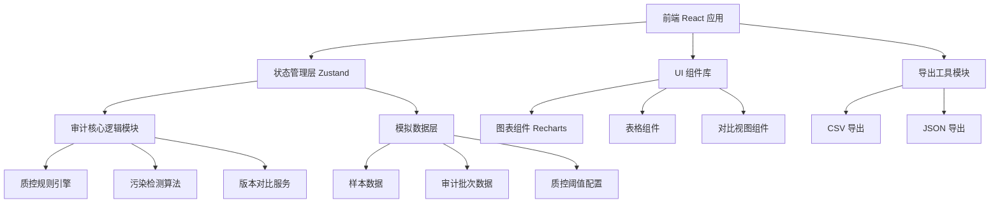

## 1. 架构设计



## 2. 技术描述

- 前端：React@18 + TypeScript + Vite@5
- 样式：Tailwind CSS@3
- 状态管理：Zustand
- 图表库：Recharts
- 图标：Lucide React
- 路由：React Router DOM@6
- 后端：纯前端模拟，数据存储于 localStorage，支持页面刷新保留状态
- 初始化工具：vite-init

## 3. 路由定义

| 路由 | 页面 | 用途 |
|------|------|------|
| / | 审计看板主页 | 质控概览、批次列表、统计图表 |
| /batch/:id | 批次明细页 | 单个审计批次的样本列表和概览 |
| /sample/:id | 样本明细页 | 单样本详细信息、质控指标、污染检测 |
| /review | 异常复核页 | 异常样本列表、前后对比、并排视图 |
| /report/:id | 审计报告页 | 最终报告、污染追溯、适合学生阅读 |

## 4. 数据模型

### 4.1 核心数据类型

```typescript
// 样本状态
type SampleStatus = 'normal' | 'warning' | 'contaminated' | 'manually_confirmed' | 'pending';

// 样本
interface Sample {
  id: string;
  batchId: string;
  name: string;
  sourceMaterial: string;      // 来源材料
  collectedAt: string;
  micrographUrl: string;       // 显微照片
  species: string;             // 物种名（可能是同义名变体）
  speciesCanonical: string;    // 标准物种名
  hasSpeciesSynonymIssue: boolean;
  
  // 质控指标
  qualityMetrics: {
    proteinConcentration: number;  // 蛋白浓度 μg/mL
    purity: number;                // 纯度 %
    integrity: number;             // 完整性 %
    backgroundNoise: number;       // 背景噪声
    particleCount: number;         // 颗粒计数
  };
  
  // 污染检测
  contamination: {
    detected: boolean;
    type: 'mycoplasma' | 'cross_sample' | 'reagent' | 'unknown';
    confidence: number;  // 0-1
    suspectedSource: string;  // 疑似污染来源材料
  };
  
  status: SampleStatus;
  manualNote?: string;
  
  // 版本历史
  versions: SampleVersion[];
  currentVersion: number;
}

// 样本版本（用于前后对比）
interface SampleVersion {
  version: number;
  timestamp: string;
  reason: 'initial' | 're_run' | 'qc_param_change' | 'supplementary';
  qualityMetrics: Sample['qualityMetrics'];
  contamination: Sample['contamination'];
  status: SampleStatus;
}

// 审计批次
interface AuditBatch {
  id: string;
  name: string;
  createdAt: string;
  sampleCount: number;
  abnormalCount: number;
  contaminationRate: number;
  status: 'completed' | 'running' | 'needs_review';
  qcThresholds: QCThresholds;
}

// 质控阈值
interface QCThresholds {
  minProteinConcentration: number;
  minPurity: number;
  minIntegrity: number;
  maxBackgroundNoise: number;
  contaminationConfidenceThreshold: number;
}
```

### 4.2 状态管理 Store

```typescript
interface AuditStore {
  batches: AuditBatch[];
  samples: Sample[];
  currentBatchId: string | null;
  qcThresholds: QCThresholds;
  
  // 操作
  reRunSample: (sampleId: string) => void;
  addSupplementarySample: (sample: Omit<Sample, 'id' | 'versions'>) => void;
  manuallyConfirm: (sampleId: string, note: string, confirmed: boolean) => void;
  updateQCThresholds: (thresholds: Partial<QCThresholds>) => void;
  getSampleVersions: (sampleId: string) => SampleVersion[];
  exportData: (batchId: string, format: 'csv' | 'json') => string;
}
```

## 5. 核心模块划分

### 5.1 数据层 (src/data/)
- mockSamples.ts：模拟样本数据，含真实场景污染案例
- mockBatches.ts：模拟审计批次数据
- speciesSynonyms.ts：物种同义名映射表

### 5.2 逻辑层 (src/utils/)
- qcEngine.ts：质控规则引擎
- contaminationDetector.ts：污染检测算法
- versionDiff.ts：版本差异对比
- exportUtils.ts：导出工具

### 5.3 状态层 (src/store/)
- useAuditStore.ts：Zustand 全局状态

### 5.4 组件层 (src/components/)
- Dashboard/：看板首页组件
- SampleDetail/：样本详情组件
- ReviewPanel/：异常复核组件
- Report/：报告组件
- common/：通用组件（卡片、表格、图表等）

### 5.5 页面层 (src/pages/)
- Dashboard.tsx
- BatchDetail.tsx
- SampleDetail.tsx
- Review.tsx
- Report.tsx
